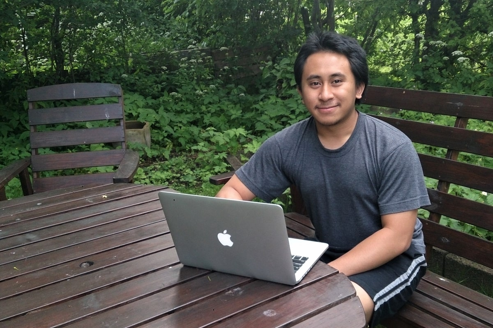

# Welcome weary traveler. To my website. How may I assist you?

My name is Risan Bagja Pradana and I love playing with the computer. I got my first computer when I was in junior high school. At that time, when I was bored playing Flash games, I read a book about Borland Delphi 6. I was hooked and later was able to finish the tutorial by making a simple text editor. I started to publish my software under the pseudonym of RdF, which stands for Reason da Freak—spells like "Risan the Freak" (don’t judge me).

Years later, my passion for computer programming is stronger than ever. Now I'm writing code for a living. I help my clients to launch their dream website. Sometimes I help startups to ship their million-dollar idea ([one of them got acquired](https://www.crunchbase.com/organization/fixd-repair) for tens of millions of dollars in 2019). I work with companies to manage and analyze their data, so they can make better decisions and grow their business.

This website serves as an archive for my thoughts. Sometimes I write about [programming stuff](/code/). But most of the time I blog about my daily life, my traveling experiences, or any random stuff that comes to my mind.

