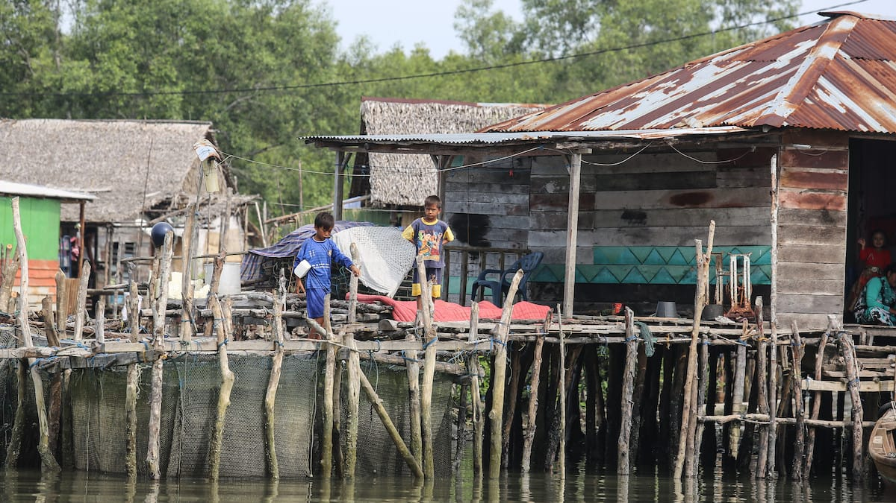

Berawal dari undangan pesta perkawinan adat seorang kawan—sesama mantan TKI di Malaysia dulu—di Pariaman, Ary memulai kembali petualangan gilanya. Pasca operasi tumor perutnya, kini daratan Sumatera yang menjadi sasaran keingintahuan Ary yang luar biasa besar itu. Dengan bermodalkan uang empat juta rupiah, ia nekat melanglang buana ke berbagai sudut Sumatera: mulai dari Bukittinggi, Langkat, Medan, Takengon, Banda Aceh, Toba, Palembang, hingga Prabumulih.

Buku ini memuat kumpulan catatan perjalanannya selama melancong ke tak kurang dari 15 kota selama 30 hari. Buku ini bukan *travel guide* yang akan membahas: "*how to get there*?", "*where to stay*?" atau "*what to do*?". Buku ini juga tidak menceritakan cantiknya pantai berpasir putih, air laut jernih yang berwarna hijau toska ataupun permainya ngarai-ngarai yang dibelah sungai. Buku ini buku khas Ary yang mengisahkan tentang adat-budaya, sejarah dan manusianya. Buku yang mengangkat kehidupan sehari-hari masyarakat, tentang isu kemiskinan dan kritik sosialnya.

Pada buku ini Ary memberikan kita sebuah perspektif baru. Sisi lain dari adat "membeli lelaki" di Pariaman dan Padang. Tentang nasib Bukittinggi, Paris *van* Sumatera yang kini menjelma menjadi sebuah kota besar dengan hingar-bingarnya. Juga tentang gambaran nyata Negeri Serambi Mekah yang kita kenal dengan penerapan hukum syariatnya yang ketat. Tentang musabab runtuhnya kejayaan tembakau Deli yang dahulu terkenal hingga ke daratan Eropa. Atau juga tentang betapa seksinya para lelaki Takengon yang berbadan tegap dan berperut rata. *Aih*!

Salah satu bagian yang paling menarik adalah kisah "Sawit, Idola Baru". Tentang bagaimana hutan-hutan di Sumatera digunduli. Tanah ulayat diambil-paksa, disulap menjadi kebun-kebun sawit dengan dalih ekonomi. Pada kenyataannya, meski harga CPO tinggi dan stabil, para petani sawit tetap saja dirundung jerat kemiskinan. Para mantan petani karet ini menjadi korban kebijakan sawit. Biaya pembibitan, perawatan, panen hingga peremajaan sawit sangatlah tinggi. Tidak seperti karet yang minim perawatan dan getahnya bisa dipanen kapan saja tanpa perlu khawatir busuk seperti buah sawit.

Sebuah buku perjalanan yang lain daripada yang lain. Buku perjalanan yang akan membawa kita menyapa saudara-saudara kita di sudut lain pelosok negeri. Kisah perjalanan penuh makna yang membuka lembaran-lembaran sejarah, menumbuhkan keprihatinan pada kemiskinan di negeri ini.

)](01-30-hari-keliling-sumatera-by-goodreads.jpg)

Judul: 30 Hari Keliling Sumatra\
Penulis: Ary Amhir\
Penerbit: Through The Glass Art Foundation\
Cetakan: Januari 2013\
Tebal: 144 Halaman

Foto cover dari [Flickr](https://www.flickr.com/photos/cifor/36643044492/) oleh [CIFOR](https://www.flickr.com/photos/cifor/).

