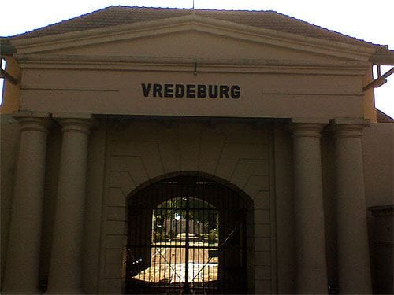
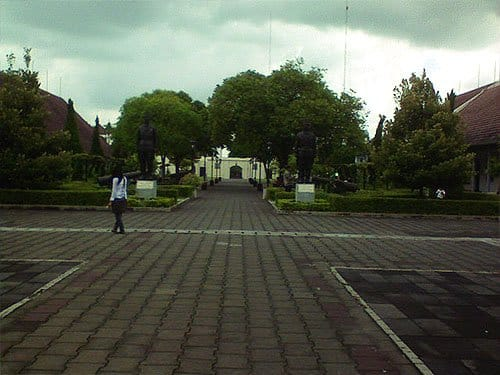
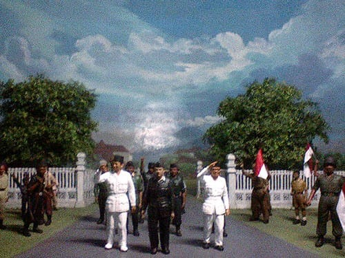
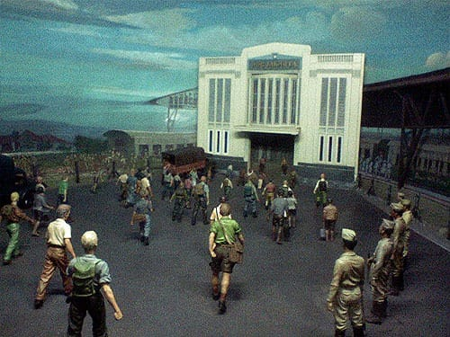

Sore mulai merayapi langit Kota Jogja. Cuaca pun mulai tidak bersahabat. Awan mendung kelabu bergelayut di langit-langit kota. Hembus angin dingin menyapu setiap sudut kota. Sebuah peringatan kalau hujan tidak lama lagi datang.

Aku bersandar, duduk di sebuah kursi yang berada tidak jauh dari Benteng Vredeburg. Sambil meluruskan otot-otot kaki yang mengkerut, aku melahap lembaran demi lembaran roti tanpa selai. Puas memanjakan kaki dan perut, aku pun beranjak menuju Benteng Vredeburg.

Tempat parkirnya lengang, sudah tidak ada lagi bis-bis yang kerap mengangkut siswa-siswi berkaryawisata. Hari sudah menjelang petang, tidak ada lagi keramaian di Benteng Vredeburg. Gerbang benteng yang tinggi menjulang, nampak angkuh menyambut kedatanganku. Di loket dekat gerbang masuk, seorang petugas tengah asyik memijit-mijit tombol HP-nya. Lunas membayar tiket seharga 750 rupiah padanya, aku dipersilakan masuk ke dalam area benteng.

Benteng Vredeburg ini dahulu dibangun oleh serikat dagang Belanda, VOC. Bangunan ini difungsikan sebagai benteng pertahanan dan pusat pemerintahan kolonial Belanda. Sri Sultan mengizinkan pembangunan benteng ini karena Belanda beralasan bahwa benteng ini dibangun untuk membantu menjaga ketertiban kota. Padahal maksud dari Belanda adalah tidak lain untuk mengawasi gerak-gerik Kraton dari dekat. Meriam yang berada di benteng ini pun di arahkan tepat ke arah Kraton.

Di dalam benteng yang telah dialigfungsikan sebagai museum ini aku mendapati taman yang indah. Rerumputan dan pepohonan tampak tertata dengan rapi. Beberapa meriam juga tampak menghiasi taman ini.

Tidak banyak pengunjung sore itu, tidak lebih dari sepuluh orang. Aku pun menyusuri benteng ini, masuk ke dalam ruangan diorama yang belum selesai direnovasi. Di dalam ruang diorama hanya ada aku dan sepasang pengunjung wanita. Di dalam ruangan yang temaram ini ditampilkan diorama-diorama yang menggambarkan perjalanan sejarah Bangsa Indonesia. Mulai dari diorama masa kerajaan hingga diorama perebutan Irian dari tangan Belanda.

Saat itu aku tidak memiliki kekhawatiran apapun. Kususuri setiap diorama, meninggalkan sepasang pengunjung wanita yang tengah asyik berfoto di dekat pintu masuk. Semakin ke dalam semakin gelap, aku tetap asyik membaca setiap keterangan pada diorama.

Di ujung ruangan—tidak jauh dari pajangan koleksi senjata museum—terdapat pintu yang terbuka. Ada tulisan "Dilarang Masuk Kecuali Petugas" pada pintu itu. Aku pun berniat untuk melongok melihat dari balik pintu. Namun saat kakiku baru melangkah, pintu tersebut tertutup dengan kerasnya. *Braaaaak!* Mungkin tidak aneh jika itu adalah pintu kayu biasa, namun pintu di sana adalah pintu yang sering kita temui di mini market. Pintu yang sekali terbuka lebar, maka akan terus terbuka, dan membutuhkan dorongan untuk menutupnya kembali.

Awalnya aku memandang hal itu biasa-biasa saja. Tidak lama berselang, serentak bulu-bulu di tengkukku tiba-tiba berdiri. Badanku pun terasa seperti menggigil. Sontak aku berjalan kembali menuju sepasang wanita yang masih juga berfoto ria dan keluar dari ruang diorama. Ini adalah kali pertama aku mengalami peristiwa semacam ini. Aku pun duduk di taman menenangkan diri sambil mengamati seorang anak kecil yang tengah bermain. Langit semakin kelabu. Angin semakin kencang. Tidak lama lagi Jogja hujan.

Foto cover dari [Unsplash](https://unsplash.com/photos/BdlDv9YychU) oleh [Aaron Mello](https://unsplash.com/@aarondnbb).
