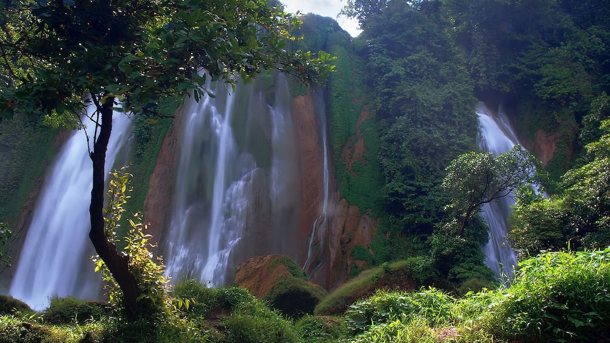
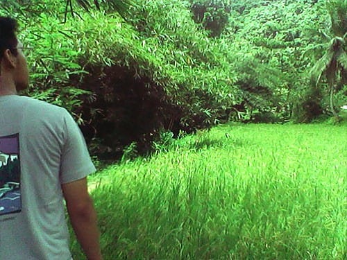
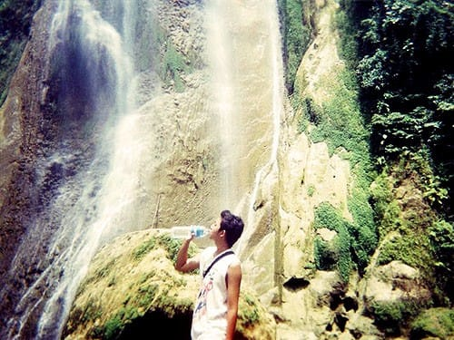
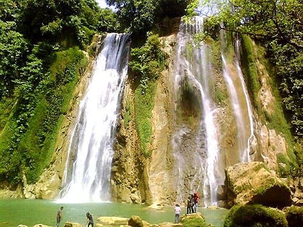
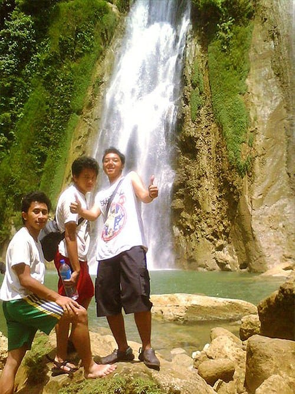
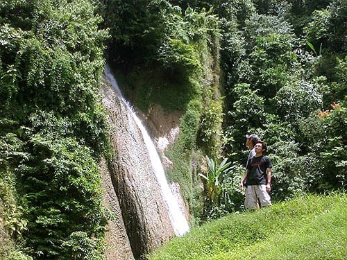
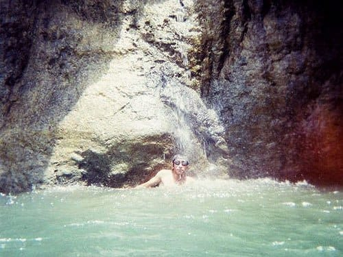
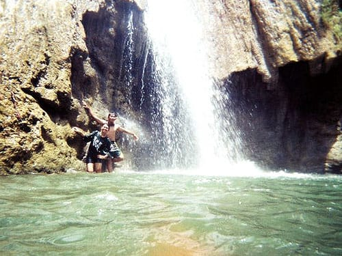
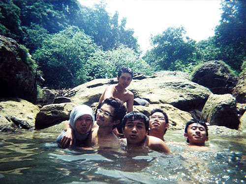

Di kursi belakang, jari-jemarinya yang halus menggenggam tempurung lutut kananku. Telapak tanggannya terasa sangat halus kala bersinggungan dengan kulitku. Tudung kepalanya telah ia lepas. Rambut hitamnya yang panjang, tergerai melebihi bahunya yang mungil. Helai-helai rambutnya beterbangan tertiup angin yang menyelusup dari pintu Elf yang menganga lebar. Tak jarang helai-helai rambutnya mendarat di wajahku, menguarkan aroma sampo yang khas.

Di depan, Pak Bonang dengan liar memelintir setir ke kiri dan kanan. Membawa elf-nya meliuk-liuk deras di perbukitan. Elf berguncang keras. Melibas tikungan demi tikungan dengan kecepatan penuh. Sementara itu gadis asing berparas cantik di sampingkku ini masih enggan melepas genggamannya, malah semakin keras ia genggam. Tak jarang pula ia menyenderkan tubuhnya ke arahku, kala elf berbelok tajam ke kiri. Padahal aku sangat yakin, kalau laki-laki di samping kanannya itu adalah kekasihnya. "Seampuh inikah air dari Curug Cikaso?", tanyaku dalam hati. Wejangan si Kakek siang tadi, nyata terbukti: meminum air Curug Cikaso mudah mendatangkan jodoh!

Siang belum juga genap, Pak Budi yang ramah dan gemar bercerita ini sudah men-*drop* kami di pintu gerbang Curug Cikaso. Kami yang masih setengah mengantuk karena perjalanan yang lumayan jauh, segera menghambur keluar dari angkot. Loketnya sangat sederhana, hanya sebuah pos yang diberi meja untuk pembelian karcis. Pengunjung diberi dua opsi untuk mencapai lokasi Curug Cikaso. Pertama dengan membayar 80 ribu rupiah untuk menyewa satu perahu menyisiri sungai Cikaso. Kedua dengan membayar 5 ribu rupiah per-orang untuk berjalan kaki menyisiri pematang sawah. Kami memilih opsi kedua. Kami pun didampingi seorang *guide* yang ditugasi untuk mengantar dan mengawasi pengunjung selama di Curug Cikaso. Pendampingan ini ditujukan untuk menghindari hal-hal yang tidak diinginkan.

Pun dengan berjalan kaki, untuk mencapai lokasi curug tidaklah jauh. Tidak menguras tenaga. Hanya sekira 15 menit saja. Itung-itung pemanasan untuk yang berniat berenang. Belum lagi pemandangan di sepanjang jalan yang meneduhkan. Di sebelah kanan pesawahan membentang berundak-undak hingga batas tebing-tebing batu. Sementara di kiri, dari balik rapatnya pohon-pohon Bambu dan kelapa, Sungai Cikaso tampak mengalir. Beberapa warga tampak tengah sibuk menambang pasir sungai.

Di tengah perjalanan menuju Curug Cikaso, kami berpapasan dengan sekelompok petani yang tengah memanen padinya. Kami ditawari untuk istirahat sejenak sembari menikmati air kelapa muda langsung dari pohonnya. Kontan kami menyetujuinya. Sebilah golok langsung menghujam kulit buah kelapa yang tebal, mengikis bagian atas tempurungnya. Kami menyeruput segarnya air kelapa dari bagian atas tempurungnya yang terbuka. Segar dan gurih. Belum lagi daging buahnya yang tebal, lembut, dan manis. *Ahhhh*, penyegar sempurna di tengah siang yang mulai terik.

Sambil asyik bergulat menghabiskan sajian kelapa segar, si Kakek—petani tua berkulit legam dan murah senyum ini—bercerita banyak hal tentang Curug Cikaso. Kisahnya penuh dengan aroma ke-gaib-an dan mitos, sehingga sempat membuat kami menggigil di siang bolong. Konon banyak pengunjung yang tiba-tiba tak bisa bergerak dan tenggelam saat berenang di sekitaran curug. Katanya juga sering ada pejabat yang sengaja singgah ke Curug Cikaso untuk dimandikan, meminta berkah agar menang Pilkada mungkin. Si Kakek juga bercerita tentang khasiat meminum air curug untuk menarik hati lawan jenis.

Curug Cikaso memiliki tiga aliran air terjun, oleh karenanya curug ini juga kerap disebut sebagai Curug Tilu—*tilu* dalam Bahasa Sunda artinya tiga. Aliran airnya yang berasal dari Sungai Cikaso deras menghujam permukaan air, menerbangkan rintik-rintik air serupa embun ke udara.

Atas wejangan si Kakek, kami tidak berenang di aliran air terjun yang paling besar. Berbahaya katanya. Kami hanya diperbolehkan untuk bermain di aliran air terjun yang paling kecil. Air terjun yang paling kecil ini berada di balik batu-batuan raksasa, kami perlu usaha yang lebih untuk bisa bermain di bawah alirannya.

Meski paling kecil, alirannya tetap saja deras. Kolam yang dibentuk di bawah alirannya pun masih tetap dalam, mungkin sekitar 2 atau 3 meter. Di dasar kolamnya banyak terdapat batu-batu besar dan batang-batang pohon mati untuk pijakan, jadi tidak perlu khawatir bila lelah berenang saat mencapai aliran air terjun.

Meski tidak percaya, kami tetap saja ingin mencoba minum langsung dari aliran Curug Cikaso. Airnya jernih, rasanya tawar dan tidak berbau. Persis seperti air mineral dalam kemasan. Aku bahkan ketagihan akan segarnya air curug ini. Sambil berpijak di bebatuan, kubuka rahangku lebar-lebar, mencoba menangkap tetesan air curug sebanyak-banyaknya. Sejuk terasa kala tegukan demi tegukan air Sungai Cikaso terus mengalir ke kerongkonganku. Soal jodoh? Itu sih bonus.

P.S: tidak usah percaya dengan mitos kemujaraban air Sungai Cikaso karena bisa berujung kepada kemusyrikan.

Foto cover dari [Flickr](https://www.flickr.com/photos/afwphotography/9275182776/) oleh [AFW Photography](https://www.flickr.com/photos/afwphotography/).
