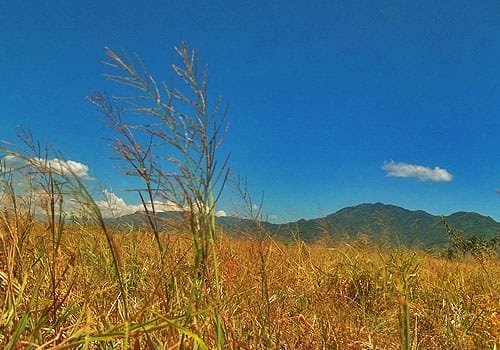
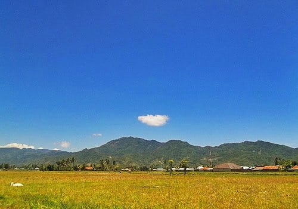
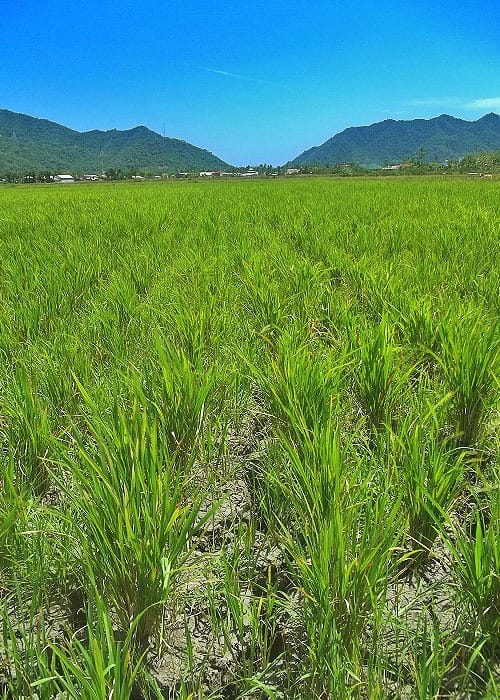
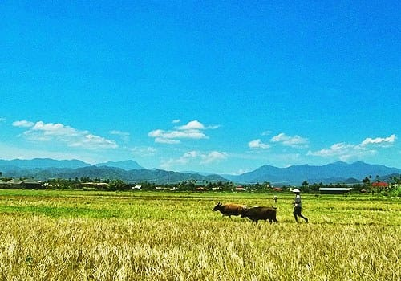
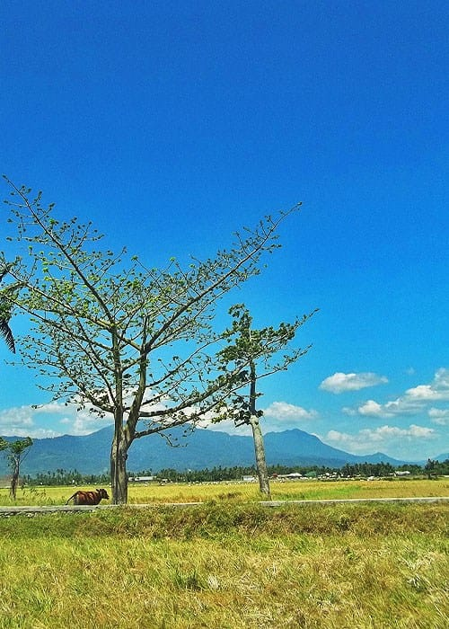
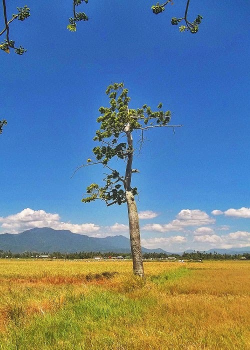
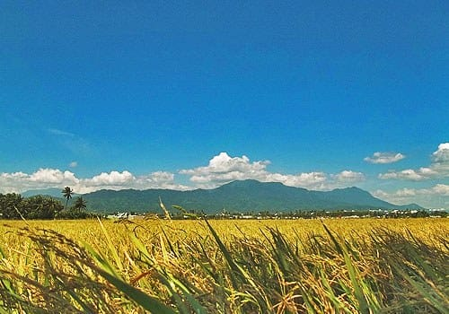
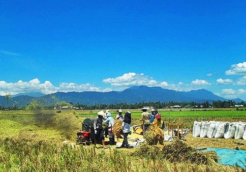

Dulu saat aku ditugaskan ke Gorontalo, aku tinggal di Perangkonero—sebuah daerah di Kota Gorontalo, tak jauh dari Universitas Negeri Gorontalo. Saat itu Bulan September, namun musim hujan masih enggan sambang di kota kecil itu. Matahari di Gorontalo sangatlah terik, bahkan di dalam rumah sangat jarang aku mengenakan baju. Bertelanjang dada dengan ditemani kipas angin yang diatur pada kecepatan maksimum.

Bagian terbaik dari tempat singgahku selama di Gorontalo adalah halamannya. Halamannya adalah hamparan pesawahan yang sangat luas, dikelilingi bebukitan. Angin berhembus deras di sana, seolah memberontak dari teriknya Sang Mentari. Aku suka duduk-duduk di tepian tanggul sungai, menghabiskan siang, dibuai deru angin.

Beberapa petak sawah mengering, tanah-tanahnya merekah. Rumput-rumput liar tumbuh di antara celah-celahnya. Sepasang kuda tengah merumput di kejauhan. Sawah-sawah yang mengering menjadi surga tersendiri bagi mereka berdua: makan sepuasnya. Seekor sapi tampak sedang bermalas-malasan di bawah pohon kapuk. Memamah rumput dalam mulutnya. Capung dan belalang pun melompat kesana-kemari.

Beberapa sawah lainnya nampak hijau dengan padi-padi yang baru tumbuh. Di sisi lain sekelompok petani tengah memanen padi-padinya, memisahkan bulir-bulirnya yang gemuk dari batang padi. Sekam-sekam padi berterbangan ke udara dilempar mesin yang berderu kencang.

Aku masih duduk di tepian tanggul sungai, memandang jauh ke bukit-bukit yang menghijau di kejauhan. Memutar kembali lagu-lagu rindu dalam ingatan.

*If only I could find my way to the ocean*\
*I'm already there with you*\
*If somewhere down the line*\
*We will never get to meet*\
*I’ll always wait for you after the rain*\
— After the Rain oleh Adhitia Sofyan

Foto cover dari [Unplash](https://unsplash.com/photos/2E_dT65fyxo) oleh [Glenn Carstens-Peters](https://unsplash.com/@glenncarstenspeters).
