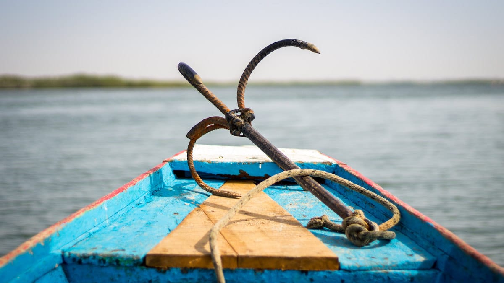
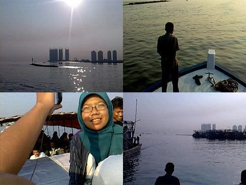
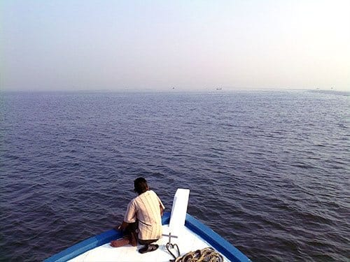

Mesin kapal dinyalakan, suaranya menyalak-nyalak membahana. Ribut sekali. Kepulan asap pembakaran solar yang hitam pekat terbang ke udara. Kayu-kayu yang menyusun kapal bergetar seirama raungan mesin kapal yang sudah uzur. Ah, kapal akan segera melaut!

Aku bangun, meluruskan sendi-sendi tubuhku yang pegal. Menggeliat meregangkan badan memang kegiatan yang paling nikmat. Kapal mulai terisi penumpang. Serombongan anak muda naik ke bagian atas kapal tempat kami berada. Rupanya mereka mengikuti paket wisata bahari Pulau Tidung yang digagas oleh pemuda karang tarunanya. Hebat sekali pemuda karang taruna Pulau Tidung, mereka mandiri memajukan sektor pariwisata daerahnya.

Setengah jam sudah mesin kapal dinyalakan, tapi kapal ojek ini belum juga melaut. Penumpang sudah berceceran di tiap sudut kapal, berebut tempat dengan karung-karung beras. Aku pun turun dan melompat-lompat di antara kapal menuju bibir dermaga. Tidak lucu bukan kalau harus buang air di tengah laut?

Beres melunaskan hajat, aku kembali ke dek atas kapal. Tidak lama jangkar kapal di tarik Sang ABK. Pluit kapal menyalak nyaring. Nahkoda memutar-mutar kemudi. Kapal pun melaut.

Mentari sudah bulat sempurna di langit Timur. Kami beranjak dari tempat kami dan memilih duduk di bagian atas kabin kemudi. Dari bagian paling atas ini kami bisa melihat lepas ke lautan. Gelombang yang datang membuat kapal limbung, bergoyang ke kanan dan ke kiri. Serasa di timang-timang.

Teluk Jakarta sangat kotor. Airnya keruh berwana hitam pekat bak oli. Sampah-sampah mengapung terseret gelombang. Botol minum, piring plastik, gabus, boneka, pohon pisang, bahkan ada jok motor!

"Coba deh mancing di sini, siapa tau dapet mobil!", gurauku pada teman-teman.

Perlahan-lahan kapal meninggalkan kotornya perairan Teluk Jakarta, melaju terus ke lautan lepas. Perlahan perairan menjadi semakin biru dan jernih. Sesekali terlihat sekelompok ikan yang melompat-lompat dari air. Burung-burung camar pun terbang mengiringi laju kapal. Mereka meniti angin dalam sebuah formasi berbentuk huruf "V". Ah, rasanya tidak sabar untuk sampai di Pulau Tidung!

Foto cover dari [Flickr](https://www.flickr.com/photos/144239902@N04/34315274883/) oleh [Yoann Gauthier](https://www.flickr.com/photos/144239902@N04/).
