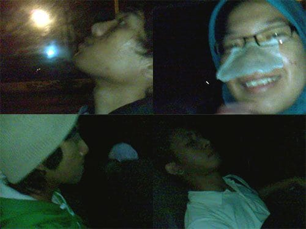

Hari masih terlalu pagi. Sayup-sayup merdu sang muazin pun belum terdengar. Seorang pria berotot dengan gaya khas seorang tentara mendekat menggunakan motor. Ia menyapa kami yang tengah tergolek di tengah taman. Kami yang setengah sadar menjawab sapaannya.

"Habis turun gunung?" Tanya pria berotot itu kepada kami.

"Enggak mas, kami mau ke Muara Angke. Pake apa ya?" Tanyaku padanya.

"Muara Angke ya? Gak bisa langsung dari sini, harus dua kali naik. Pake yang ke Grogol, nanti disambung lagi." Jawab pria itu.

"Bisnya naik dari sini?" Tanyaku lagi.

"Di depan juga banyak. Nanti naik dari sana aja." Jawab pria itu sambil menunjuk ke arah jalan raya.

"Nanti turunnya di mana mas?" Kembali kubertanya.

"Nanti bilang aja ke keneknya, mau ke Muara Angke." Jawabnya ramah. "Saya keliling-keliling dulu ya." Sambungnya lagi.

"Iya, makasih mas!" Jawab kami serempak.

Pria berotot itu pun melaju dengan motornya. Kuregang-regangkan persendian tubuhku sambil melihat pria itu berlalu. Nikmat sekali rasanya ketika sendi-sendi itu berbunyi saat diregangkan. *Krek*. Kami beranjak dari tempat kami tidur, menuju tempat bis jurusan Grogol terparkir.

Mesin bis sudah meraung dipanaskan. Beberapa penumpang sudah tampak menduduki kursi-kursi dalam bis. Bis ini tampak terawat dari luar, tidak terlihat badan bus yang keropos layaknya bis Damri di Bandung. Namanya bis Patas Mayasari Bakti 06 jurusan Kampung Rambutan—Grogol.

Tidak lama bis pun melaju meninggalkan Terminal Kampung Rambutan. Setelah membayar uang sebesar tiga ribu rupiah, kami meminta kepada Kenek agar diturunkan di tempat mikrolet jurusan Muara Angke biasa *mengetem*.

Awalnya bis melaju tenang dalam terminal. Namun ketika berhadapan dengan ruas jalan yang lebar, tanpa ragu sang sopir menginjak dalam-dalam pedal gasnya. Mesin bis meraung-raung membelah pagi yang sunyi. Jalan Jakarta yang masih lengang nampaknya membuat si Sopir kerasukan. Bis yang ukuran badannya super besar ini melesat kencang. Kursi penumpang berguncang. Kaca-kaca bis bergetar keras. Angin berhembus kencang dari jendela yang terbuka. Ini bukan bis, ini pesawat Apollo!

Foto cover dari [Unsplash](https://unsplash.com/photos/pnPS3Ox_2vE) oleh [SpaceX](https://unsplash.com/@spacex).
