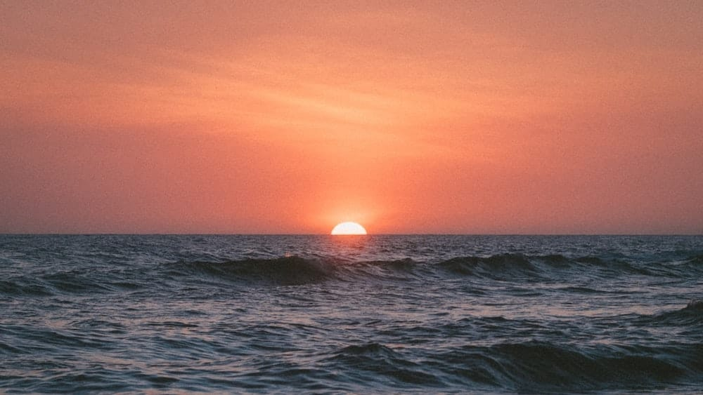

Potongan cerita yang menarik dari novel 9 Matahari karya Adenita. Pada bab yang berjudul "9 Matari", Matari si tokoh utama menanyakan berapa nilai dirinya kepada seorang sahabatnya yang bernama Arga.

"Sebagai teman, berapa nilai yang akan lu kasih sama gue?"

Arga memandangku lama.

"Buat apa pertanyaan ini?"

"Nggak buat apa-apa, buat gue sendiri. Pertama kali gue menilai diri gue adalah 6,5. Setelah itu gue niat banget buat melakukan perubahan. Gue pengen banget menaikan nilai diri gue... tapi sekarang gue malah nggak bisa menilainya sendiri. Gue merasa ada peningkatan... tapi..."

"Tapi, apa?"

"Mungkin belum sebesar yang gue bayangkan."

Arga tersenyum kecil, kemudian menatapku. "Sembilan, Tar..." Jelas sekali ia mengucapkan angka itu. Tapi, aku seperti ingin agar Arga mengulanginya lagi. Aku takut salah dengar.

"Sembilan...? Nilai gue?"

Arga mengangguk.

"Nggak salah?"

"Tar, semua orang pasti tahu angka sepuluh adalah angka tertinggi. Tapi buat gue, sembilan itu adalah angka yang pas buat diri gue melambangkan betapa bernilai dan berharganya sesuatu itu buat gue. Angka itu berada di atas rata-rata, tapi masih menyisakan satu ruang untuk terus mencapai kesempurnaan. Angka 9 masih akan terus mencari perbaikan diri untuk menjadi 10. Itu yang akan membuatnya terus bergerak, melakukan hal yang lebih baik dari waktu ke waktu... Dari bentuknya, buat gue angka 9 lebih menawan. Kalau lu perhatiin, angka 8 itu membuat dua bulatan yang tertutup. Sementara angka 9, bagian atasnya membentuk sebuah lingkaran yang menurut gw itu adalah ruang pribadi bagi setiap orang. Seperti tempat untuk menyimpan keyakinan yang tidak akan terganggu. Sementara buntut di bawahnya adalah ruang terbuka, tempat orang itu bisa terus mengasah dirinya untuk menerima wawasan dan pengetahuan baru, serta akhirnya membuat dirinya terus-menerus termotivasi untuk bisa lebih baik lagi. Dan, sembilan itu adalah nilai buat seorang yang terus membawa impiannya dengan semangat matahari, sembilan itu nilai buat seorang Matari."

Foto dari [Unsplash](https://unsplash.com/photos/11Sw1SVPPKo) oleh [Jakob Owens](https://unsplash.com/@jakobowens1).
