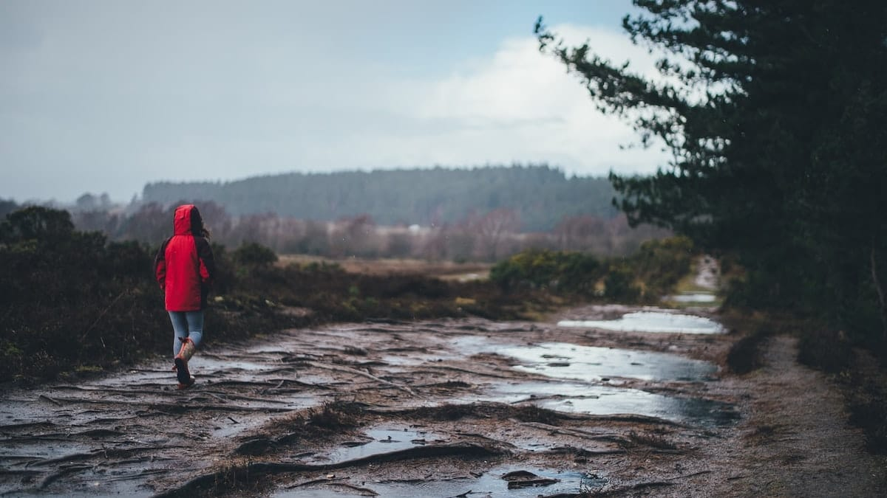

Saya baru sadar kalau Pemerintah Kota Bandung sangat perhatian kepada para warganya. Bagaimana tidak, kota yang berjuluk "Parijs van Java" ini selain memiliki ratusan *factory outlet* dan objek-objek wisata menarik lainnya, kini memiliki sejumlah sarana *off-road* bagi warganya.

Saya sebagai mahasiswa tentunya merasa sangat senang dengan tersedianya fasilitas jalan *off-road* ini. Setiap hari untuk mencapai kampus, saya dengan riang-gembira menjajal sarana yang disediakan pemerintah ini. Wah! Rasanya tidak sia-sia menghabiskan empat tahun kuliah di Bandung. Selain nanti lulusnya jadi seorang sarjana, saya pun mendapat bekal ilmu tambahan sebagai *crosser*. *Nuhun ah pamarentah!*

Selain itu, kalau hujan turun, wahana *off-road* yang disediakan pemerintah ini membawa berkah tersendiri bagi warga di sekitarnya. Bagaimana tidak, setelah hujan turun, bermunculanlah sumur-sumur dadakan di tengah jalan (bahkan terkadang muncul sungai). Kala di daerah lain kesusahan mendapatkan air, di Bandung dapat dengan mudah kita menemui sumur. 🙂

Ah, tidak sabar rasanya untuk kembali ke kampus besok. Tidak sabar menjajal trek *off-road*! YEAAAAH!

Foto dari [Unsplash](https://unsplash.com/photos/Qq8d7y2xcq8) oleh [Annie Spratt](https://unsplash.com/@anniespratt).
