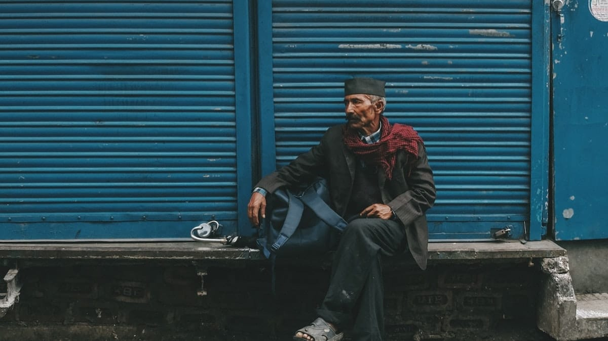

Sinar matahari mulai terasa terik. Pijar cahayanya menyinari sudut-sudut ibu kota. Hari itu hari Minggu. Hari yang lazimnya dinikmati untuk beristirahat, berlibur atau sekadar bercengkrama dengan keluarga. Namun hal itu rupanya berbeda bagi Supriono. Pria paruh baya berumur 36 tahun itu harus ikut berdesak-desakan dalam kereta rel listrik (KRL) jurusan Jakarta – Bogor.

Belum sempat kereta berjalan, seluruh penumpang dalam gerbong yang Supriono tumpangi geger.

Penyebabnya adalah Supriono saat itu tengah menggendong jenazah anaknya—Khaerunisa—putri bungsunya yang baru berumur tiga tahun. Rencananya Supriono akan membawa jenazah anaknya itu ke Kampung Kramat, Bogor. Bukan tanpa alasan Supriono membawa jenazah putri kecilnya itu dengan KRL, ia yang sehari-harinya berprofesi sebagai seorang pemulung tidak sanggup menyewa mobil ambulan.

Berita yang mengejutkan itu akhirnya sampai pada pihak kepolisian. Tidak lama Supriono pun dipaksa turun dari kereta. Ia, putra bungsunya Muriski Saleh serta jenazah putrinya dibawa ke kantor polisi.

Polisi mencurigai almarhumah putrinya merupakan korban kejahatan. Ketika dimintai keterangan, Supriono memaparkan bahwa putrinya itu meninggal karena terserang muntaber. Pihak kepolisian lantas tidak langsung percaya dengan keterangan Supriono, polisi pun memaksanya untuk membawa jenazah putrinya ke RSCM untuk di autopsi.

Sesampainya di RSCM, Supriono kembali menjelaskan bahwa putrinya Khaerunisa sudah empat hari terserang muntaber. Ia sempat membawa putri bungsunya itu pergi berobat ke Puskesmas di Kecamatan Setiabudi.

"Saya hanya sekali membawa Khaerunisa ke Puskesmas. Saya sudah tidak punya uang lagi untuk membawanya ke Puskesmas. Meski biaya berobat ke puskesmas hanya 4 ribu rupiah, saya tidak sanggup membayarnya. Saya hanya seorang pemulung kardus, gelas dan botol-botol plastik, penghasilan saya pun tak seberapa, paling hanya 10 ribu rupiah per hari." Tutur Supriono yang tinggal bersama kedua anaknya di kolong perlintasan kereta di Cikini.

\*\*\*

Tidak kuasa lagi menahan penyakitnya, gadis kecil bernama Khaerunisa itu akhirnya dipanggil sang Khalik. Balita yang belum genap berumur empat tahun itu menutup usianya di dalam gerobak berkarat yang biasa digunakan ayahnya untuk menyambung nyawa.

Putri Hawa yang tak berdosa itu harus menghembuskan nafas terakhirnya di sela-sela kardus lembab yang kotor. Saat itu hari masih pagi, hari Minggu jam 7 pagi. Ayahnya Supriono dan kakaknya Musriski yang baru berumur enam tahun hanya termenung melihat anggota keluarga terkecilnya meregang nyawa.

Cukup lama Supriono terdiam. Uang disakunya tinggal enam ribu rupiah. Uang sebanyak itu jelas tidak cukup untuk membeli kain kafan, apalagi untuk menyewa mobil ambulan.

Khaerunisa masih tetap di sana, tergolek tanpa nyawa di atas gerobak kecil yang pengap dan kotor. Akhirnya Supriono mengajak Muriski pergi menyorong gerobak menyusuri Manggarai hingga ke Stasiun Tebet, membawa jenazah si mungil Khaerunisa.

Supriono berniat membawa Khaerunisa ke kampung Pemulung di daerah Kramat, Bogor. Ia berharap di sana ia mendapat bantuan dari sesama pemulung lainnya untuk memakamkan anak bungsunya.

Jarum jam sudah menunjukan pukul sepuluh pagi. Sinar mentari mulai terik menyinari. Supriono, Muriski dan gerobak yang membawa jenazah Khaerunisa tiba di stasiun Tebet. Tidak ada yang tersisa, hanya sarung kucel yang bisa digunakan Supriono untuk membungkus tubuh putrinya yang terbujur kaku. Wajah Khaerunisa sengaja tidak ia tutupi, berharap orang lain mengira putrinya sedang tertidur.

Supriono menggandeng putranya Musriski sambil menggendong jenazah putrinya. Sesampainya di gerbong, seorang pedagang asongan menghampiri Supriono. Pedagang asongan tersebut menanyakan keadaan putrinya. Supriono pun menceritakan kejadian yang sebenarnya. Percakapan dalam kereta yang penuh sesak itu jelas terdengar oleh penumpang lainnya. Sontak seisi gerbong pun menjadi lebih riuh dan berkumpul mengerumuni Supriono. Polisi pun akhirnya datang dan memaksa Supriono untuk ikut ke kantor polisi Tebet.

Polisi yang tidak sepenuhnya percaya atas keterangan Supriono, meminta Supriono untuk melakukan autopsi terhadap jenazah anaknya di RSCM. Supriono tetap ngotot meminta agar anaknya segera dimakamkan. Akhirnya polisi pun memaksanya untuk membawa jenazah Khaerunisa ke RSCM dengan menggunakan ambulan berwarna hitam.

Di RSCM Supriono hanya terduduk pasrah menunggu jenazah putrinya selesai diautopsi. Setelah cukup lama menunggu, akhirnya sekira pukul empat sore akhirnya Supriono diperbolehkan membawa pulang jenazah putrinya.

Lagi-lagi karena tidak mempunyai uang, Supriono terpaksa berjalan menggandeng Musriski sambil menggendong Khaerunisa. Warga yang merasa iba kepadanya kemudian memberikan uang alakadarnya untuk ongkos ke Bogor. Para pedagang di RSCM juga memberikan Supriono dan Muriski air minum sebagai bekal perjalanan.

\*\*\*

Cerita di atas terinspirasi dari kisah nyata. Kisah tersebut saya baca di koran Warta Kota. Kejadiannya terjadi tanggal 5 Juni 2008. Sebuah fakta memilukan yang saya coba tuliskan kembali dengan kata-kata saya pribadi.

Foto dari [Unsplash](https://unsplash.com/photos/h6jP-QeVV_w) oleh [Nitin Garg](https://unsplash.com/@nitingarg).
