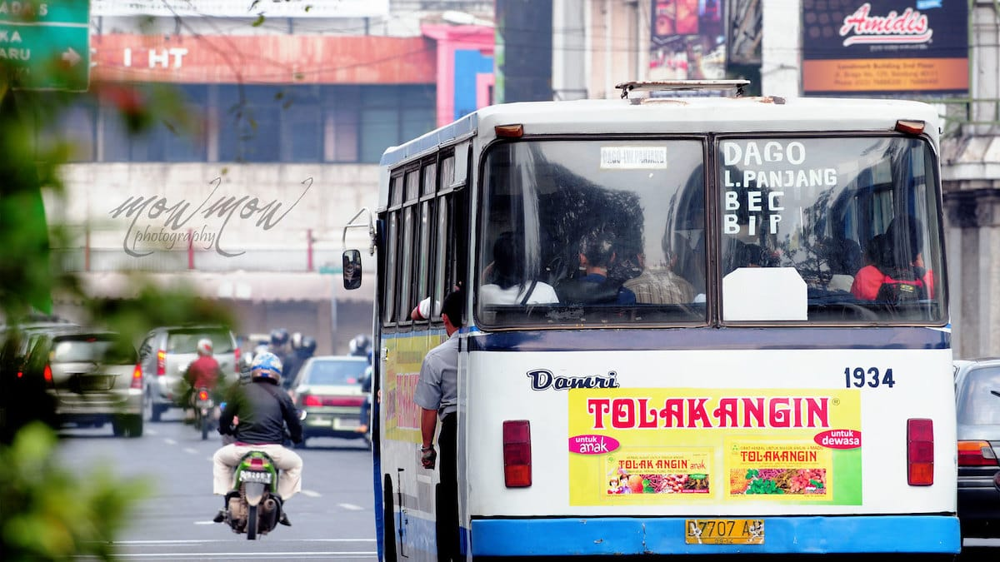
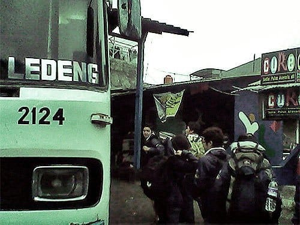
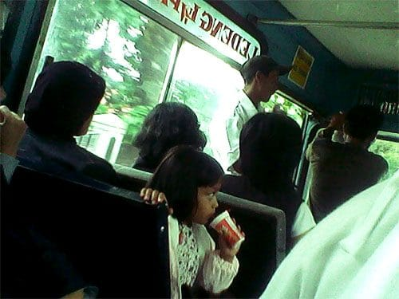
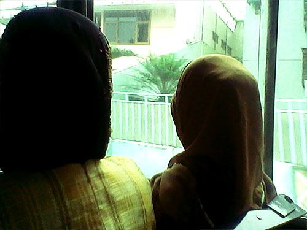
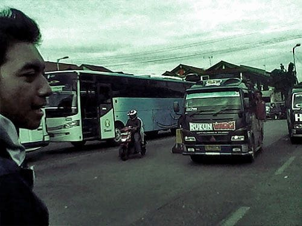

Sore itu kami sudah berkumpul di Griya Assalam, kosan di bilangan Ciwaruga ini memang sudah menjadi rumah kedua bagi anak-anak kelas saat tidak ada kuliah. Aku bersama keenam kawan kuliah berencana akan menyisir pantai-pantai eksotis di Selatan Sukabumi.

Dari Ciwaruga kami menyergap sebuah angkot dan memaksanya untuk mengantar kami ke Terminal Ledeng dengan bayaran empat ribu rupiah per-orang. Sesampainya di Terminal Ledeng, kami berlari-lari kecil menuju Bis Damri jurusan Terminal Leuwipanjang yang akan segera berangkat.

Kursi-kursi plastik khas Bis Damri sudah hampir penuh, beruntung kami masih mendapatkan kursi meski harus duduk terpisah. Aku duduk bersama sepasang kekasih. Aku, si laki-laki, dan si perempuan yang duduk di dekat jendela. Aku tergelitik melihat tingkah polah si lelaki. Si laki-laki itu meregangkan kedua tangannya ke udara, lalu perlahan ia jatuhkan lengan kanannya ke pundak si perempuan. Si perempuan pun mulai merasa risih dipeluk si lelaki, ia naik-turunkan pundaknya seolah meminta kepada si laki-laki untuk melepas pelukannya. Si laki-laki pun mengerti, perlahan ia tarik lengannya dari pundak si perempuan. Sementara itu aku senyum-senyum saja sambil menoleh ke arah lain. Bis Damri bukan tempat yang cocok untuk berasyik-masyuk simpulku dalam hati.

Bis berjalan tersendat-sendat, jalanan macet dimana-mana. Suasana di dalam bis semakin pengap, pun begitu aku tetap saja tertidur. Kepalaku bersandar pada kursi di depanku, mataku pun terpejam nikmat. Lalu tiba-tiba dari barisan belakang bis seorang penumpang berteriak-teriak,

"Iya siap Komandan! Iya, ya siap Dan!" begitu ujarnya berulang-ulang.

Kontan aku melirik ke arahnya. Bapak tersebut rupanya tengah menerima telpon. Suaranya sangat menggelegar mengalahkan raungan mesin bis. Para penumpang lain pun ikut menoleh ke arahnya, namun bapak itu tak sedikitpun menurunkan volume suaranya.

Bis kolot ini terus melaju, membelah kemacetan Kota Bandung. Asap hitamnya mengepul, membumbung tinggi ke udara. Pengamen-pengamen naik dan turun, bernyanyi demi keping-keping logam para penumpang. Setelah satu jam lebih berlalu, akhirnya bis sampai juga di Terminal Leuwipanjang.

Foto cover dari [Flickr](https://www.flickr.com/photos/erimowmow/5978225860/) oleh [Eri Mowmow Heryawan](https://www.flickr.com/photos/erimowmow/).
