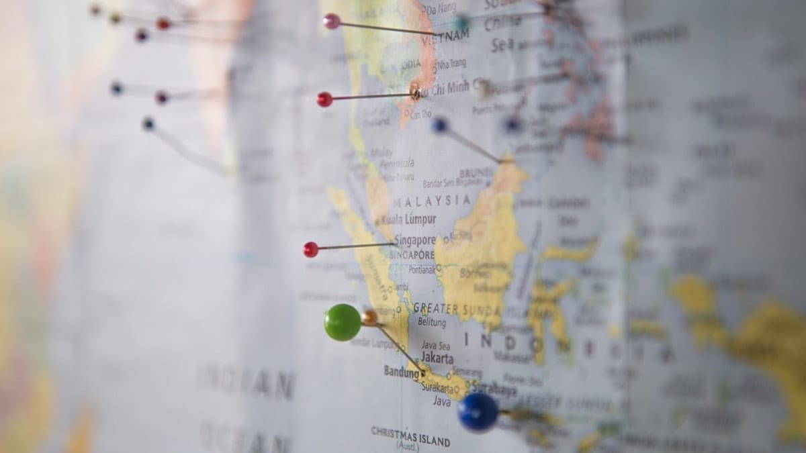
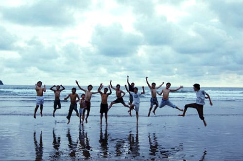
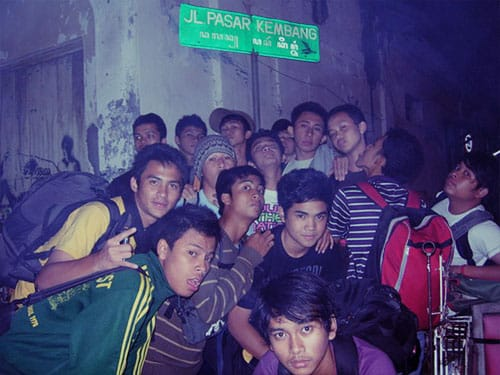

BM3 sebenarnya adalah sebuah ekstrakurikuler sepak bola sewaktu aku bersekolah di SMAN 3 Bandung dahulu. BM3 sendiri merupakan akronim dari **Belitung Muda Tiga**. Kata Belitung tentu merupakan hasil konsekuensi dari lokasi sekolah yang memang berada di jalan Belitung—tidak jauh dari jantung pusat Kota Bandung.

Belitung Merantau sendiri merupakan hasil pelesetan anak-anak BM3 yang *doyan* jalan-jalan bersama kala musim liburan tiba. Pelesirannya tidak hanya di sekitar Bandung, tapi ibukota Jakarta, Pangalengan, Garut, Ciamis, Jogja, hingga tanah Borneo sempat kami jelajahi.

Aku sendiri sebenarnya bukan anggota dari ekstrakurikuler BM3 ini. Namun karena kedekatan dan (mungkin) ditambah rasa iba para anggotanya yang kerap kali memergoki aku nganggur di kantin sekolah: makan, minum, main kartu, *nungguin* pacar, bahkan tidur; aku pun selalu diajak untuk ikut jalan-jalan bersama mereka. *Alhamdulillah*.

Dari Belitung Merantau ini perlahan tapi pasti, aku mulai terserang virus *wanderlust*. Jiwa-jiwa petualang personil BM3 benar-benar meracuni aku untuk menggeluti dunia *traveling* seperti sekarang ini.

Banyak peristiwa dan pengalaman yang tidak terlupakan selama melancong bersama BM3. Bersama mereka, pertama kalinya aku harus berbagi bak rendam air panas bersama hampir 10 remaja laki-laki. Pertama kalinya juga aku ikut merasakan siksaan kereta ekonomi Bandung–Jogja. Pertama kalinya aku menginap di sebuah penginapan super murah yang tidak terurus nan berdebu. Pertama kalinya aku pun hilir-mudik di Sarkem malam-malam (hanya lewat, sumpah!). Pertama kalinya merasakan sensasi terbang ribuan kaki di udara. Pertama kalinya juga aku menjejakan kaki di tanah paru-paru dunia, tanah Borneo.

Banyak kesan dan cerita untuk ku kenang bersama kalian! Termakasih BM3 2008! Mengutip slogan dari National Geographic Traveler: *All Traveler All The Time!*

Foto dari [Unsplash](https://unsplash.com/photos/TrhLCn1abMU) oleh [Capturing the human heart](https://unsplash.com/@dead____artist).

