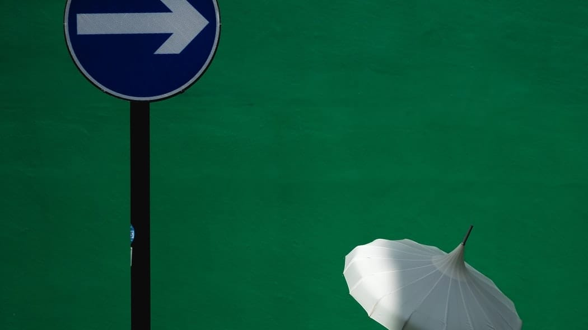
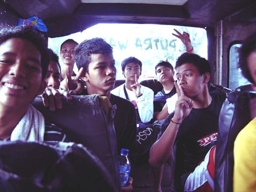
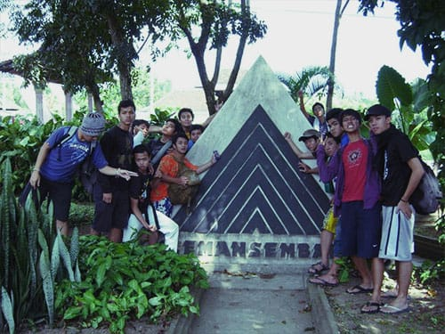
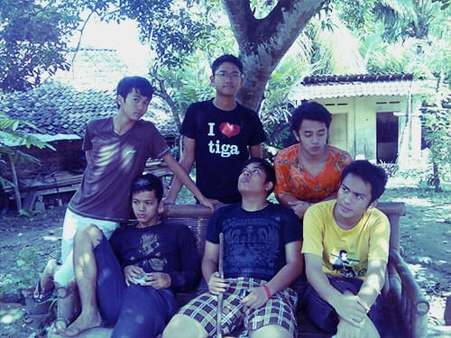
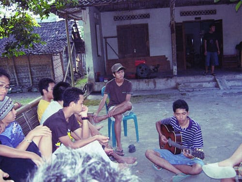
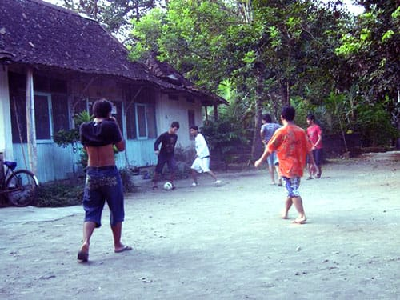
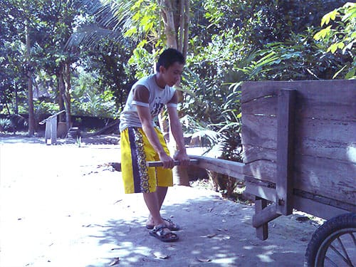
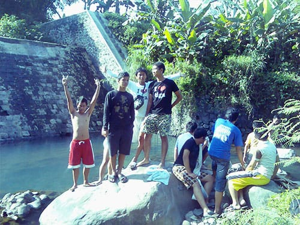
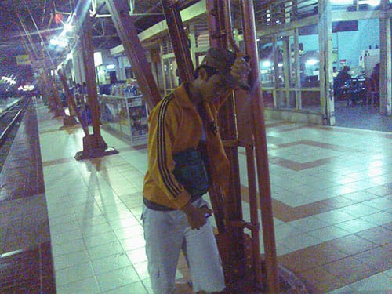

Dari Jogja saya dan teman-teman secara mendadak memutuskan untuk melanjutkan perjalanan ke Sleman. Sleman merupakan salah satu kabupaten yang ada di provinsi Yogyakarta. Di Sleman kami singgah di rumah salah seorang kerabat dari Om Ega.

Awalnya kami sempat kebingungan bagaimana cara mencapai Sleman. Dalam mengidentifikasi bis, warga Jogja cenderung menggunakan kode trayeknya, bukan nama jurusannya seperti di Bandung. Yang menjadi masalah adalah tulisan kode trayek pada bis sangatlah kecil dan nyaris tidak terbaca. Setelah bertanya kesana-kemari, akhirnya kami mendapatkan petunjuk yang jelas. Untuk mencapai Sleman, kami menggunakan sebuah bis kecil yang sudah sangat rapuh. Bis nya mirip dengan *Madonna*, *Kotrima*, atau *Kopaja*; hanya saja di Jogja si sopir tidak ugal-ugalan. Bis berjalan dengan santai.

Setelah perjalanan yang tidak terlalu lama, kami pun akhirnya sampai di kediaman kerabat Om Ega. Rumahnya terdapat di pedesaan yang asri. Halamannya luas dan terdapat pohon yang sangat rindang. Kami duduk di bawah rindangnya pohon, merasakan hembus angin yang sepoy-sepoy.

Tidak jauh dari kediaman kerabat Om Ega, terdapat bendungan kecil yang airnya bersih. Untuk menujunya kami melewati pematang sawah yang padinya sudah menguning. Sangat indah. Di bendungan itu kami mandi dan bermain air. Sungguh pengalaman yang tidak terlupakan.

## Kehabisan tiket pulang

Selepas dari kerabat Oom Ega, kami kembali ke kota Jogja untuk pulang ke Bandung. Saat akan membeli tiket kereta ekonomi di stasiun Lempuyangan, ternyata tiket kereta apinya sudah ludes terjual! Beruntung dengan bantuan Om Adzan dan Om Disa kami semua bisa pulang dengan menggunakan kereta bisnis secara cuma-cuma! Terimakasih kakak!

Foto cover dari [Unsplash](https://unsplash.com/photos/49m3xCfHako) oleh [Craig Whitehead](https://unsplash.com/@sixstreetunder).
