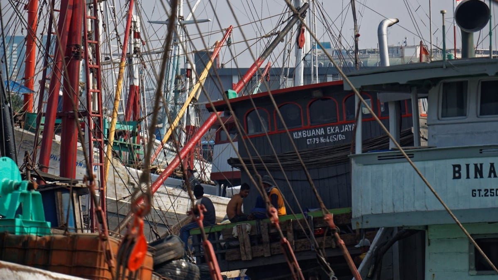
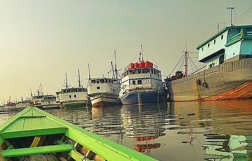
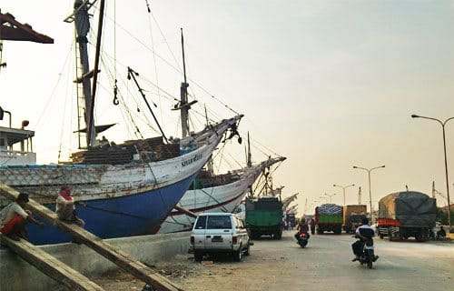
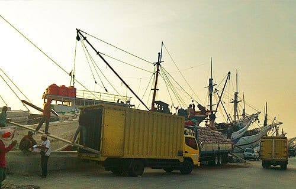
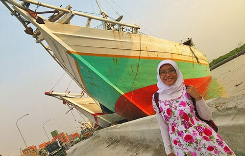
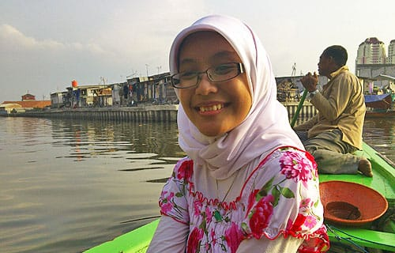
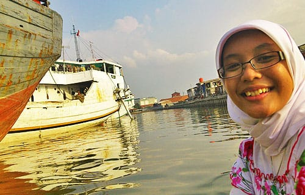

"Istri Pak?" Tanya pria bertubuh gempal nan kekar di hadapanku ini. Jelas yang ia maksud "istri" adalah kekasihku ini—si Riri.

"Calon," Jawabku singkat sembari melemparkan senyum selebar-lebarnya. Sambil mengaamini dalam hati, kutarik lengan kekasihku. Menuntunnya untuk naik di atas sampan milik pria bertubuh gempal ini.

Pria berbadan gempal pemilik sampan ini bernama Pak Oting. Kulitnya legam karena terlalu sering terbakar matahari. Matanya hitam berkilat-kilat. Pandangannya tajam. Senyumnya selalu terkembang, memperlihatkan gigi-gigi putihnya yang tersusun rapi. Pria asal Bugis ini sudah 30 tahun menawarkan jasa sampannya. Mengantar para pelancong mengelilingi Pelabuhan Sunda Kelapa. Ia hidup sendiri di Jakarta, sementara istri dan anak-anaknya menetap di Buton.



Waktu sudah menunjukan pukul tiga sore, namun matahari di atas Kota Jakarta seolah enggan berdamai dengan kami. Teriknya masih tersisa. Memaksa keringat menetes deras dari kening, ketiak hingga punggungku. Aku dan kekasihku duduk di pelataran Museum Fatahilah, memanjakan tungkai kaki kami yang lelah berjalan seharian.

Aku kembali membujuk kekasihku untuk mencari Pelabuhan Sunda Kelapa. Siang tadi kami gagal melacak lokasi dari pelabuhan itu dan malah terdampar di Kampung Luar Batang—yang kemudian kuketahui kalau itu adalah salah satu perkampungan tertua di Batavia. Meski jelas tampak sangat kelelahan, namun ia mengiyakan keinginanku. Ah, kau memang kekasihku yang paling tangguh!

Kami pun kembali menyusuri Kota Tua, berjalan terus ke arah Utara. Dengan bantuan GPS dan modal tanya sana-sini, akhirnya kami sampai di Pelabuhan Sunda Kelapa. Truk-truk kontainer berukuran raksasa hilir-mudik di muka pelabuhan. Ratusan atau mungkin ribuan peti kemas tertumpuk memenuhi setiap sudut pelabuhan. Kuli-kuli panggul nampak sibuk menurunkan karung-karung terigu dari sebuah kapal. Dengan lihai mereka meniti tangga dari papan kayu yang kecil, membopong satu atau dua karung di punggungnya.

Tiba-tiba seorang bapak menawari kami untuk berkeliling pelabuhan dengan sampannya. Seketika aku teringat Kamga, pembawa acara Explore Indonesia itu juga menyusuri pelabuhan bersejarah ini dengan sampan. Aku tergoda tawarannya, kekasihku pun turut merestui. Dengan sedikit tawar-menawar, akhirnya kami menyutujui harga jasa sampannya.



Aku dan kekasihku sudah duduk berhadap-hadapan di tengah sampan. Sesekali sampan kecil kami yang tertambat di antara kapal-kapal besar itu berayun-ayun diterpa riak air. Pak Oting pun mulai mendayung, membawa sampan keluar dari himpitan kapal-kapal pengangkut barang itu. Tangannya yang kekar dengan mudah mendayung sampan yang hanya diisi olehku dan kekasihku. Sampan berwarna hijau—warna kesukaan kekasihku—ini pun perlahan melaju menyisiri tepian dermaga.

Kapal-kapal kayu bermotor dengan ukuran yang besar berjejer menyesaki sisi kanan dermaga. Kapal-kapal ini digunakan untuk mendistribusikan berbagai jenis barang ke seluruh pelosok nusantara. Ada yang membawa karung-karung beras, terigu, semen, kardus-kardus mi instan, sabun mandi hingga tangki air berwarna jingga-menyala. Tiba-tiba aku mengkhayal untuk mengelilingi Indonesia dengan menumpang kapal-kapal itu.

"Bisa saja kita menumpang kapal itu. Minta izin aja ke kaptennya.", jawab Pak Oting. "Tapi lama kalau pakai kapal itu, bisa berminggu-minggu. Pakai saja PELNI, lima ratus ribu atau enam ratusan." Sekali lagi pikiranku terbang ke pelosok-pelosok negeri yang belum pernah kujamah.

Sampan terus melaju perlahan, membelah perairan Sunda Kelapa yang kian mengeruh dan semakin dangkal. Aku membayangkan masa lalu dari pelabuhan ini. Bagaimana pelabuhan ini menjadi salah satu pusat perdagangan terpenting di Nusantara. Dari kuasa Kerajaan Pajajaran hingga jatuh ke tangan Fatahilah dari Kerajaan Demak. Dari kuasa Demak hingga jatuh ke tangan pimpinan VOC: Jan Pieterszoon Coen yang menancapkan taring-taring kolonialisme di Nusantara.

Aku membayangkan bagaimana kapal-kapal layar besar dari Sumatera, Sulawesi, Cina, India hingga Arab berlabuh di pelabuhan ini. Membawa barang-barang dagangan seperti lada, pala, cengkeh, kopi, porselen, anggur, sutera hingga wangi-wangian. Pastilah dahulu pelabuhan ini sangat meriah.



"Nyanyi dong!" Pintaku pada gadis yang mahir bermain alat musik ini.

"Kamu aja, aku kan udah!" Jawabnya. Ya, ia memang sudah menyanyikan lagu Avril Lavigne yang berjudul "I Wish You Were Here" saat kami berkeliling di Taman Fatahilah siang tadi. Aku pun berpikir sejenak, kemudian teringat Kamga yang menyanyikan lagu "Nenek Moyangku Seorang Pelaut" di episode Kota Tua Jakarta.

*Nenek moyangku seorang pelaut...*\
*Gemar mengarung luas samudera...*\
*Menerjang ombak, tiada takut...*\
*Menempuh badai, sudah biasa...*

Perairan di Sunda Kelapa, nasibnya hampir sama dengan perairan di Jakarta pada umumnya. Hitam tercemar limbah dan tumpukan sampah. Lalu aku dan kekasihku berpikir: apakah nenek moyang kita masih berani melaut jika kondisi perairannya seburuk ini?

*Post scriptum*: ini adalah salah satu momen terindah dalam hidupku.

Foto cover dari [Flickr](https://www.flickr.com/photos/dotfinger/15683804083/in/photostream/) oleh [Jean Baptiste ROUX](https://www.flickr.com/photos/dotfinger/).
