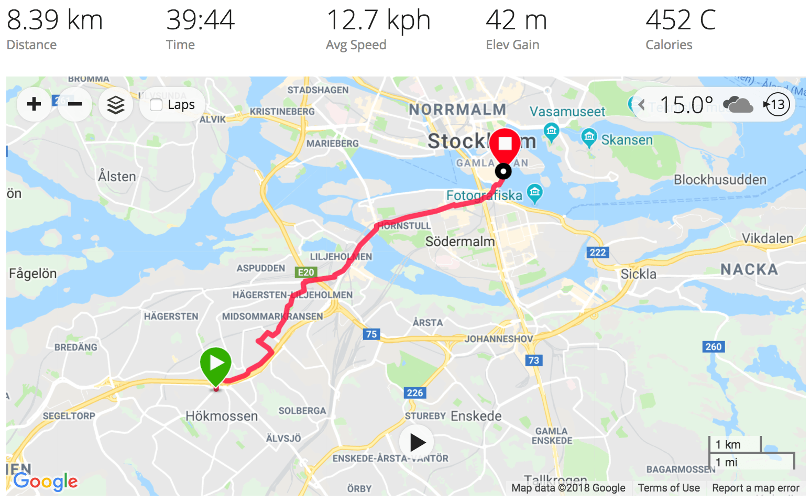
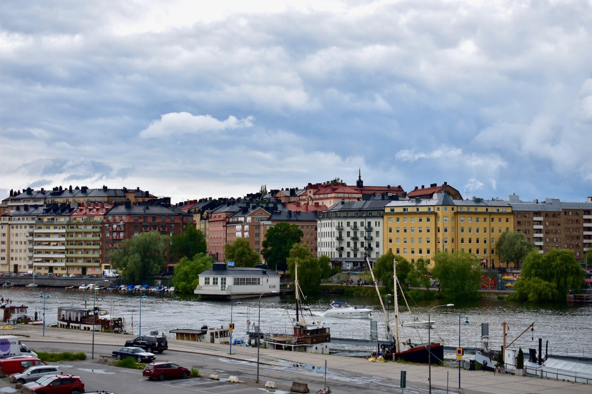
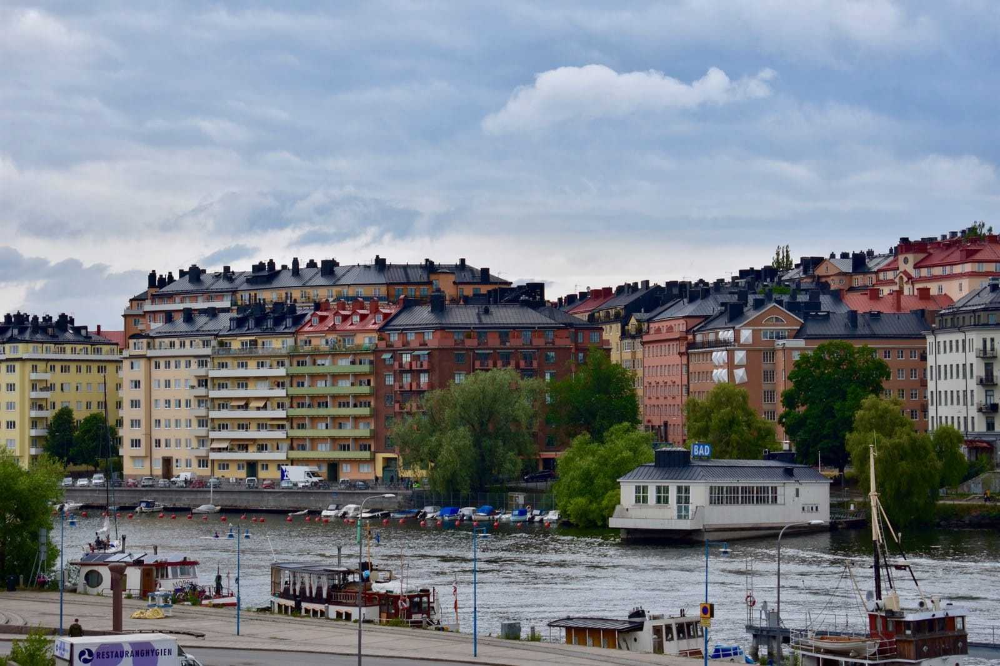
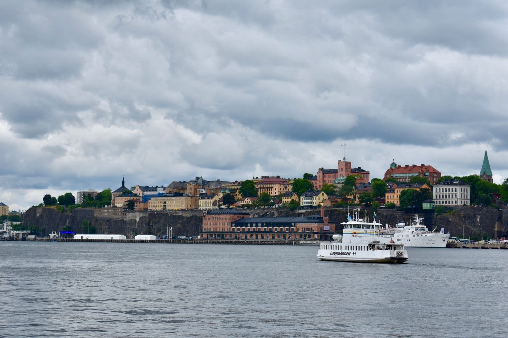
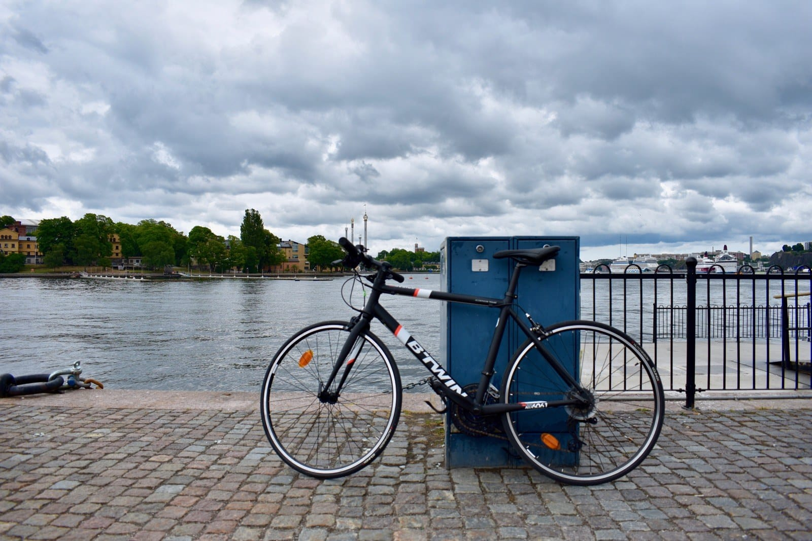
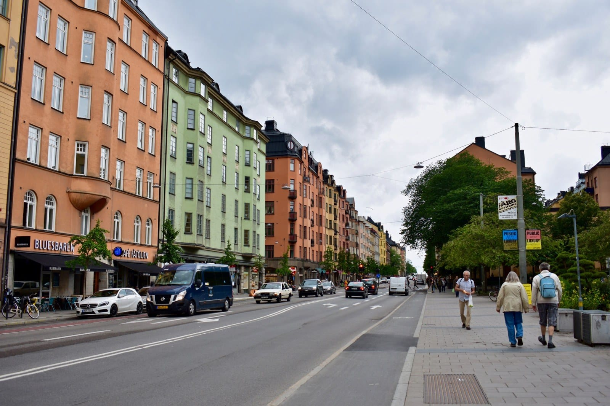
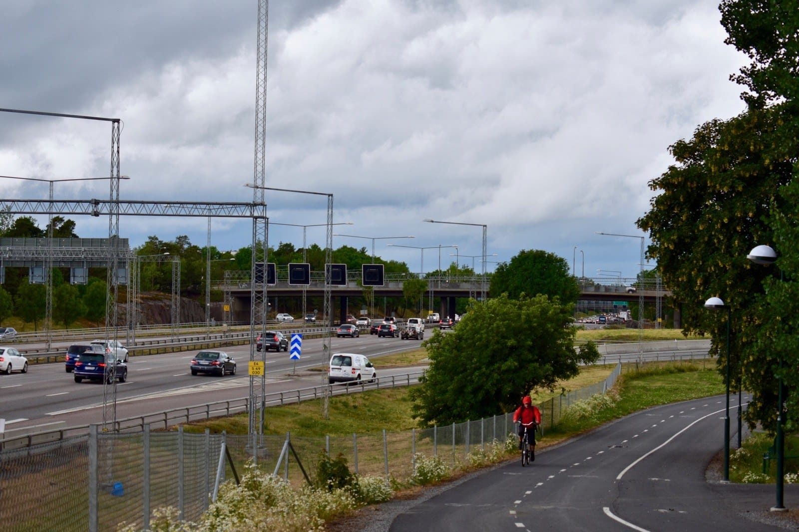

Meski cuaca mendung dan diramalkan akan hujan pada sore harinya, tiba-tiba saya memiliki dorangan impulsif untuk bersepeda hari ini. Hitung-hitung membakar lemak, mengingat postur badan saya yang kian bongsor.

Namun sayang, kedua ban sepeda saya sudah kempis. Gerigi dan rantainyapun kering sudah. Maklum saja, hampir setahun sepeda ini terbengkalai tak terpakai. 🙈

Beruntung saya masih menyimpan pompa dan pelumas rantai di rumah. Pagi tadi saya sempatkan untuk memperbaiki sepeda agar siap di*gowes*. Lalu tepat pukul dua siang tadi akhirnya saya mengayuh sepeda kembali!

Untuk ukuran musim panas, suhu di luar cukup dingin: 15 derajat Celsius. Saya pun sudah bersiap dengan mengenakan dua rangkap kaus dan dua rangkap celana panjang. Tak lupa jaket tambahan saya bawa di dalam tas untuk mengantisipasi cuaca Stockholm yang bisa berubah drastis.

Awalnya saya hanya berencana untuk bersepeda hingga Södermalm, namun rupanya lutut saya masih sanggup mengayuh sedikit lebih jauh hingga Gamla Stan. Total jarak yang harus saya tempuh untuk pulang-pergi antara rumah dan Gamla Stan adalah 17 kilometer. Permulaan yang baik. Semoga saja saya tetap konsisten menjalankannya.

