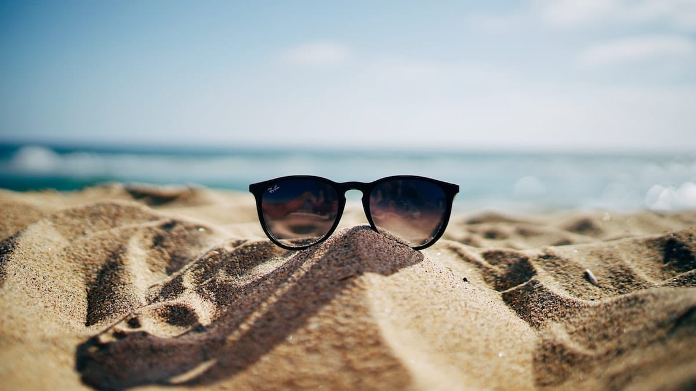
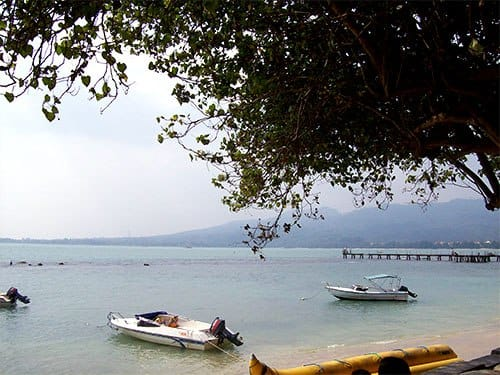
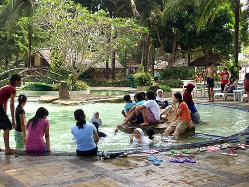
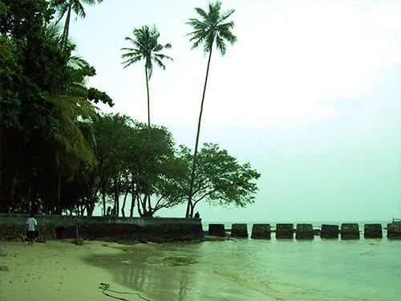
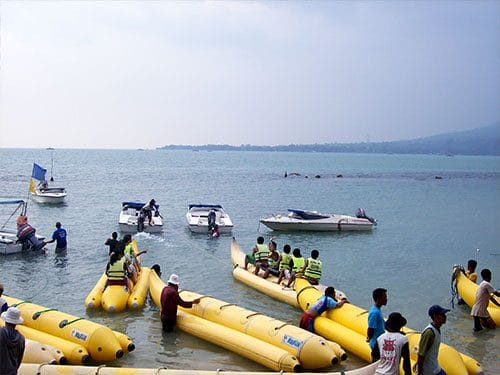
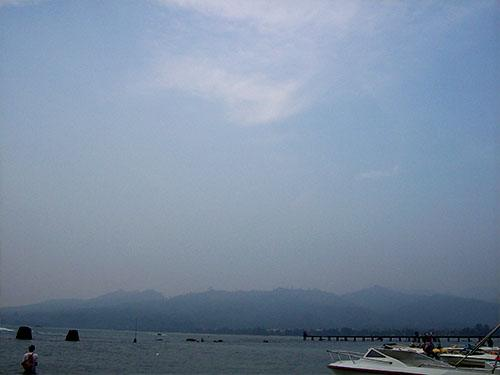

Angin berhembus membawa aroma laut yang segar. Sepoinya seolah menjadi obat penawar atas teriknya sinar mentari. Suguhan bentang alam yang memukau seketika menghapus kejenuhan kami selama belajar di sekolah.

Saat itu tahun 2007, aku bersama seluruh teman-teman seangkatan mengadakan tur budaya ke Banten. Salah satu objek wisata yang menjadi tujuan kami adalah Pantai Carita. Pantai yang terletak di Kabupaten Pandeglang ini memiliki hamparan pasir pantai yang putih. Karena merupakan bagian dari perairan Selat Sunda, debur ombak sepanjang garis pantai pun sangat tenang. Apabila cuaca sedang cerah, kita bisa melihat Gunung Anak Krakatau di laut lepas.

Selama di Banten kami menginap di Mutiara Carita, sebuah pondok. Mutiara Carita memiliki sejumlah pondok inap yang unik, mulai dari pondok dengan bilik-bilik bambu hingga bangunan-bangunan bernuansa hotel berbintang. Fasilitas di pondok Mutiara Carita pun terbilang lengkap, mulai dari ruang untuk rapat, *hall* luas yang dapat menampung banyak pengunjung, kolam renang, sampai meja biliar tersedia di sini.

Selain fasilitasnya yang cukup lengkap, Mutara Carita berada tepat di bibir Pantai Carita. Tembok beton serta pemecah-pemecah ombak yang mengelilingi pondok, membuat pantai di sini terkesan lebih *private*. Pepohonan pun tumbuh rindang di sini, menjadikan suasana terasa lebih teduh. Di bibir pantai pohon-pohon kelapa pun tumbuh subur. Kala angin berhembus daun-daunnya doyong bergerak melambai, seolah mengajak para pengunjung untuk turut bersuka cita.

Pengelola pondok Mutiara Carita pun bekerja sama dengan warga sekitar pesisir Carita. Beberapa warga kini beralih profesi menjadi pemandu wisata air di sini. Mereka menyediakan sarana permainan seperti *Banana Boat*, Jetski, hingga *Speed Boat*. Dengan membayar sejumlah rupiah, pengunjung dapat menikmati fasilitas-fasilitas permaianan air tersebut.

Berkunjung ke Pantai Carita tentu menjadi wisata bahari alternatif. Selain keasrian pantainya, fasilitas pendukung pariwisata di pantai ini sudah cukup memadai. Sangat cocok untuk menghabiskan waktu bersama keluarga ataupun kolega.

Foto cover dari [Unsplash](https://unsplash.com/photos/SYx3UCHZJlo) oleh [Ethan Robertson](https://unsplash.com/@ethanrobertson).

