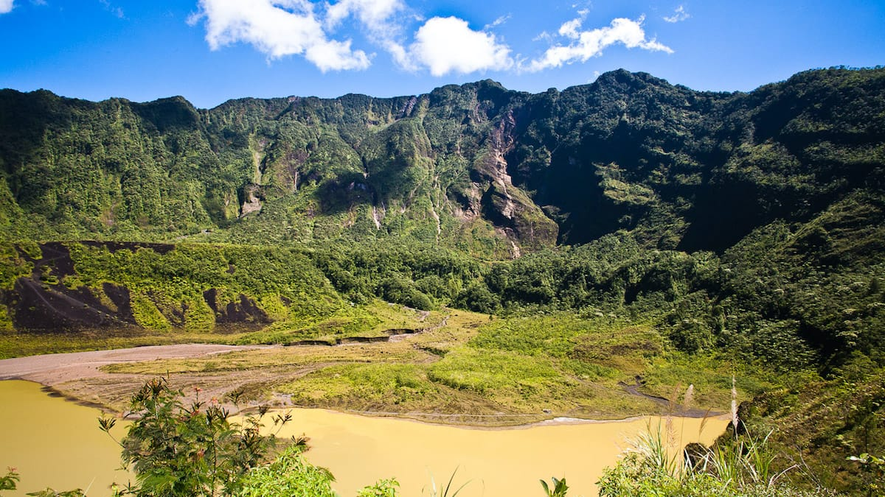
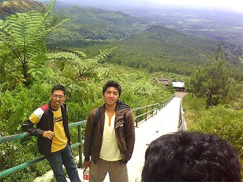
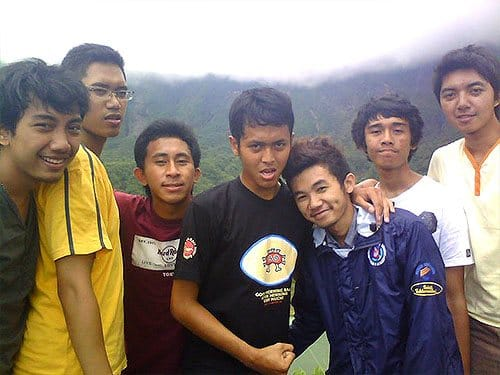
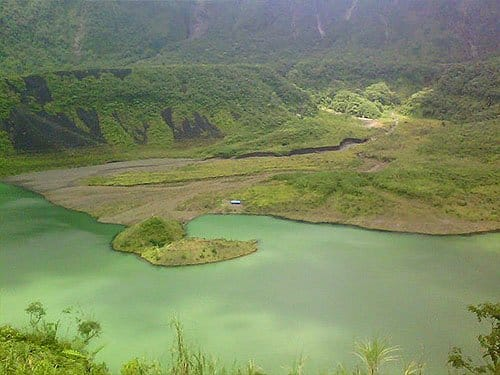
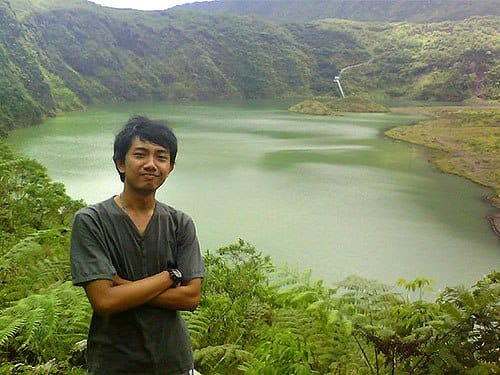
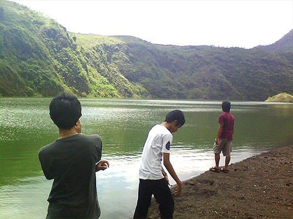

Roda motor terantuk-antuk melibas batu-batu sebesar kepala orang dewasa. Jok motor pun ikut berayun keras. Naik-turun menyiksa bokongku. Sesekali aku bermanuver. Meliuk-liukan motor menghindari kubangan air yang tercecer di sepanjang jalanan berpasir ini. Tak jarang ketangkasanku diuji. Aku harus memacu laju motor untuk menyalip truk-truk pasir di jalanan yang rusak dan becek karena hujan semalam. Mungkin tak jadi soal jika motor yang kugunakan adalah *motorcross* dengan ban kembang tahu-nya. Sayangnya motor yang kugunakan adalah skuter bertransmisi otomatis, alias skutik. Itupun sudah uzur dan tidak pernah diservis.

Dengan menggunakan motor, pagi itu aku dan teman-temanku pergi untuk menjelajah Gunung Galunggung. Kami bertolak dari Kota Tasikmalaya, setelah malam sebelumnya menginap di rumah kawan kami yang memang asli orang Tasik. Pagi itu Gunung Merapi di Jawa Tengah masih terus meletupkan material vulkaniknya, bahkan abu letusannya hinggap hingga ke Tasikmalaya. Meski begitu kami tetap saja melakukan perjalanan ke Gunung Galunggung yang juga tergolong gunung berapi aktif.

Salah satu akses menuju Gunung Galunggung adalah dari daerah Indihiang. Di antara ruas jalan raya Bandung—Tasik, terdapat jalan pedesaan yang mengarah ke Selatan di sekitar daerah Indihiang tersebut. Di awal perjalanan, kondisi jalannya masih relatif mulus. Namun semakin jauh ke dalam, jalanan semakin rusak. Mulai dari jalan aspal, kemudian jalan makadam, lalu jalanan berpasir, hingga jalanan berbatu. Truk-truk pengangkut pasir pun berseliweran memakan lebar jalan. Meski begitu pemandangannya sangat cantik: kolam-kolam ikan milik warga, hamparan pesawahan luas, serta bayang-bayang Gunung Galunggung yang hijau di depan mata.

Sesampainya di gerbang kawasan Gunung Galunggung, kami pun disambut oleh sebuah tanjakan yang sangat curam dan sangat panjang. Selepas tanjakan tajam tersebut, jalanan menanjak yang berkelok di sepanjang lereng gunung segera menyusul. Gunung berapi dengan ketinggian 2.167 mdpl itu memang sudah memiliki akses jalan beraspal untuk menuju puncaknya. Sepanjang jalan menuju puncak tersebut, mata kami disuguhi hijaunya hutan tropis yang tumbuh lebat di lereng-lereng gunung. Belum lagi udara dingin gunung yang menyejukan tubuh, sangat menyenangkan!

Untuk benar-benar mencapai puncak Galunggung dan melihat kawahnya, kami masih harus meniti tangga beton yang menjulang tinggi. Dengkul kaki yang prima benar-benar diperlukan untuk menaklukan anak tangga yang jumlahnya lebih dari 600 buah itu. Namun setelah mencapai puncaknya, semua kelelahan itu akan lunas terbayar.

Dari Puncak Galunggung, keindahan alam yang tiada duanya terhampar sejauh mata memandang. Deretan pegunungan yang hijau, Kota Tasik yang bergeliat di kejauhan, dinding Kawah Galunggung yang megah, serta danau eksotis di dasar kawahnya.

Danau berwarna kehijauan di dasar Kawah Galunggung terbentuk karena genangan air hujan yang tertampung. Karena airnya tawar, beberapa jenis ikan hidup di danau ini. Debit air danau pun diatur oleh sebuah pintu air. Pintu air ini akan mengalirkan air danau ke sungai-sungai untuk mencegah jebolnya dinding kawah karena debit air yang berlebih.

Pengunjung dapat pula turun hingga ke dasar kawah. Ada sebuah jalan setapak yang menurun dan berbatu di sisi kawah. Jalan kecil yang biasa disebut "turunan zorro" ini meliuk curam seperti membentuk huruf "Z". Ketika melewatinya harus ekstra hati-hati, karena tanah di jalan kecil tersebut sangat labil.

Di kawasan Gunung Galunggung juga terdapat pemandian air panas yang tepat berada di pinggiran tebing curam. Pemandian air panas tersebut menyediakan kolam terbuka, kolam renang, serta beberapa bilik kamar dengan bak rendam. Setelah capai naik-turun tangga di Puncak Galunggung, relaksasi dengan berendam air panas tentu menjadi pilihan yang sangat tepat. Untuk memanjakan perut, beberapa warung makan juga tampak berjejer tak jauh dari pelataran parkir pemandian.

Foto cover dari [Flickr](https://www.flickr.com/photos/buitenzorger/8035404797/in/photostream/) oleh [buitenzorger](https://www.flickr.com/photos/buitenzorger/).
