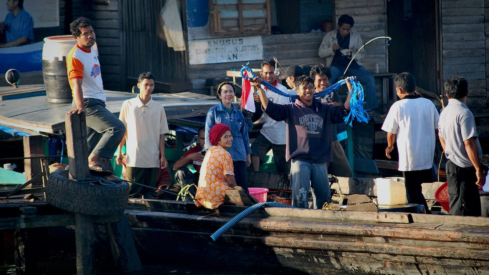
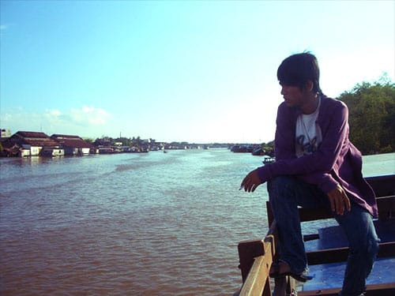
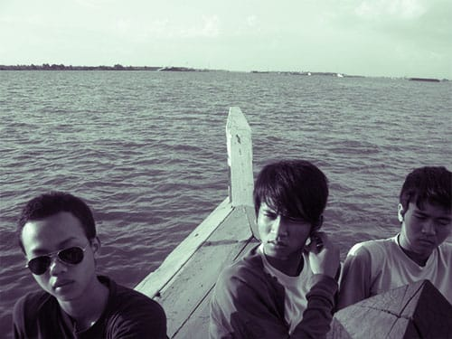
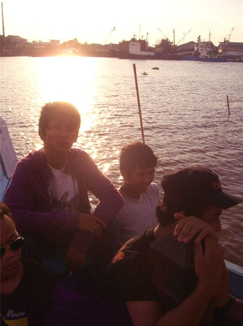

Bila hutan adalah paru-parunya, maka sungai adalah urat nadinya. Kehidupan di Kalimantan tidak bisa dilepaskan dari keberadaan sungai. Denyut masyarakat Kalimantan bermula dari sungai-sungai yang membelah dan mengurat di tanah Borneo ini. Warga memanfaatkan sungai sebagai sumber air dan sarana transportasi utama. Pun begitu dengan Sungai Barito.

Sungai Barito yang mengular dari Pegunungan Muller di Kalimantan Barat hingga Muara Banjar di Kalimantan Selatan menjadi nadi kehidupan di kedua provinsi ini. Sungai dengan panjang 900 km ini benar-benar lebar dan luas. Bahkan lebarnya nyaris mencapai 1 km! Oleh karenanya tidak heran jika kita bisa menemui kapal-kapal besar berlabuh di sungai ini.

Selama di Kalimantan Selatan, kami berkesempatan untuk menyusuri Sungai Barito beberapa kali. Berawal dari Banjarmasin, kami menyusuri perairan Sungai Barito hingga berlabuh di deltanya: Pulau Kembang. Pulau Kembang ini terbentuk dari endapan pasir di muara Sungai Barito. Uniknya Pulau Kembang ini dihuni oleh ratusan monyet ekor panjang (*Macaca Fascicularis*).

Kami pun berkesempatan untuk berkunjung ke pasar apung di pagi hari. Puluhan sampan yang memadati perairan Sungai Barito menjajakan berbagai produk pertanian dan berbagai panganan khas Banjar. Kami pun menyempatkan diri untuk sarapan di Pasar Apung. Mencoba berbagai makanan khas, salah satunya adalah soto Banjar.

Selain ke Pulau Kembang dan Pasar Apung, kami pun menyusuri anak-anak Sungai Barito. Dengan menggunakan perahu klotok—sampan berukuran sedang dengan mesin tunggal di bagian buritan—kami menyusuri aliran-aliran anak Sungai Barito. Saat itu aku seperti tengah berada di Venesia, namun tentu saja dengan cita rasa Indonesia. Di kiri dan kanan sungai berdiri rumah-rumah penduduk yang terbuat dari kayu ulin (*Eusideroxylon zwageri*). Selang setiap beberapa meter ada jembatan kayu yang menjadi penghubung antarsisi sungai.

Sepanjang sungai kita pun bisa mengamati geliat masyarakat yang benar-benar menggantungkan hidupnya dari keberadaan Sungai Barito. Air sungai menjadi sumber air utama untuk keperluan minum, mandi, mencuci, bahkan (maaf) buang air. Sungguh miris mengingat aliran air Sungai Barito ini terbilang kotor dan tidak layak untuk dikonsumsi. Sebuah pengalaman hidup yang tidak terlupakan.

Foto cover dari [Flickr](https://www.flickr.com/photos/jason_weemin/2793357926/in/photostream/) oleh [Jason D’ Great](https://www.flickr.com/photos/jason_weemin/).
