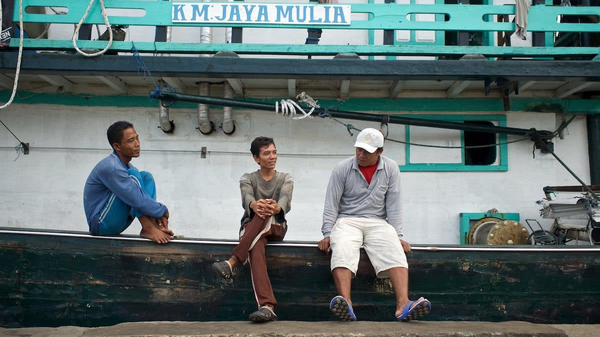
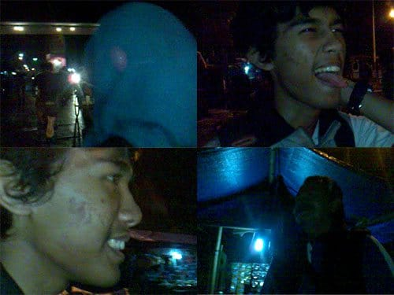
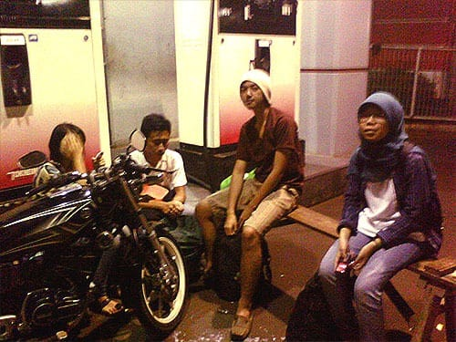

Sayup-sayup suara adzan subuh menggema tepat saat kami turun dari mikrolet. Jalanan gelap, tidak ada satu pun lampu jalan yang berfungsi. Kami pun terpaksa menggulung celana panjang kami karena jalanan yang becek, seolah habis disiram hujan lebat. Kami sampai di tepian Teluk Jakarta, Muara Angke.

Tempat pelelangan dan pasar ikan ini riuh ramai. Orang-orang bersepatu bot hilir mudik mengusung gerobak berisi ikan-ikan segar. Ratusan bahkan ribuan boks berisi ikan bertumpuk, berjejer di kiri dan kanan jalan. Beberapa pedagang menggelar dagangannya di bawah keremangan lampu pijar. Bau anyir menyeruak dari segala penjuru, membuat perutku mual.

Cukup lama kami berjalan, namun dermaga kapal tidak juga terlihat. Sampai akhirnya di ujung pasar—tidak jauh dari pom bensin—terdapat sebuah lorong besar. Lorong besar yang becek, kusam, dan gelap. Lorong ini yang aku lihat dalam reportase wisata Pulau Tidung kemarin. Kami menyusuri lorong yang panjangnya tak lebih dari 10 meter itu. Sambil melompat-lompat menghindari kubangan air, kami sampai di ujung lorong yang lain. Ada sebuah dermaga di sana. Dermaga Muara Angke.

Tidak seperti yang kubayangkan. Dermaga ini sangat kecil, sangat suram. Lebar bibir dermaganya mungkin tidak sampai 5 meter, itu pun sudah diriuhi oleh tenda-tenda warung kopi. Kapal-kapal yang bersandar pun kecil-kecil. Dan tidak ada penerangan sama sekali.

Kami bertanya-tanya tentang kapal menuju Pulau Tidung pada orang-orang di sekitar dermaga. Tidak ada yang tahu.

"Kalau kapal menuju Pulau Pramuka nanti berangkat jam tujuh", jawab seorang bapak-bapak.

Kami pun bertemu dengan sekelompok pelancong lainnya.

"Kemana mas?", tanya pemuda berambut gondrong yang tengah duduk di atas kabin nahkoda.

"Pulau Tidung!", jawab kami.

"Wah sama kalo gitu", jawab mereka.

"Ini kapal yang ke Tidung?", tanyaku kepada mereka.

"Bukan. Gak ada kapal yang langsung ke Tidung. Ke Pramuka dulu, dari sana disambung lagi", jawab si gondrong.

Kami pun berpamitan kepada mereka. Aku masih yakin kalau ada kapal yang langsung menuju Pulau Tidung dari sini. *Wong* aku lihat liputannya. Kami pun berjalan terus ke ujung dermaga. Kembali kami menanyakan kapal ke Tidung kepada seorang bapak yang tengah asyik mengopi di sebuah tenda.

"Pulau Tidung? Itu kapalnya! Tuh yang di sebelah sana!" si Bapak menunjuk ke arah kapal berwarna biru

"Oh, jam berapa berangkatnya Pak?" tanya kami.

"Jam 7. Tapi nanti jam 6 kesini aja, takutnya keburu penuh." saran si Bapak kepada kami.

Kami pun berterima kasih dan beranjak pergi ke Pom Bensin. Kami berniat untuk memberitahu kawanan si Gondrong, tetapi mereka sudah tidak di ada tempat. Entah pergi kemana.

Ada sebuah Pom Bensin tepat bersebelahan dengan dermaga Muara Angke. Pom Bensin ini tampak diperuntukan untuk kapal-kapal. Ada sebuah mini market kecil, kamar mandi, dan mushola. Ya, ada mushola dan beberapa sejadahnya! Ah, kenapa semalam kami tidak bermalam di sini, pasti lebih nyaman.

Kami mandi ala koboy dan gosok gigi, tidak lupa sembahyang di mushola Pom Bensin. Sejurus kemudian, serombongan muda-mudi datang turut sembahyang. Nampaknya mereka pun akan berpelesir ke Pulau Tidung. Kami sarapan, mengisi perut yang keroncongan dengan gumpalan-gumpalan roti dan biskuit. Lebih bertenaga rasanya.

Hari perlahan semakin terang. Jam enam tepat kami kembali ke dermaga. Kami memilih-milih tempat duduk yang nyaman. Kapal masih sepi, hanya ada beberapa penumpang. Kami duduk di dek bagian atas yang masih basah oleh embun. Kami siap mengarungi laut!

Foto cover dari [Flickr](https://www.flickr.com/photos/hendrik_mintarno/23399967143/in/photostream/) oleh [Hendrik Mitarno](https://www.flickr.com/photos/hendrik_mintarno/).
