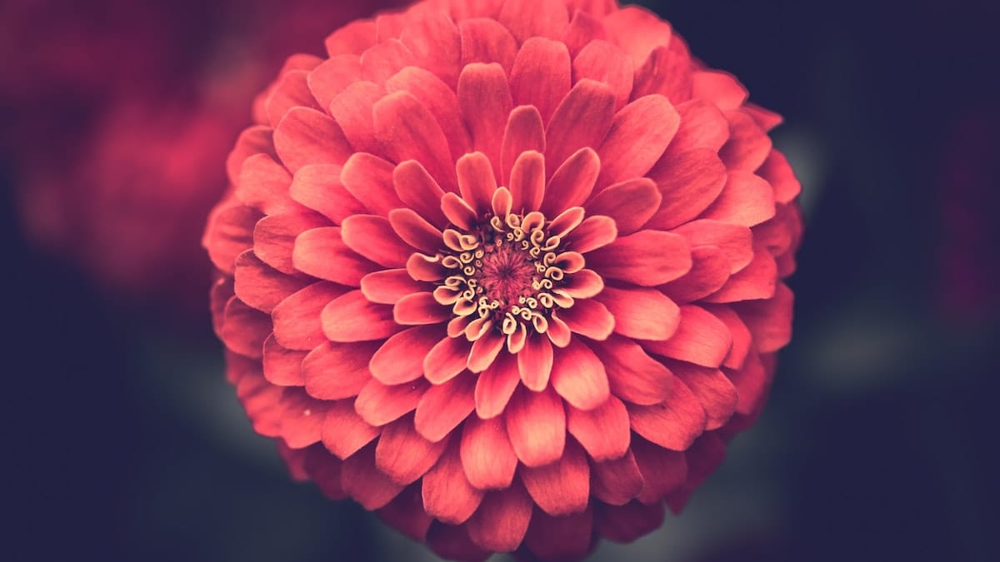

Sebenarnya ada yang sedikit mengganjal pagi itu. Pintu kamar-kamar di penginapan tertutup rapat semua. Gorden-gordennya pun rapat menutupi kaca jendela kamar yang kehitaman. Lampu pijar yang kuning keremangan tampak menyala di dalam deretan kamar-kamar itu. Dan kini ada beberapa sepeda motor terparkir di lorong penginapan yang sempit. Padahal kami sangat yakin, semalam hanya kami yang menginap di penginapan ini.

Akupun penasaran. Aku berjalan mengendap-ngendap ke kamar mandi yang ada di ujung lorong penginapan. Melewati deretan kamar-kamar yang kini tertutup rapat. Di ujung lorong, samar-samar terdengar suara ranjang berdecit dari dalam kamar. Rupanya memang ada orang di dalamnya. Suara decitnya berirama. Terdengar seperti ketukan bertempo tinggi. Pikiranku pun melambung, menerka-nerka sebab-musabab suara decitan bertempo tinggi itu. Tentang apa yang kupikirkan saat itu tak perlu kuceritakan di sini bukan?

Aku pun bergegas kembali ke dalam kamar, menemui teman-temanku. Mereka tengah sibuk mengemasi barang-barang mereka ke dalam tas. Beberapa tengah asyik mengunyah *cracker* dan menyesap susu coklat. Aku menceritakan tentang apa yang kudengar di ujung lorong penginapan. Beberapa dari temanku turut memastikan bahwa apa yang kudengar bukan fantasi belaka. Setelah turut mengendap-ngendap ke ujung lorong penginapan, mereka pun mendengar suara decitan bertempo tinggi persis seperti yang aku ceritakan. Kami pun kembali menerka-nerka tentang apa yang terjadi di dalam kamar itu.

Tak lama kami pun berhenti menerka-nerka sumber bunyi decitan itu. Kami sibuk mengemasi barang-barang kami. Tidak lama kemudian wanita paruh baya berlenggok dari lorong penginapan. Pakaiannya ketat memperlihatkan bentuk tubuhnya yang boleh dibilang bongsor. Rambutnya basah sehabis keramas. Ia miringkan kepalanya, membiarkan rambutnya yang panjang tergerai. Perlahan-lahan ia keringkan rambutnya itu dengan selembar handuk kecil. Pikir kami pun kembali melayang. Terkaan kami semakin kuat. Ah, lucu juga kami bisa sampai terdampar di penginapan seperti ini.

Sementara itu diluar Pak Budi—sopir angkot yang kami sewa kemarin—sudah memarkirkan angkot kuning bergaris birunya. Dengan asyik ia meminum sebotol minuman soda di warung depan penginapan. Akupun menghapirinya, mengutarakan rencana kami hari ini untuk menyambangi Amanda Ratu, Curug Cikaso, dan kembali lagi ke Surade.

Foto cover dari [Unsplash](https://unsplash.com/photos/FlUbZ-2S014) oleh [Chris Hayashi](https://unsplash.com/@alexb).
