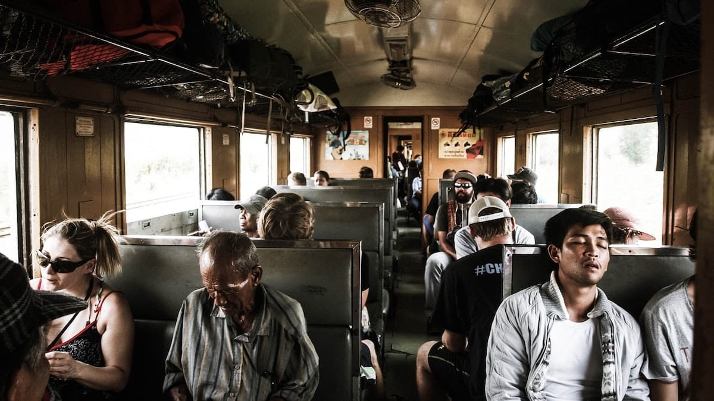
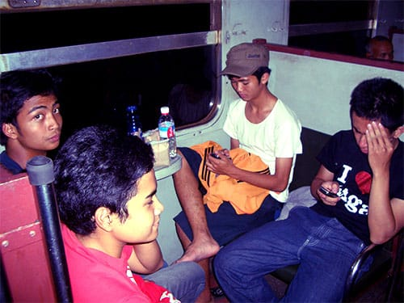
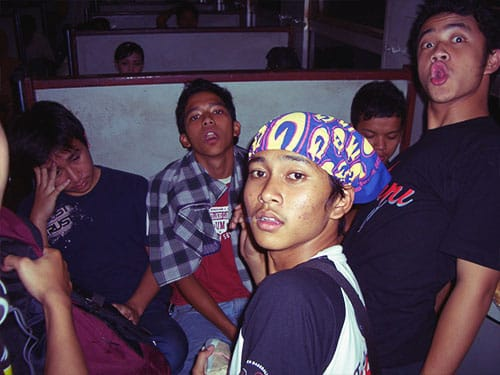
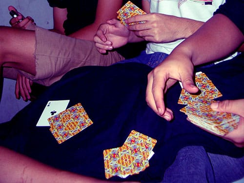
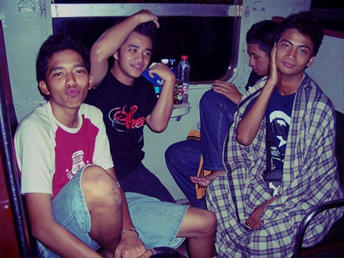
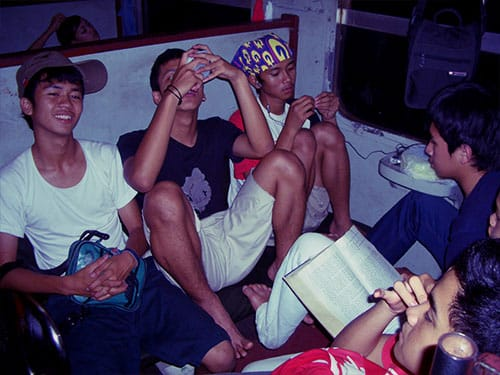
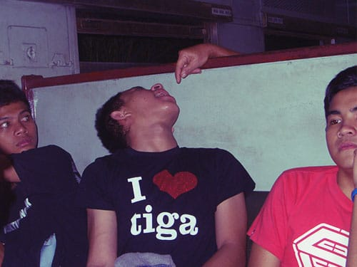
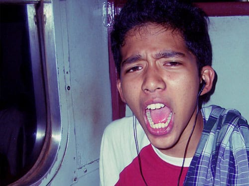
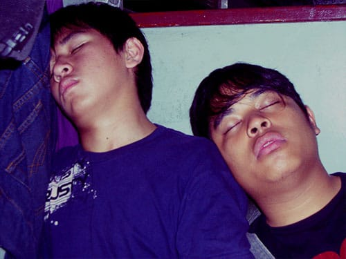

Kereta api yang kami gunakan untuk mencapai Jogja bernama Kahuripan. Kereta Kahuripan ini merupakan kereta kelas ekonomi yang melayani jalur Padalarang di Jawa Barat hingga Kediri di Jawa Timur. Kala itu harga tiketnya sendiri hanya 24 ribu rupiah saja. Terbilang sangat murah.

Kereta ekonomi ini berhenti hampir di setiap stasiun kecil, sehingga waktu tempuhnya pun sangatlah lama. Belum lagi kereta kasta terendah ini harus mengalah pada kereta bisnis atau kereta eksekutif yang akan melintas. Kami berangkat dari Stasiun Kiaracondong sekira pukul 8 malam. Dan baru sampai Jogja sekira pukul 7 pagi. Hampir 10 jam!

Ini adalah pengalaman pertamaku naik kereta ekonomi. Rasanya sungguh tidak terlupakan. Duduk di atas jok kursi yang sangat tipis. Sandaran kursi yang tegak. Orasi para pedagang yang tiada hentinya. Kecoa-kecoa yang bergentayangan, serta asap rokok yang mengepung. Beruntung saya pergi bersama anak-anak Belitung Merantau yang jenaka.

## Melewatkan malam di atas kereta

Malam di atas kereta terasa sangat panjang. Kami mengalami kesulitan untuk tidur, karena bentuk kursi yang tidak manusiawi serta teriakan para pedagang sepanjang perjalanan. Kami melewatkan malam dengan *ngobrol ngalor-ngidul*, SMS-an, mendengarkan musik, membaca, *bengong*, dan main kartu.

Berjam-jam di atas kereta akhirnya sukses membuat kami kehilangan akal sehat. Perut yang kelaparan, ditambah angin yang menerobos dari jendela kereta—yang sulit ditutup—membuat diriku kalap. Jemari penumpang lain hampir akan kumakan. Beruntung teman-teman mengingatkanku.

Lamat-lamat suara roda-roda kereta yang bergesekan dengan rel mampu menghipnotis kami. Orasi-orasi penjaja makanan dan minuman pun kini lebih terdengar seperti lagu pengantar tidur. Kami pun terlelap.

Foto dari [Unsplash](https://unsplash.com/photos/_1CaJEQcUBM) oleh [Braden Barwich](https://unsplash.com/@braden_barwich).
