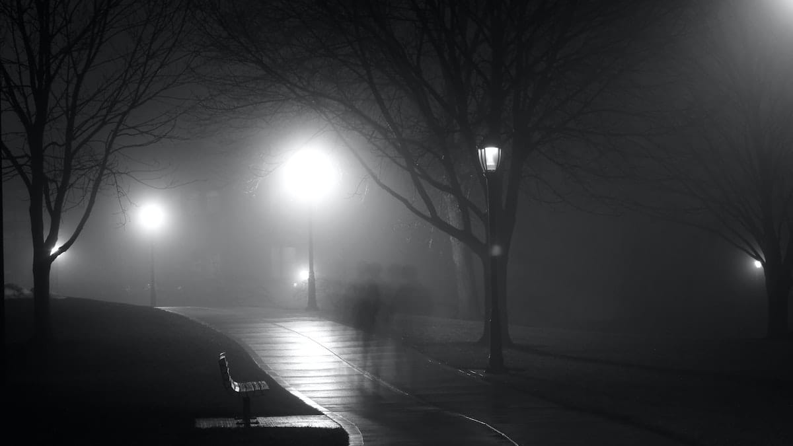

Kurasa Malam lupa untuk membawakanku sepiring kantuk. Pastinya ia terlalu sibuk mencari-cari gemintang yang bersembunyi di ketiak Awan Mendung. Lihat saja ia tampak semakin muram tanpa Bintang-Bintang yang genit itu.

Pasalnya kemarin ia telah berjanji padaku: "Besok akan kubawakan kau sepiring kantuk, lantas akan kuantarkan kau ke Kota Mimpi!"

Nyatanya?

Coba kau lihat si Jam Dinding sialan itu! Berputar menjengkelkan. Mengolok-olok tiada hentinya. Apa salahnya jika aku mengaduh pada Secangkir Kopi? Toh Malam pun lupa akan janjinya padaku. Ia terlalu sibuk mengurusi Bintang-Bintang centil itu.

Rinai hujan menguarkan aroma rindu yang pekat. Menggugahku untuk membisikan sebait cinta pada angin yang membawanya. Berharap ia akan berhembus ke seberang lautan, di mana rindumu berlabuh di tepian malam.

Foto cover dari [Unsplash](https://unsplash.com/photos/ZmBnq7ui6mU) oleh [Jesse Bowser](https://unsplash.com/@jessebowser).
