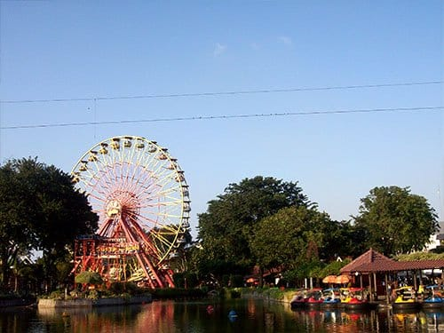
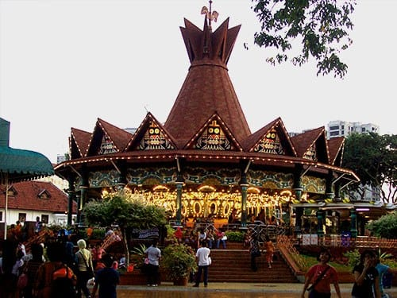
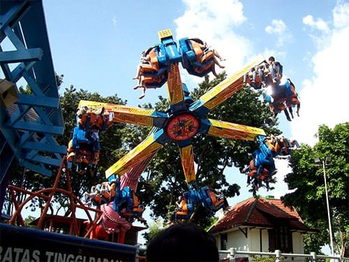
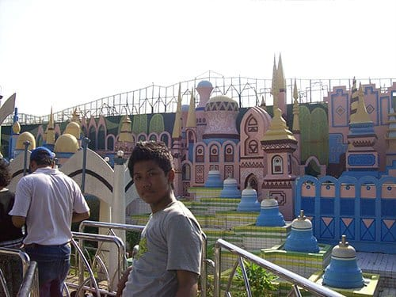

Siapa yang tidak kenal Dufan? Taman rekreasi yang berada di bilangan Ancol, Jakarta ini menjadi primadona tempat wisata favorit bagi warga Jakarta dan kota sekitarnya. Dufan atau Dunia Fantasi ini merupakan bagian dari kawasan wisata terpadu Taman Impian Jaya Ancol.

Dufan menawarkan tempat hiburan yang menyenangkan bagi semua umur: dari anak-anak, remaja, sampai orang dewasa. Di sana disediakan berbagai wahana menarik bagi pengunjungnya: mulai dari yang bernuansa edukasi, petualangan, *thriller*, ketangkasan, hingga wahana-wahana yang menguras adrenalin.

Wahana Niagara misalnya, pengunjung dibawa oleh sebuah kereta berbentuk kayu untuk mengarungi aliran air. Di ujung aliran air terdapat jalur luncuran tinggi yang menukik tajam. Kereta yang membawa penumpang akan melesat dari ketinggian dan membelah genangan air di bawahnya. *Byuuur*!

Salah satu wahana favorit di Dufan lainnya adalah Kicir-Kicir. Wahana ini akan memutar-mutar kursi penumpang di udara. Tidak puas memutar-mutar kursi penumpang, wahana ini akan membolak-balikan posisi tubuh anda. Lain halnya dengan Bianglala, wahana kincir raksasa ini berputar perlahan membawa pengunjungnya menikmati Dufan dari ketinggian. Akan sangat romantis bila anda dan pasangan anda berdua naik wahana ini. Pemandangan dari atas sungguh tidak terlupakan. Terlebih saat senja kala matahari terbenam lepas di lautan, atau saat malam tiba dengan pemandangan lampu-lampu kota yang indah.

Wahana yang tidak kalah populernya adalah Istana Boneka. Bangunan besar dengan bentuk layaknya sebuah istana ini menjadi wahana yang tepat untuk mengenalkan kebudayaan pada anak-anak. Tidak hanya budaya dari Indonesia, namun juga dari negara-negara lain di dunia. Boneka-boneka robot dalam wahana ini mengenakan pakaian khas daerah atau negaranya masing-masing. Selain itu boneka-boneka robot itu memperagakan pula kebudayaan, kesenian, hingga kebiasaan dari masing-masing daerah atau negara yang diwakilinya. Untuk menikmati wahana ini pengunjung cukup naik di atas perahu yang secara otomatis berjalan menyusuri aliran air dalam sebuah lorong.

Masih banyak wahana-wahana menarik lainya di Dufan, seperti Kora-Kora, Tornado, Halilintar, Gajah Bledug, Lorong Sesat, hingga Hysteria. Dengan harga tiket yang tidak lebih dari 200 ribu rupiah, kita sudah bisa menjajal semua wahana yang ada di Dufan sepuasnya. Cari juga informasi dari internet, karena tidak jarang ada diskon tertentu yang ditawarkan. Selamat berlibur!

Foto cover dari [Unsplash](https://unsplash.com/photos/zyU2gQ9mWLM) oleh [Ethan Hoover](https://unsplash.com/@ethanchoover).

