Nyaris empat tahun berlalu sejak pertama kali saya menginjakan kaki di tanah Swedia. Sebelumnya saya bahkan tidak pernah berpelesir jauh hingga ke luar negeri. Paspor pun sebetulnya baru saya miliki beberapa minggu menjelang keberangkatan ke Swedia. Karenanya banyak hal baru yang membuat saya berdecak kagum saat tinggal di negeri Skandinavia ini.

## Kota yang Super Bersih

Hal pertama yang membuat saya kagum akan Stockholm adalah kebersihannya. Meski saya lahir dan besar di Kota Cimahi yang konon katanya telah mendapatkan tujuh Piala Adipura 😛, kebersihan kota-kota di Swedia berada jauh di atasnya.

Saya jarang menemukan sampah yang berserakan di jalanan, trotoar, ataupun di tempat-tempat umum. Sungai dan danau pun bersih sehingga banyak di antaranya dijadikan tempat untuk berenang di musim panas. Taman-taman kota terawat dengan baik. Tempat-tempat sampah pun sangat mudah ditemukan.

Pun begitu, di Kota Stockholm saya juga sering menemukan puntung-puntung rokok berserak di tepian rel kereta. Elevator di stasiun kereta bawah tanah juga kerap bau pesing—terutama di akhir pekan.

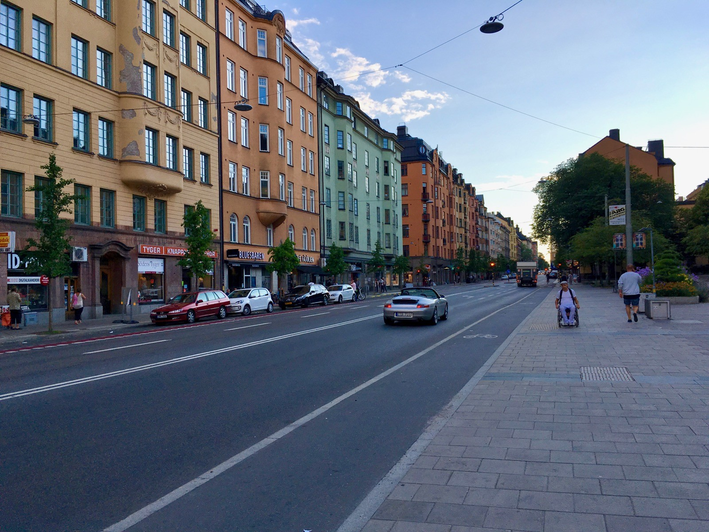

## Sistem Transportasi yang Baik

Saya sangat mengandalkan transportasi publik dan pada dasarnya saya memang senang menggunakan angkutan umum: mulai dari angkot, bus, hingga kereta api. Karenanya tinggal di Kota Stockholm yang memiliki transportasi publik yang nyaman dan dapat diandalkan menjadi berkah tersendiri.

Jaringan sistem transportasinya mencakup setiap sudut Kota Stockholm. Moda transportasinya pun beragam: mulai dari bis, *tunnelbana* (kereta bawah tanah), *pendeltåg* (kereta komuter), spårvagn atau trem, hingga kapal feri.

Armada-armadanya pun terawat dengan baik dan sangat nyaman. Dan yang paling penting: tepat waktu! Sehingga kita dapat dengan mudah memperkirakan kapan harus berangkat dan kapan akan sampai di tempat tujuan. Meski akhir-akhir ini *pendeltåg*-nya sering mengalami gangguan sinyal sehingga jadwalnya molor.

Tentu kenyamanan sistem transportasi di Stockholm ini harus dibayar dengan kocek yang cukup dalam. Untuk orang dewasa, tiket transportasi untuk 30 hari harus ditebus dengan 860 kronor—hampir 1,3 juta rupiah. Sedangkan untuk pelajar dan lansia mendapat potongan; sehingga cukup membayar sebesar 590 Kronor—sekira 900 ribu rupiah (harga dan kurs per Mei 2019).

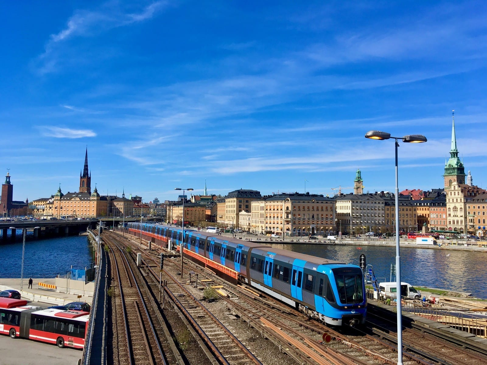

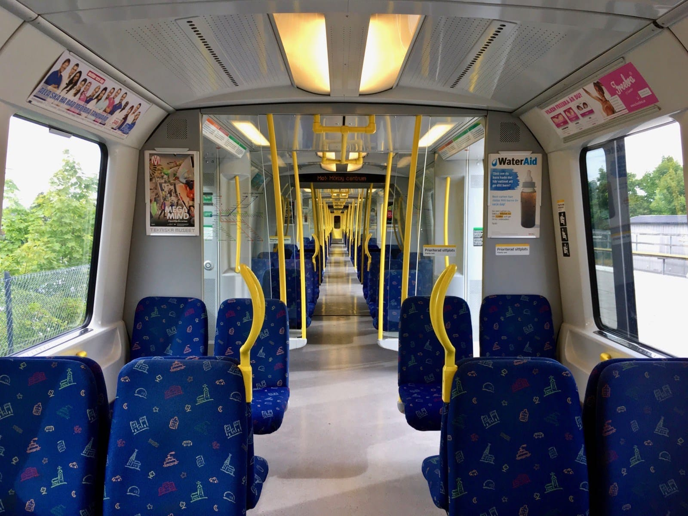

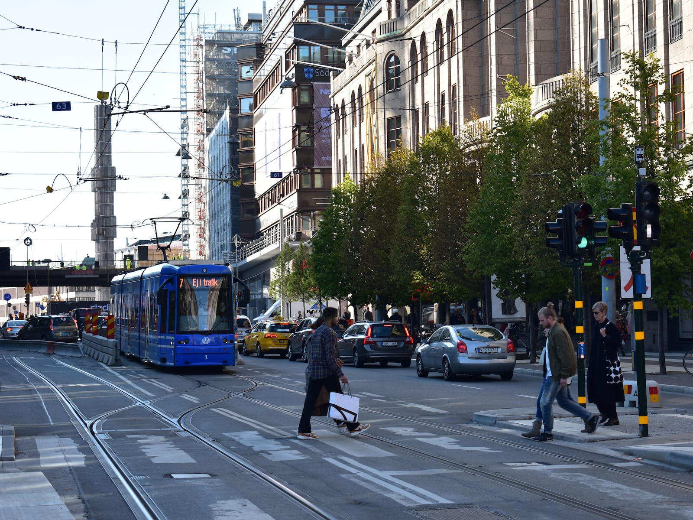

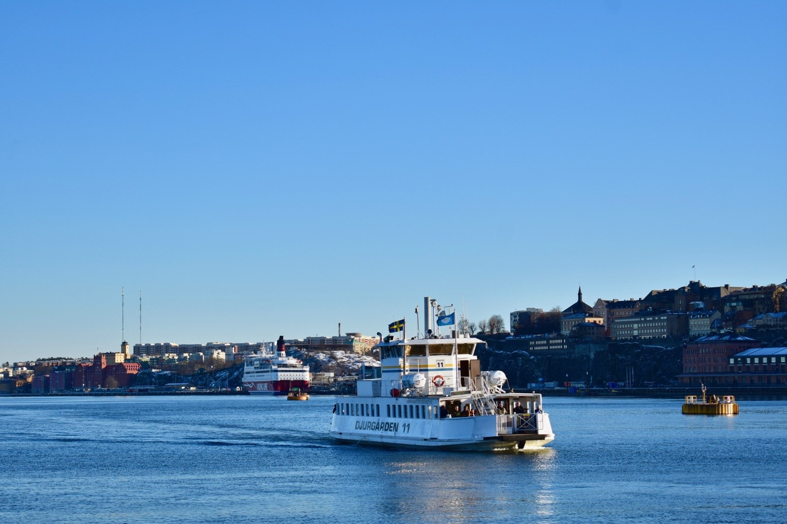

## Trotoar yang Layak

Hal lainnya yang membuat saya kagum adalah keberadaan trotoar yang layak untuk para pejalan kaki. Di mana ada jalan untuk kendaraan bermotor, di kiri dan kanannya selalu ada trotoar untuk pejalan kaki. Dan mayoritas ruas trotoarnya cukup lebar, mungkin cukup untuk menampung satu mobil. Biasanya di samping trotoar juga ada jalur khusus untuk para pesepeda.

Keberadaan trotoar yang baik ini berimbas pada tingginya jumlah pejalan kaki di Kota Stockholm. Dari data tahun 2012 lalu, 38% perjalanan di Kota Stockholm dilakukan dengan berjalan kaki. Angka ini relatif tinggi di antara kota-kota di Eropa lainnya. Bahkan untuk di pusat kota persentase perjalanan yang dilakukan dengan berjalan kaki ini mencapai hampir 54%.

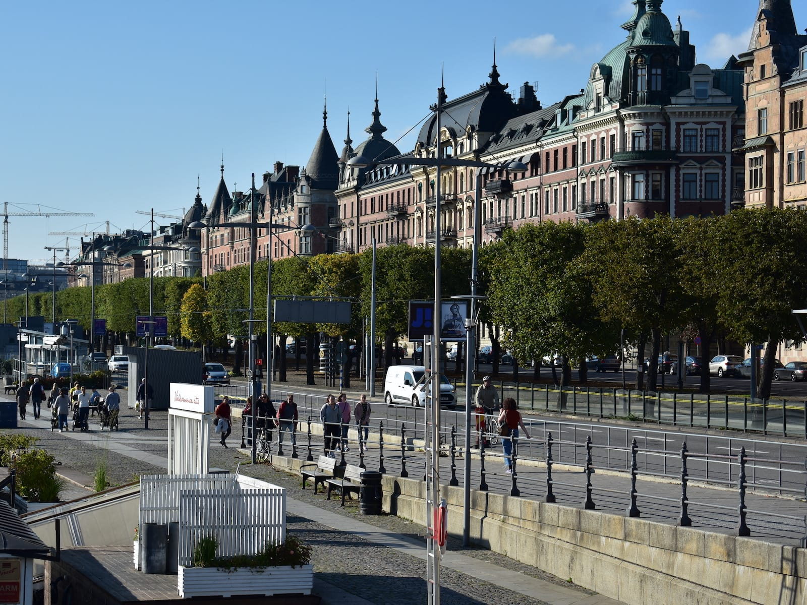

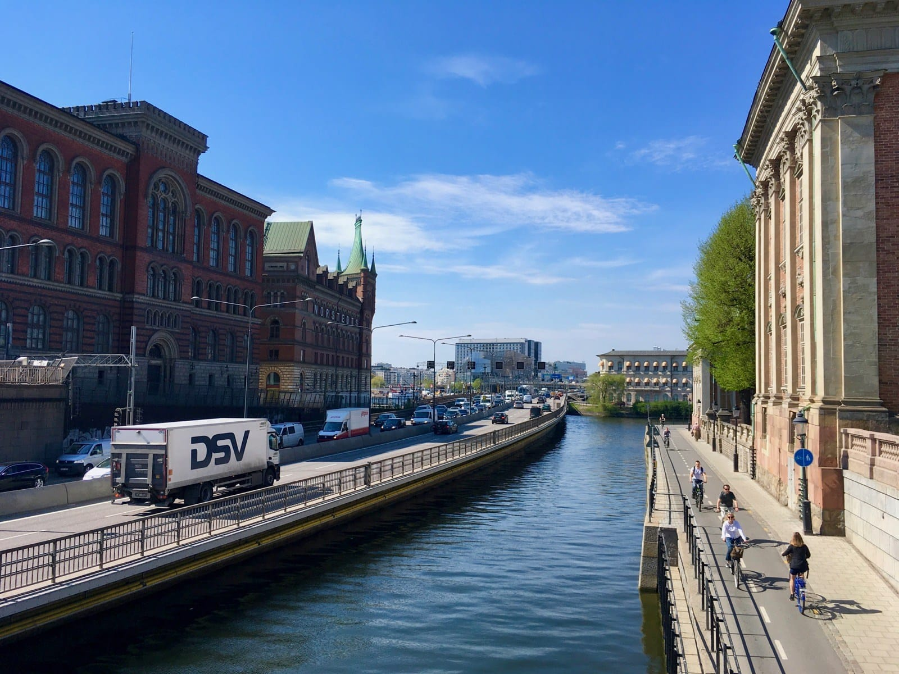

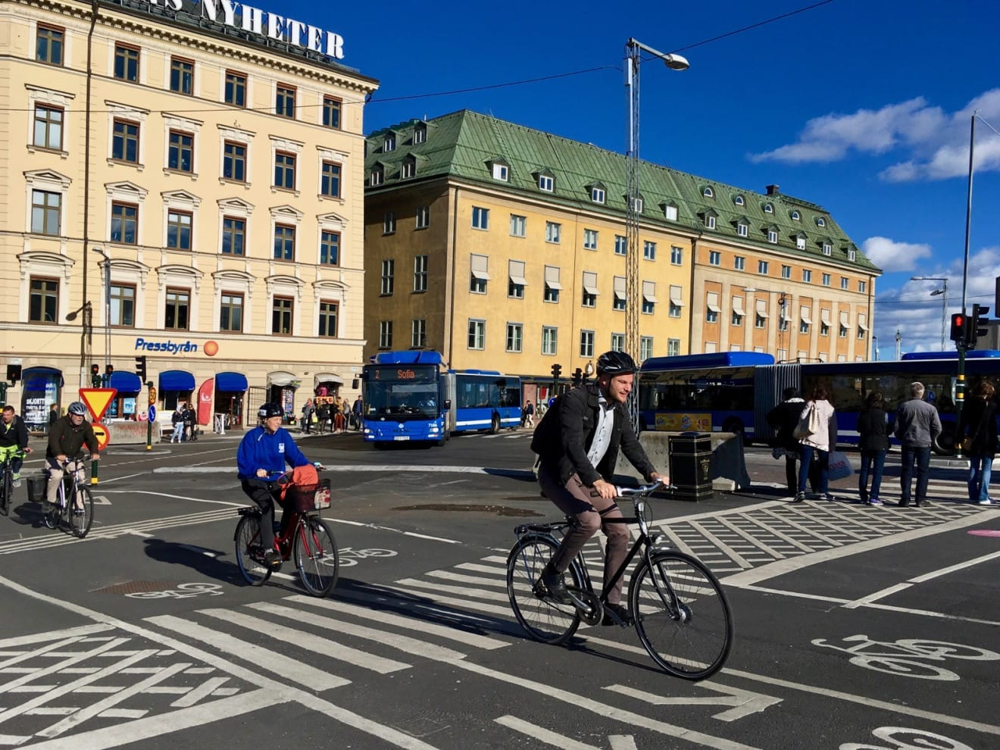

## Manajemen Pengolahan Sampah yang Baik

Hanya 1% sampah domestik di Swedia yang akan berakhir di tempat pembuang akhir. 99% sisanya akan dimanfaatkan kembali. Sebagian didaur ulang. Sebagian lainnya dibakar untuk menghasilkan listrik dan panas yang kemudian disalurkan ke rumah-rumah warga.

Masyarakat Swedia memang sudah terbiasa memisahkan sampah-sampah yang dapat di daur ulang di rumahnya. Pemerintah juga mengatur agar terdapat stasiun daur ulang dalam radius 300 meter dari areal pemukiman warga.

Umumnya di stasiun daur ulang ini terdapat beberapa bak terpisah untuk beragam jenis sampah. Ada bak untuk sampah plastik, sampah kemasan karton, botol kaca bening, botol kaca berwarna, logam, serta bak untuk majalah dan koran. Bahkan di beberapa stasiun daur ulang ada juga bak khusus untuk alat-alat elektronik, bohlam, baterai, hingga furnitur.

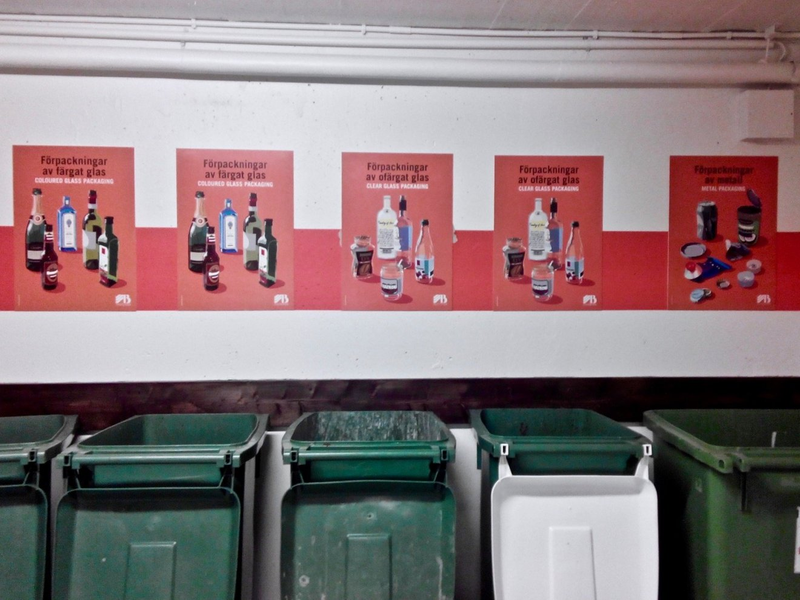

## Air Keran yang Dapat Diminum

Satu hal lainnya yang sangat saya nikmati adalah: air keran yang dapat diminum langsung! Air minum yang dialirkan ke rumah-rumah warga ini berasal dari Danau Mälaren yang kemudian diolah di dua fasilitas pengolahan air milik *Stockholm Vatten och Avfall* di Norsborg dan Lovö. Setiap tahunnya lebih dari seribu sample acak diambil dan diteliti dari pelanggan untuk menjaga kualitas air minum.

## Kota yang Hijau nan Asri

Pemerintah Swedia memang menjaga betul kelestarian alamnya. Di Stockholm misalnya, meski menjadi ibukota negara, kita dapat dengan mudah menemui “hutan” mini yang rindang dengan pohon-pohon pinus, ek, hingga elm. Bahkan masih dalam wilayah Stockholm *county*, terdapat dua taman nasional: Ängsö dan Tyresta.

Warga dapat dengan mudah mengakses ruang terbuka hijau. Taman-taman kota yang astri tersebar di tiap penjuru kota. Hal ini berimbas juga pada tingkat polusi udara yang sangat rendah. Tak jarang pula kita menemui satwa seperti bebek, kelinci, tupai, hingga rusa berkeliaran di tengah perkotaan.

Wajar saja rasanya apabila Stockholm menjadi kota pertama yang menerima penghargaan *European Green Capital Award* pada tahun 2010 silam.

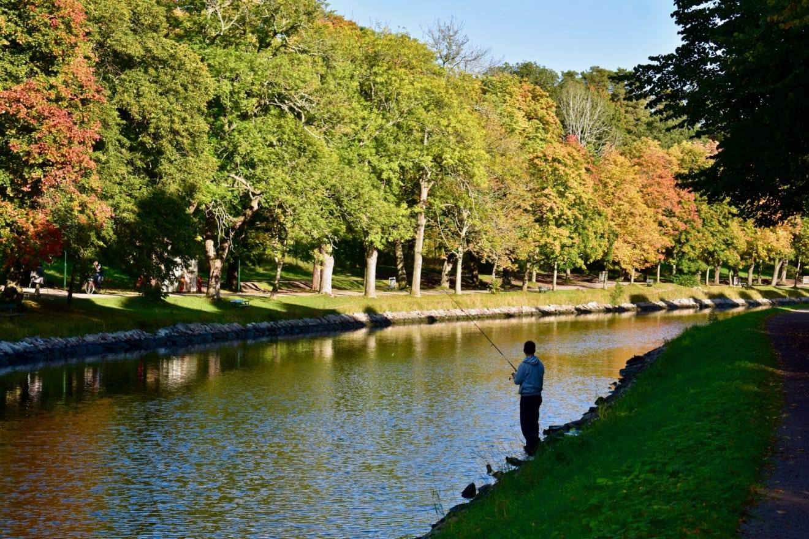

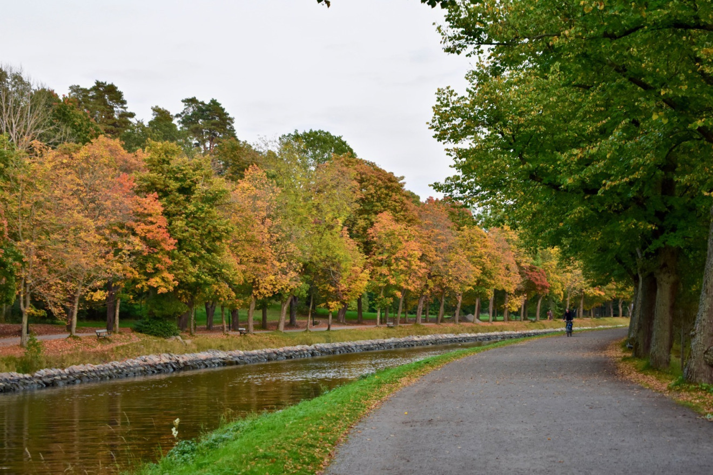

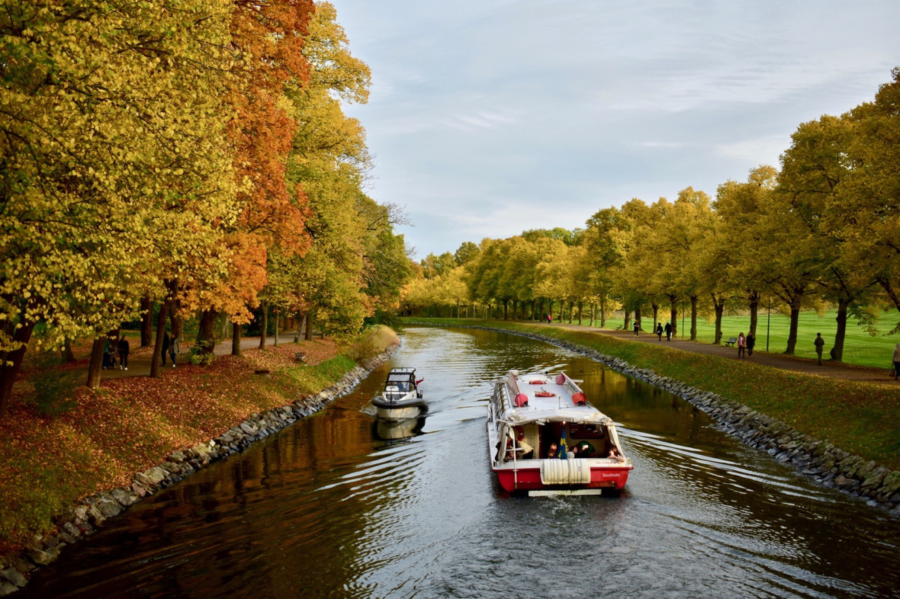
