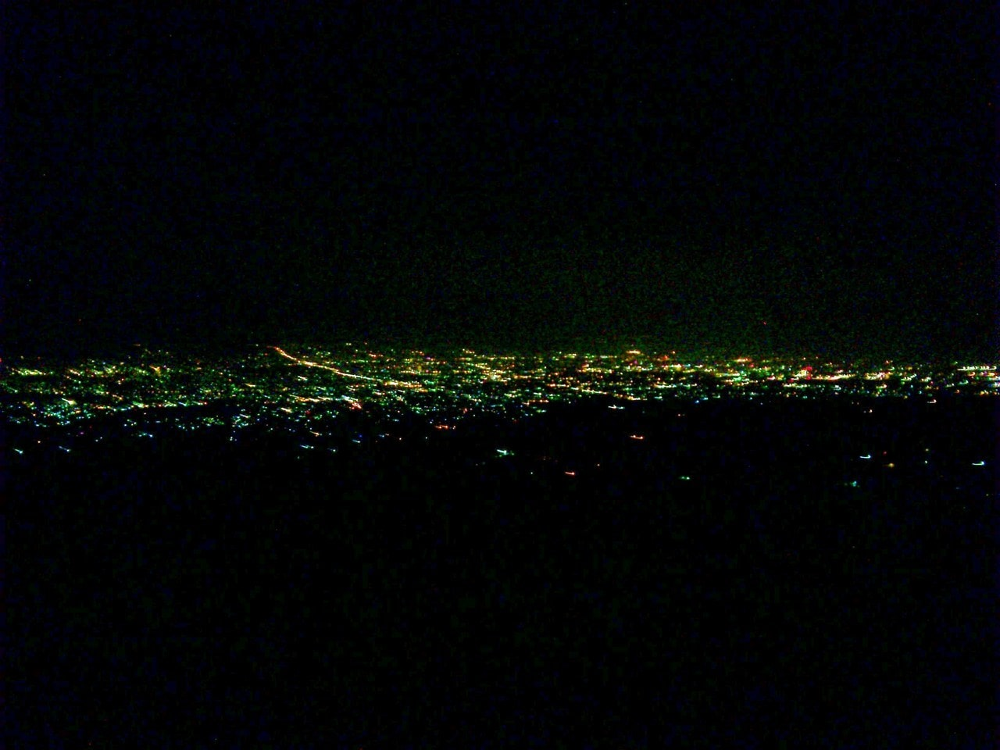

My partner and I decided to go on our separate way. We'd been struggling with our marriage for the last four years. We tried to make it works but failed miserably. Until we agreed that this was the only way for us. It was a hard decision that we had to make.

There's no single thing I regret. Even though there were lots of ups and downs, it had been a beautiful journey. It taught us a lot. We both grew as better human beings. Wiser, more patient, more open, more affectionate.

To her mother, father, brothers, and family, I will be forever in their debt. Thank you for all your kindness and for bringing me in as part of your family.

I wish her the best of luck. I hope she'll continue to be a humble and brilliant researcher. I hope she'll keep playing the viola and be a great musician. Thank you for everything.

If there's one thing I regret, that would be not having a proper goodbye with all my friends in Stockholm. I wish someday I could pay you all a visit.
