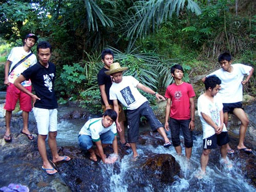
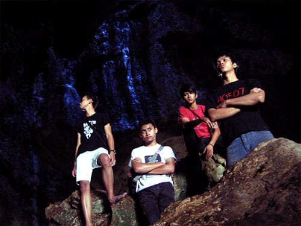
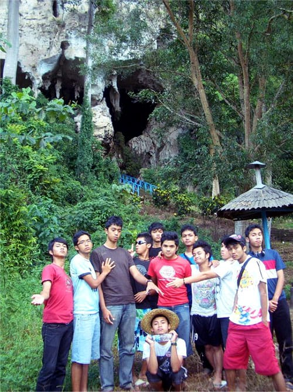
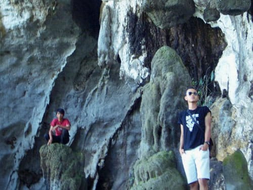

Selama di Kalimantan, kami semua menginap di kediaman Bos Adzan, tepatnya di Kabupaten Tapin, Kalimantan Selatan. Dari Kota Banjarmasin memakan waktu sekira 3 jam untuk mencapai Kabupaten Tapin dengan melewati Kota Intan Martapura.

Dugaanku meleset mengenai Kalimantan. Dalam benak ku Kalimantan yang dijuluki paru-paru dunia itu akan menyuguhkan sensasi *thriller*: keluar masuk hutan rimba seperti dalam *scene* film Tarzan. Namun sepanjang perjalanan bukan lebatnya hutan yang kami temui, justru rapatnya perkebunan sawitlah yang mendominasi perjalanan kami. Puluhan bahkan ratusan truk mengular di sepanjang jalan. Mereka mengangkut sawit dan batubara. Antriannya terkadang menghambat laju kendaraan yang kami tumpangi.

## Tracking ke Goa Batu Hapu

Selama di Kabupaten Tapin, kami mengunjungi salah satu objek wisata unggulan di sana: Goa Batu Hapu—sebuah gua karst yang sangat luas. Letaknya berada jauh di pelosok Tapin. Setelah memarkir kendaraan, kami pun memulai *tracking* untuk mencapai bibir gua.

Setelah sampai di bibir gua, kami pun takjub dengan kemegahan yang ditawarkan Goa Batu Hapu. Mulut gua ini benar-benar besar dan sesekali kelelawar terbang keluar-masuk dari mulut gua. Sesampainya di dalam gua, indahnya stalagmit dan stalaktit yang terbentuk secara alami memukau kami. Belum lagi ratusan kelelawar yang terbang dan bergelantungan di atap gua menambah eksotisme yang disuguhkan gua karst ini. Ini baru Kalimantan!

Kami menyusuri setiap liku jalan-jalan setapak dalam goa ini. Di beberapa bagian, air menetes dari ujung stalaktit-stalaktit. Namun sangat disayangkan di beberapa bagian dinding gua terdapat coretan-coretan tangan jahil. Di salah satu ujung gua, kami menemukan dinding gua yang miring, sehingga memungkinkan kami untuk mencapai bagian atasnya. Kami pun memanjat licinnya dinding gua tersebut dan mencapai bagian atas gua. Dari atas gua kita dapat melihat hamparan rindangnya pepohonan, sungai, dan berberapa rumah penduduk.

Setelah puas melihat-lihat dari atas atap gua, kami pun kembali pulang ke kediaman bos Adzan.

Foto cover dari [Unsplash](https://unsplash.com/photos/zDyg7wfqjpE) oleh [Vincent Foret](https://unsplash.com/@vforet).
