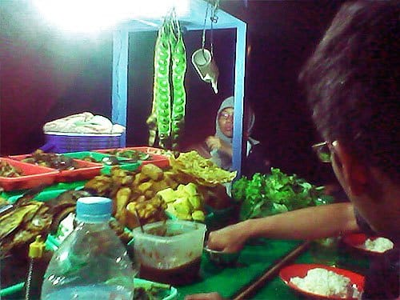
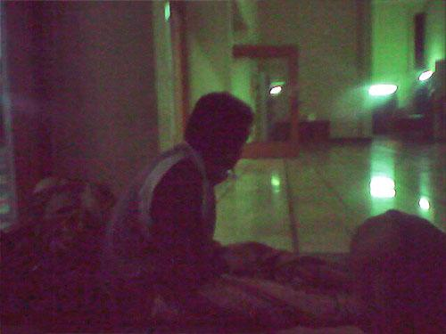
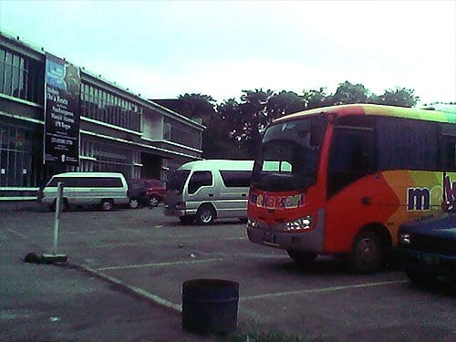
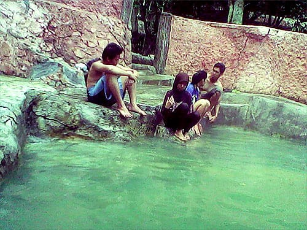

Kolamnya kecil, tak lebih besar daripada kamarku. Catnya berwarna merah-bata. Sebuah pipa PVC berukuran sedang meliuk dari bebukitan dan bermuara di bibir kolam. Dari mulut pipa tersebut, air jernih mengalir deras. Uap air sesekali ikut mengepul dari mulut pipa, lalu hilang ditelan udara.

Seorang kakek berbalut singlet putih tengah khusyuk berjongkok di bawah pancuran. Tubuhnya yang terlihat ringkih terus diguyuri aliran air dari mulut pipa. Matanya sesekali terpejam, seperti menikmati sensasi guyuran air panas.

Tak lama kemudian si kakek berdiri dan duduk di bibir kolam. Ia lantas mengambil gelas air-mineral-kemasan yang telah kosong di sampingnya. Gelas tersebut kemudian ia isi dengan air yang keluar dari mulut pipa. Sejurus kemudian ia tegak air dalam gelas tersebut. *Gile*!



Malam sudah terlanjur tiba saat kaki-kaki kami menjejak Kota Bogor. Lampu-lampu merkuri berpendar merah-kejinggaan, mewarnai jalan-jalan arteri di Kota Hujan. Sementara di Terminal Baranangsiang, gelap merajalela. Lampu-lampu mati tak berfungsi. Di bawah temaram calo-calo tanpa lelah berorasi, merayu, membujuk, memaksa para calon penumpang yang kelelahan. "Bandung-Bandung-Bandung?" atau "Lebak Bulus-Lebak Bulus-Lebak Bulus?" atau juga "Sukabumi-Sukabumi-Sukabumi?"

Saat itu kami tidak tahu akan menginap dimana. Rencana mendadak ke Bogor ini muncul malam sebelumnya, saat kami terdampar di Ujung Genteng. Kami makan malam di salah satu tenda kaki lima yang tidak jauh dari pintu tol. Di sana dijajakan ayam goreng, pecel lele, soto babat, tempe, tahu, rempeyek udang, hingga pete. Dan yang paling tidak diduga adalah rasa sambalnya yang luar biasa enak. Enak, benar-benar enak.

Lunas mengisi perut, aku dan teman-teman pun mencari penginapan: Mesjid Raya Bogor! Sebetulnya salah satu kerabat kami punya keluarga di Bogor, tapi karena sudah terlalu larut kami pun mengurungkan niat untuk ikut bermalam di sana. Setelah menitipkan KTP, kami pun diperbolehkan bermalam oleh pengurus mesjid.



Setelah bertanya kesana-kemari, akhirnya rute perjalanan kami ke Gunung Pancar menjadi jelas. Dari Bogor kami menggunakan bis Damri ke Sentul. Dari Sentul dilanjutkan jalan kaki beberapa menit hingga pertigaan Cikole. Dari pertigaan Cikole kita tinggal menyewa angkot ke Gunung Pancar.

Obyek Gunung Pancar sendiri aku ketahui kala beberapa hari sebelumnya menonton acara *traveling* di televisi. Selain keunikan air panasnya yang tidak berbelarang, di acara itu diperlihatkan fasilitas pemandian air panas yang mewah. Deretan *shower* air panas. kolam-kolam air panas dengan ornamen-ornamen batu kalinya. Bilik-bilik kamar bilas yang bersih, hingga sabun lumpur yang disediakan secara percuma.

Nah, rupanya di Gunung Pancar terdapat dua pemandian air panas: yang mahal dan yang murah meriah. Yang kulihat di televisi adalah pemandian air panas yang mahal. Menimbang keuangan kami yang hampir pailit, kami pun memilih pemandian air panas yang murah dan terletak lebih jauh.



Tak disangka fasilitas di pemandian air panas seharga 10 ribu rupiah ini sangat jauh dengan fasilitas yang ditawarkan di pemandian tetangganya. Hanya ada dua kolam pemandian air panas dan salah satunya rusak. Kolamnya terbuat dari semen dengan cat merah. Ukuran kolamnya pun kecil, mungkin tak sampai 5×3 meter. Di pojok kolam sebuah pipa mengalirkan air panas dari balik bukit-bukit yang dirindangi pohon pinus. Atap-atap asbes dengan tiang kayu menutupi sebagian mulut kolam. Sangat tidak terurus. Untung saja kolamnya bersih tanpa ada sampah sedikit pun.

Saat itu ada seorang kakek yang tengah meminum air panas dari pancuran. Aku dan teman-teman yang lain pun menjadi penarasan untuk ikut mencoba. Rasanya airnya seperti aqua, hanya saja jauh lebih panas. Benar saja kalau sumber air panas Gunung Pancar di Bogor ini memang merupakan salah satu sumber air panas yang tidak mengandung belerang atau mineral beracun lainnya. Oleh karenanya tidak heran jika air panas di Gunung Pancar ini bisa langsung kita nikmati.

Dan menyoal suhu air panasnya, Gunung Pancar tak usah diragukan lagi: panas! Benar-benar panas! Mencelupkan kaki ke kolamnya saja merupakan hal yang tidak mudah. Jangankan untuk berendam, air yang keluar dari pipanya bisa langsung kita gunakan untuk menyeduh teh atau kopi. Tak ayal aku dan seorang temanku pun bereksperimen dengan menyeduh cokelat panas dengan air panas Gunung Pancar. *Ahhhhh* nikmat!

Foto cover dari [Unsplash](https://unsplash.com/photos/PLeo6LGc3AI) oleh [Sebastian Engler](https://unsplash.com/@snengl).
