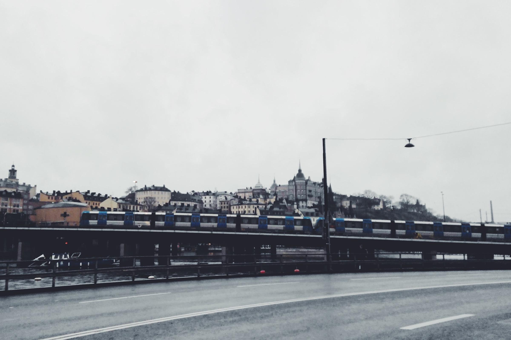
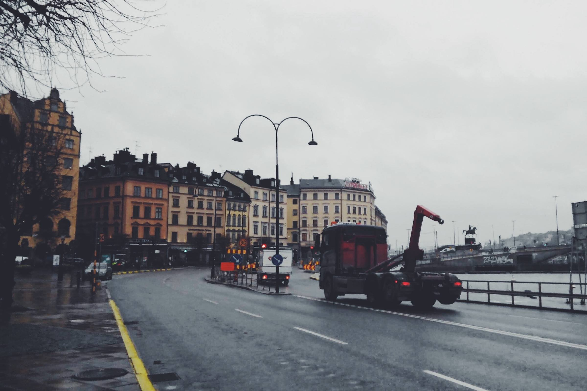
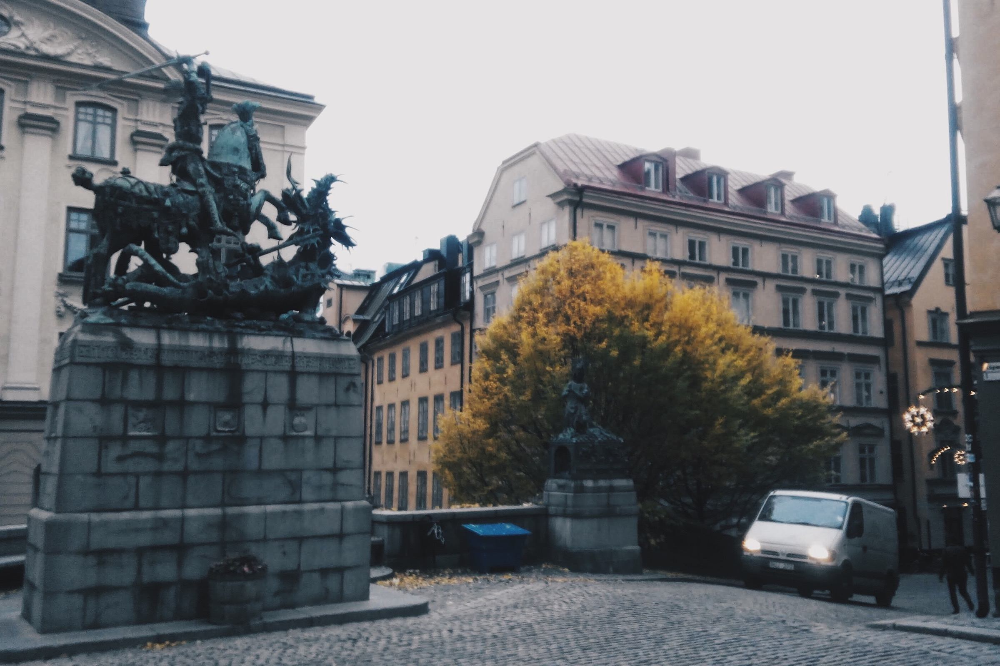
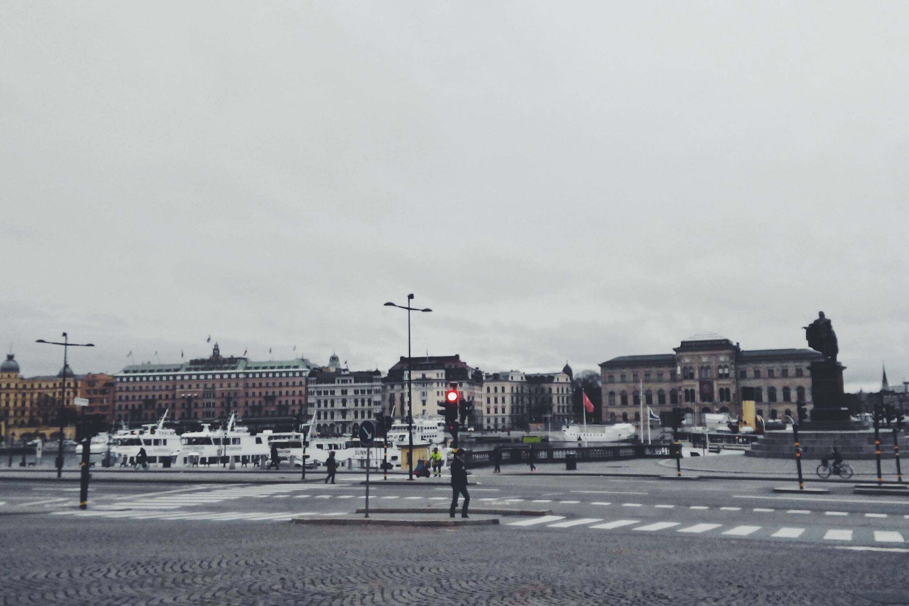
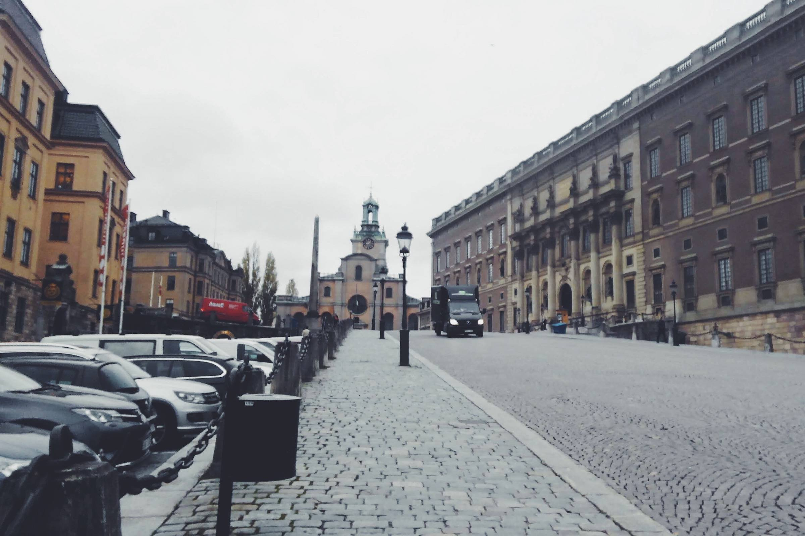
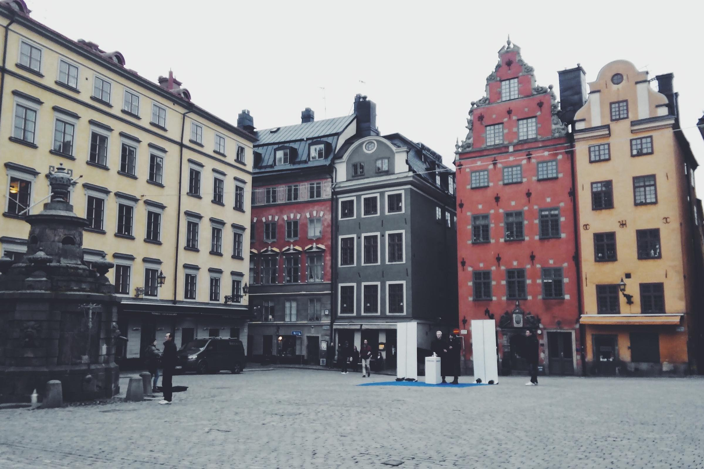
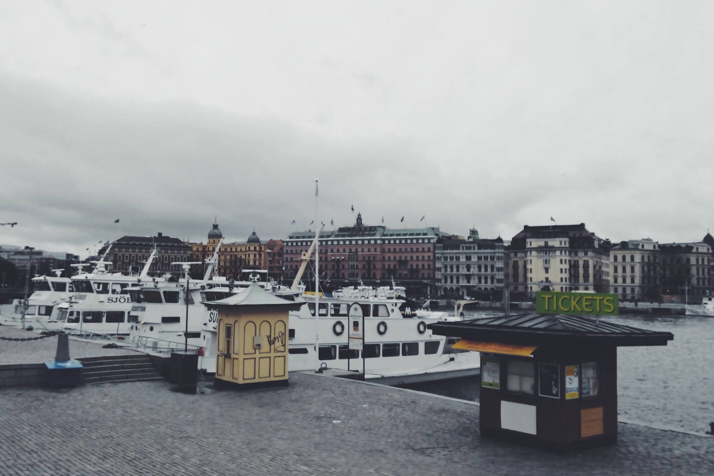
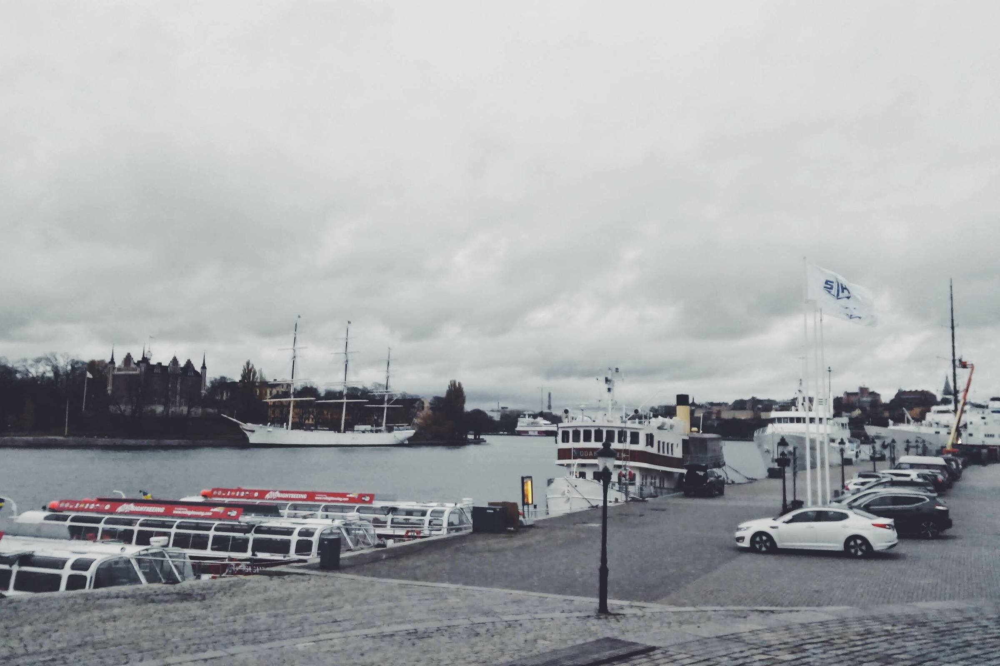
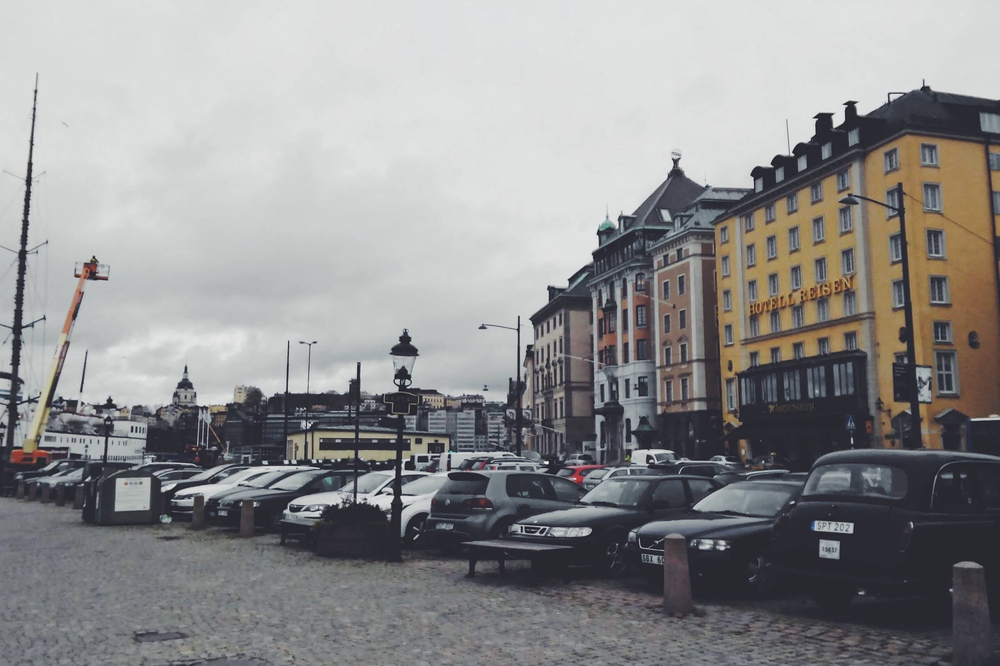
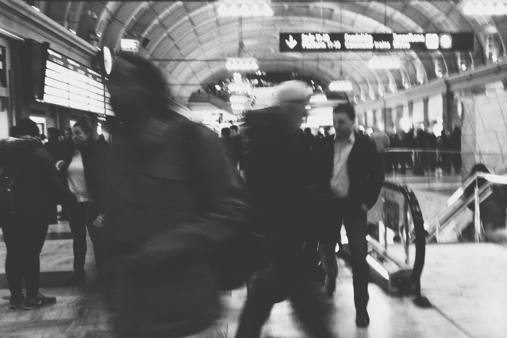

Hari itu tanggal 4 November 2014. Sekira pukul enam pagi, pesawat Thai Airways yang saya tumpangi akhirnya mendarat di Bandara Internasional Arlanda. Bila transit dua jam di Thailand tidak masuk hitungan, itulah kali pertama saya menjejakan kaki di luar negeri.

Puncak musim gugur telah berlalu. Daun-daun sudah purna berguguran. Langit pun nampak mendung seolah siap menumpahkan hujan kapan saja. Udara dingin menyambut saya di luar bandara. Meski setengah menggigil, saya menikmati dinginnya negara Skandinavia ini.

Saya menggunakan *Flygbussarna*—bis bandara untuk menuju Central Station. Kekaguman saya dimulai saat naik bis bandara tersebut. Belum pernah saya menggunakan bis sebagus itu sebelumnya. Alat pindai elektronik untuk tiket bus. Layar yang menunjukan rute perjalanan, posisi bis, hingga prakiran waktu tempuh ke tempat tujuan. Ada layanan Wifi gratis. Dan yang tak kalah penting: sabuk pengaman di setiap kursi penumpang!

Sepanjang jalan saya tidak henti-hentinya berdecak kagum melihat langsung bagaimana keadaan sebuah negara maju. Jalan-jalan yang mulus dengan penerangan yang memadai, lingkungan yang bersih dari sampah, para pengguna jalan yang tertib, hingga trotoar yang lengang.

Lepas menyimpan koper di Central Station, saya beranjak ke Gamla Stan—kota tua yang berada tidak jauh dari Central Station. Berikut adalah foto-foto yang saya ambil pada hari itu.

{{}}

{{}}

{{}}

{{}}

{{}}

{{}}

{{}}

{{}}

{{}}

{{}}
