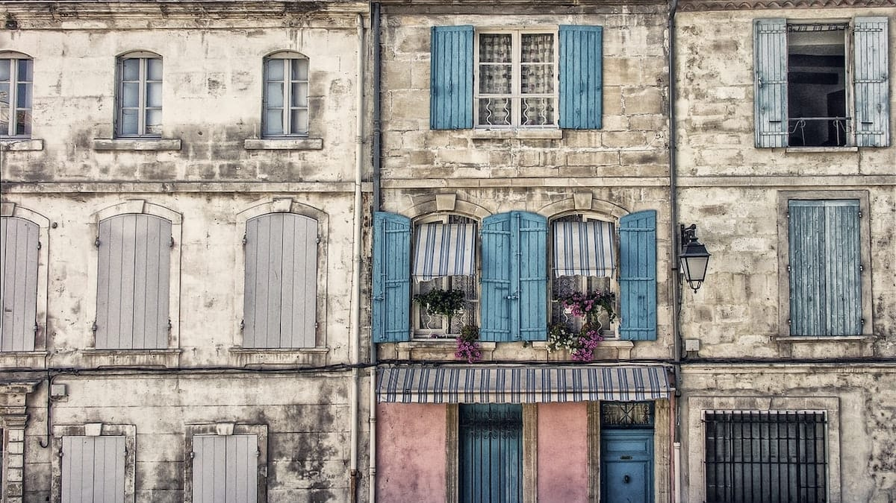
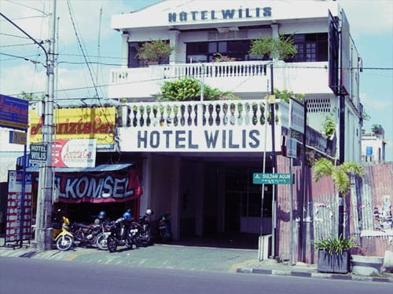
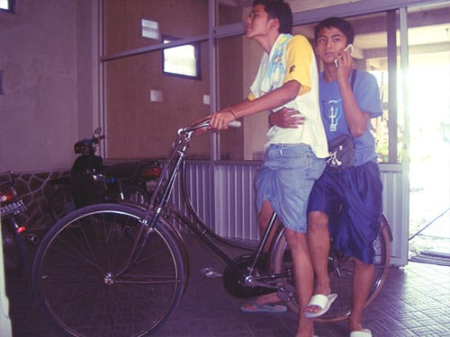
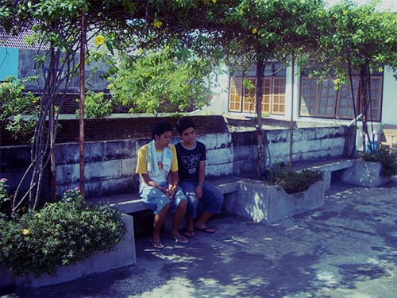
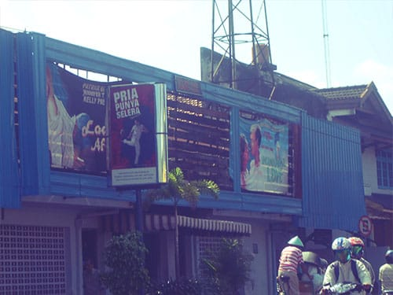

Sehabis keliling kota Jogja seharian, kami akhirnya melabuhkan diri di sebuah hotel. Hotel Wilis namanya. Meski bertitel "hotel", Hotel Wilis sangat jauh dari kemewahan. Bahkan bila dibandingkan dengan penginapan-penginapan sederhana di sudut gang Sosrowijayan, Hotel Wilis masih kalah. Rasanya lebih pas jika dinamai "Losmen Wilis" menuruku.

Hotel Wilis letaknya relatif jauh dari pusat keramaian Malioboro. Gedungnya sudah tua dan di beberapa bagian dindingnya ditumbuhi jamur. Nampak tidak terawat. Kelebihannya hanya satu: harganya super murah.

Kami memesan dua buah kamar yang berdampingan di lantai dua. Di setiap kamar terdapat dua buah kasur yang usang dan berdebu. Miris sekali keadaannya. Namun kami masih beruntung, air melimpah ruah di sini.

Meski pemandangannya hanya puing-puing bangunanan dan sebuah bioskop *eheem eheem*, leyeh-leyeh di balkon terasa nikmat sekali. Menikmati damainya senja sembari ditiup angin yang sepoy-sepoy.

Foto dari [Unsplash](https://unsplash.com/photos/nF66LmjQclI) oleh [LoboStudio Hamburg](https://unsplash.com/@lobostudiohamburg).
