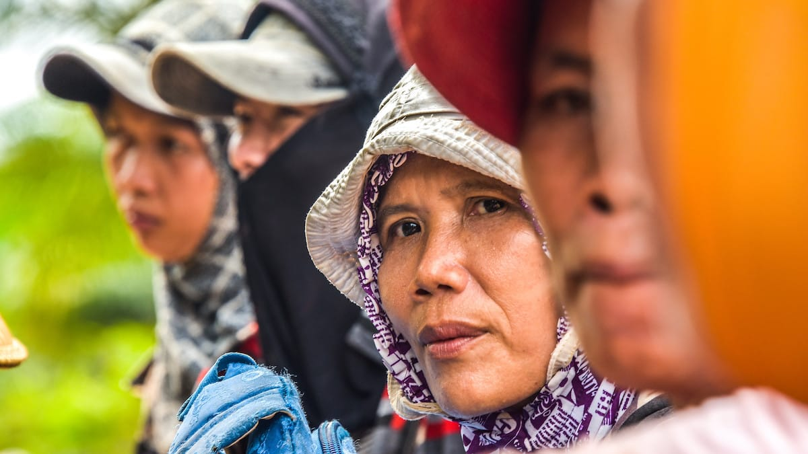

Gila! Itulah pikirku saat tuntas membaca buku ini. Bagaimana seorang Ary Amhir—penulisnya—seorang sarjana dari universitas terkemuka di negeri ini, meninggalkan pekerjaannya sebagai seorang jurnalis untuk menjadi TKI di negeri Jiran. Selama hampir empat tahun Ary bekerja di sebuah pabrik komponen elektronik di Penang, Malaysia. Membaur, menyelami dan mengamati secara langsung kehidupan para TKI di negeri Jiran itu. Pengalamannya bersentuhan langsung dengan para TKI ini, ia tuangkan dalam buku mikro-etnografi ini.

Buku karya pertamanya ini menuturkan lima belas kisah kehidupan sehari-hari para TKI di Malaysia. Meski kisah-kisahnya sederhana, namun artinya sangatlah dalam sehingga membukakan mata kita yang selama ini terbutakan pemberitaan TKI di media yang melulu soal penyiksaan dan hukum gantung. Sekelumit kisah para pahlawan devisa ini akan membawa kita pada pemahaman baru tentang TKI yang jarang—atau bahkan belum pernah—tersentuh pemberitaan.

Pada kisah pertama yang berjudul "Aku Indon", Ary menemukan bahwa panggilan "Indon" bagi para TKI di Malaysia ini hanyalah sebuah bentuk panggilan semata. Semacam akronim untuk mempermudah dan memperingkas kata Indonesia; seperti halnya Bangla untuk Bangladesh. Tidak ia temui nada merendahkan tiap kali ia dipanggil Indon. Tak seperti di negaranya, di Indonesia, istilah Indon ini dianggap hina—mungkin karena anggapan bahwa profesi TKI adalah profesi rendahan.

Adapun kisah "Dilarang Hamil", menceritakan bagaimana para pengguna jasa TKI ini tidak mau rugi dengan menerapkan berbagai peraturan yang sangat ketat. Salah satunya larangan untuk hamil! Tingkat produktifitas para perempuan yang tengah hamil pastilah menurun, belum lagi mereka akan butuh cuti hamil kelak.

Kisah ketiga "Orang Kosong" mengisahkan tentang peran penting sebuah *permit* kerja bagi para TKI di Malaysia. Berdasarkan *permit*, TKI dibagi kedalam tiga kelompok: pertama para pekerja yang memiliki dan mengantongi sendiri *permit* kerjanya, kedua para pekerja yang memiliki *permit* namun ditahan oleh majikannya dan ketiga pekerja yang tidak memiliki *permit* atau biasa disebut "Orang Kosong"—TKI ilegal. Kepemilikan *permit* ini juga yang mempengaruhi kebebasan para TKI, di mana para orang-orang kosong ini dengan mudah diintimidasi majikannya dan selalu dihantui oleh Rela—semacam Pamong Praja—yang kerap menganiaya.

Pada kisah "Konsumtif biar Eksis" kita akan dibuat terbelalak, bagaimana budaya konsumtif menjangkiti para TKI di Malaysia. Budaya yang merebak di kalangan para buruh yang bisa dibilang memiliki penghasilan seadanya. Dikisahkan pula bagaiamana para TKI yang berasal dari kampung, yang tidak tahu bagaimana caranya berdandan dan bersolek mulai ditulari virus konsumtif ini. Gaji yang seharusnya digunakan untuk hidup sekadarnya dan ditabung, justru kerap habis untuk dibelikan ponsel anyar, lipstik, baju baru, bra, atau bahkan perhiasan. Tak mengherankan, belum juga sepekan gaji sudah ludes hanya untuk kepuasan semu: tampil eksis dan dipuja kelompoknya.

Masih banyak kisah TKI lainnya yang Ary kisahkan. Tentang bagaimana para TKI melakukan praktik poligami, memiliki keluarga di kampung halaman dan menikah siri di perantauan. Bagaimana para TKI (yang bahkan legal sekalipun) dihantui ras atau razia yang dilakukan para Rela. Bagaimana para TKI dari Buton atau Muna yang kecanduan akan judi nomor. Sesuatu yang mereka anggap hiburan dan baru akan berhenti kala uang dikantong sudah habis. Atau tentang para TKI yang menjual kemolekan tubuhnya untuk meraup ringgit, mengenyampingkan cinta di atas materi. Atau juga tentang kecemburuan pada para Indon yang dengan mudah berinteraksi dan membaur bersama ras Cina, India atau Melayu yang terkotak-kotakan satu sama lain.

Buku ini ditutup dengan kisah yang berjudul "Malaikat Bernama Kak Ras". Kisah manis yang menceritakan tentang sosok Kak Ras yang humanis dan mau menolong siapapun tanpa memandang status, ras, ataupun etnisnya. Kala saudara senegara terkesan tak peduli dengan kesulitannya, justru Kak Ras yang berkewarganegaraan Malaysia inilah yang datang dan menawarkan bantuan padanya. Sosok yang dianggapnya patut menjadi warga dunia, yang pandangannya tidak sempit memandang sosok manusia.

)](01-indonesia-yang-bukan-indonesia-by-goodreads.jpg)

Judul: TKI di Malaysia – Indonesia yang Bukan Indonesia\
Penulis: Ary Amhir\
Penerbit: Through the Glass Art Foundation\
Cetakan: Januari 2013\
Tebal: 104 Halaman

Foto cover dari [Flickr](https://www.flickr.com/photos/cifor/36642500092/) oleh [CIFOR](https://www.flickr.com/photos/cifor/).
