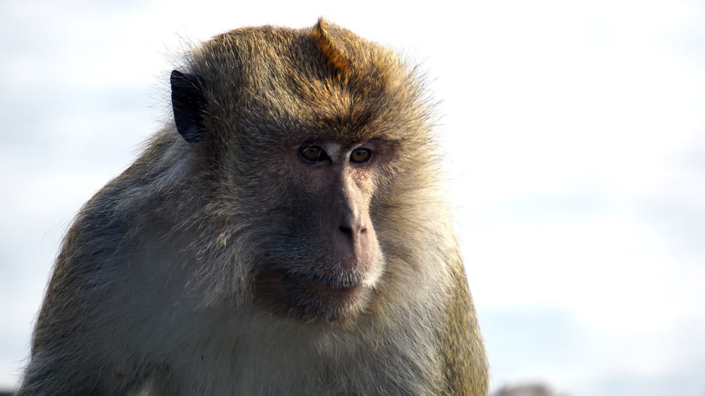
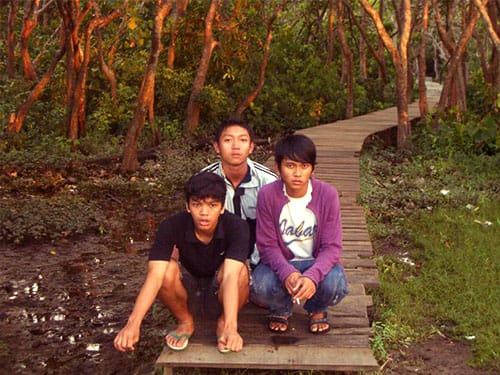
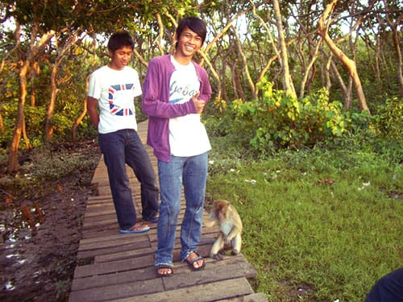
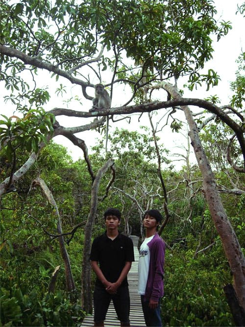

Alam memang pemurah dan ajaib. Lumpur yang mengendap di muara sungai kini menjadi sebuah pulau kecil, atau biasa disebut dengan istilah delta. Sungai Barito yang mengular dari hulunya di Pegunungan Muller pun membentuk sebuah pulau kecil di muaranya—Muara Banjar. Pulau kecil di tengah aliran Sungai Barito itu bernama Pulau Kembang.

Pulau yang terbentuk dari endapan lumpur itu kini ditumbuhi pepohonan hijau yang rapat. Di tepiannya akar-akar pohon bakau menancap kokoh pada lumpur yang terbawa arus sungai. Ada yang menarik dari pulau kecil nan hijau ini: ratusan monyet ekor panjang (*Macaca fascicularis*) bergelantungan menghuni dahan-dahan pohon. Sebuah atraksi yang menarik.

Selama melancong ke Kalimantan Selatan, kami menyempatkan diri untuk menyambangi Pulau Kembang. Pulau yang berada di Muara Banjar ini dapat dicapai dengan menggunakan perahu motor dari pusat Kota Banjarmasin. Sangatlah mudah menemukan penyewaan perahu motor di Kalimantan, semudah menemukan angkot di padatnya Kota Bandung. Di Kalimantan sungai memang menjadi andalan untuk transportasi.

Di sepanjang aliran Sungai Barito yang membelah Kota Banjarmasin, kita dapat melihat kapal-kapal berukuran besar berlabuh. Tidak mengherankan karena lebar Sungai Barito bisa mencapai 1 kilometer! *Crane-crane* pengangkat muatan peti kemas pun tampak berhimpitan dengan pemukiman-pemukiman kumuh di sepanjang aliran sungai.

Perjalanan dari pusat kota tidaklah terlalu lama. Ketika kapal merapat di dermaga kayu Pulau Kembang, monyet-monyet berhamburan loncat dari pohon. Mereka bergerombol mendekat, seolah menyambut kedatangan kami. Mereka tampaknya sudah terbiasa dengan pengunjung yang kerap memberi mereka makanan.

Di Pulau Kembang ini sudah dibangun *shelter* permanen sebagai tempat berteduh dan tetirah para pengunjung. Beberapa warung pun tampak mendirikan tenda di dekat dermaga. Jalan setapak dari papan-papan kayu sengaja dibuat meliuk-liuk diantara rimbunnya pepohonan. Pengunjung dapat menyusuri riuhnya pepohonan sembari mengamati tingkah laku para monyet yang mendiami pulau ini. Sebuah pengalaman yang menarik bisa pelesir ke pulau yang dihuni para monyet ini.

Foto cover dari [Flickr](https://www.flickr.com/photos/bukrie/15592221259/in/photostream/) oleh [Budi Nusyirwan](https://www.flickr.com/photos/bukrie/).
