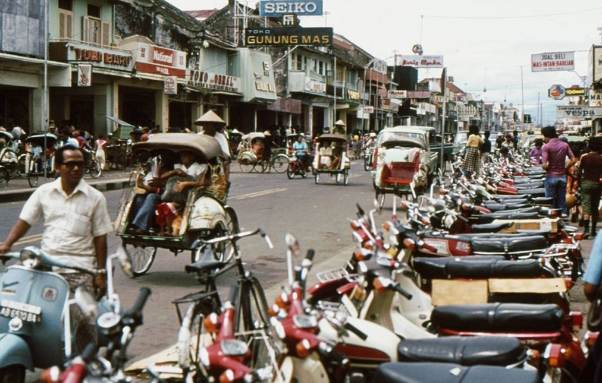
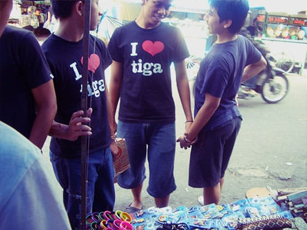
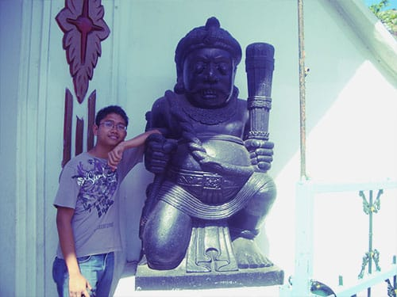
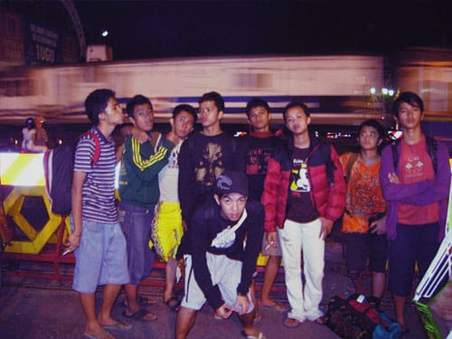

Malioboro sepertinya menjadi agenda yang wajib bagi para wisatawan yang mengunjungi kota Jogja. Di sepanjang emperan jalan ini pedagang-pedagang menjajakan berbagai dagangan: kaos oblong, batik, blangkon, gantungan kunci, tas, berbagai macam pernak-pernik, hingga jasa tato pun ada di sini. Selain barang, di Malioboro pun berderet penjaja makanan.

Setelah istirahat sebentar di hotel, saya bersama pasukan Belitung Merantau jalan-jalan di sekitar Malioboro. Ada yang membeli kaos, batik, cinderamata atau hanya sekadar melihat-lihat.

## Malioboro malam hari

Di malam hari Malioboro akan makin ramai dengan hadirnya berbagai tenda lesehan. Kami pun memutuskan untuk makan malam di lesehan Malioboro. Menu yang ditawarkan setiap penjual pun relatif sama, mulai dari nasi gudeg, lele, ayam goreng, bebek, burung dara, hingga nasi goreng. Kalau soal rasa *sih*, ku kira tidak terlalu istimewa. Standard. Untuk masalah harga pun kini lesehan Malioboro tergolong sangat mahal.

Tidak jauh dari Malioboro—tepatnya di awal jalan Malioboro—dekat Stasiun Tugu, terdapat sebuah jalan yang terkenal di Jogja. Jalan Pasar Kembang, atau yang lebih dikenal dengan singkatan Sarkem. Gang-gang di sepanjang jalan Sarkem ini terkenal sebagai pusat prostitusi di Jogja. Astaga.

Foto cover dari [Flickr](https://www.flickr.com/photos/34517490@N00/5195594928/in/photostream/) oleh [Nick](https://www.flickr.com/photos/34517490@N00/).
