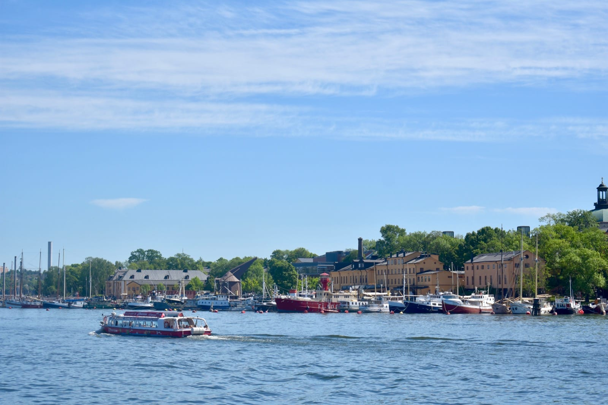
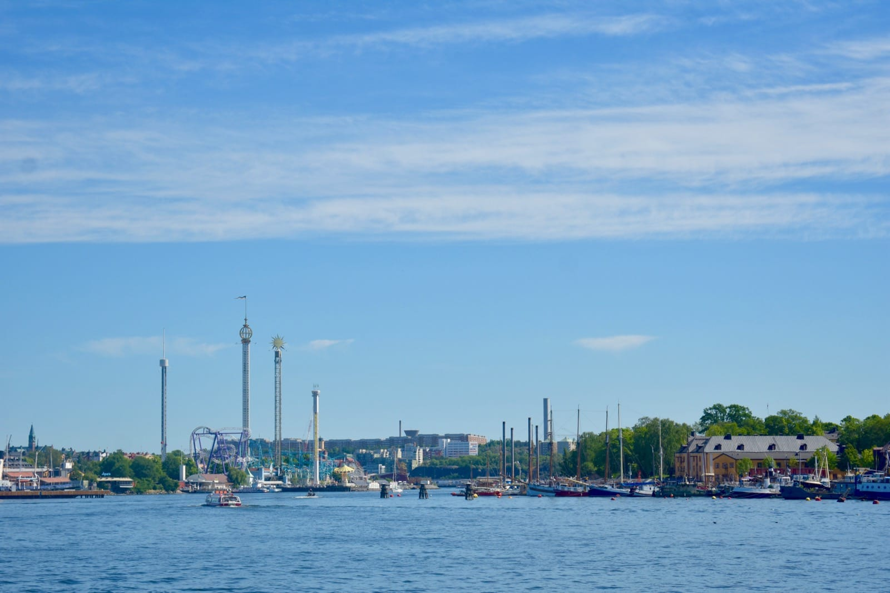
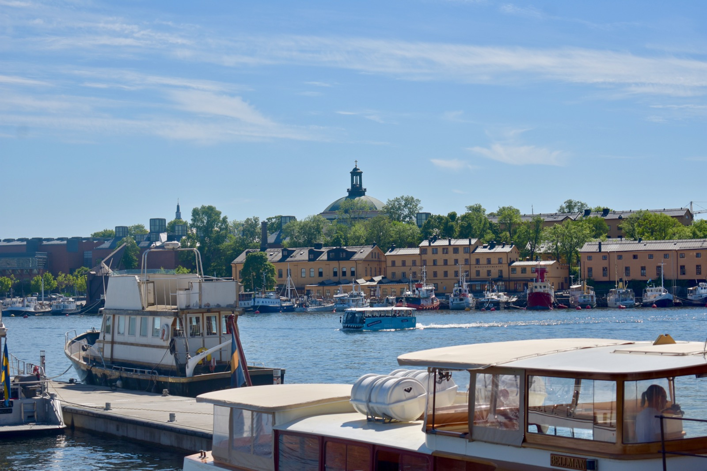
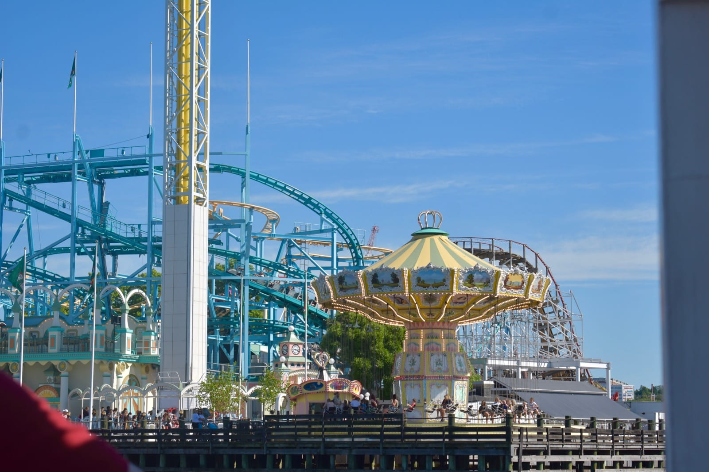
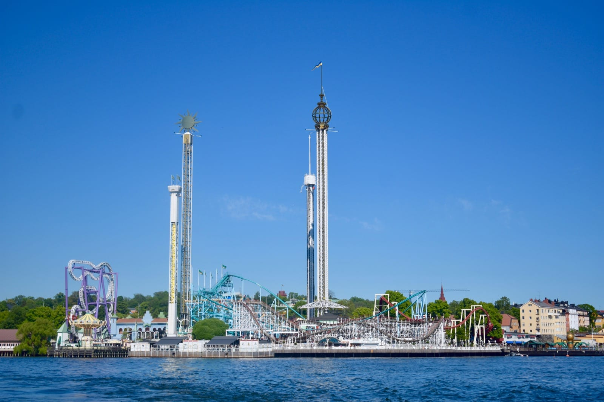

Minggu kemarin, saya sengaja jalan-jalan ke daerah Östermalm. Cuaca sangat cerah dan suhu hari itu begitu panas—sekira 27 hingga 30 derajat Celsius. Membuat kerongkongan kian kering di tengah jam puasa yang panjang.

Saya turun di stasiun metro Östermalmstorg. Berjalan sepanjang jalan Strandvägen, menyisiri teluk Ladugårdslandsviken yang kian marak dengan kapal-kapal yang tertambat. Kafe dan restoran-restoran yang tutup sepanjang musim dingin, kini ramai dipadati pengunjung.

Di ujung jalan Strandvägen, saya pun berbelok ke Pulau Djurgården. Banyak objek wisata di pulau ini. Mulai dari beragam museum dan galeri seni, kebun binatang, hingga taman ria.

Jalan-jalan singkat saya pun berakhir di pulau ini. Menyebrang ke Gamla Stan dengan kapal feri sebelum akhirnya pulang kembali ke rumah.

