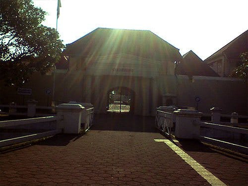
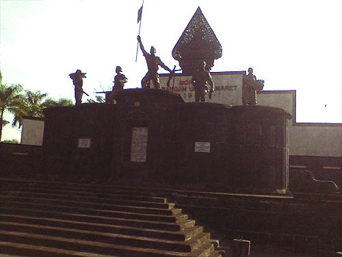
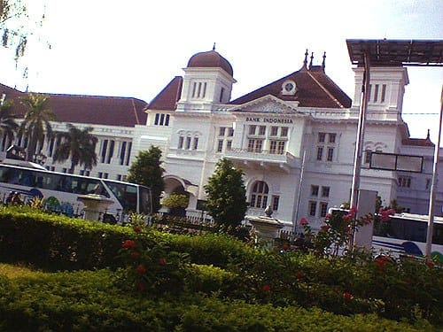

Lelah masih menggelayuti tubuhku. Sepuluh jam dalam kereta ekonomi benar-benar merontokan setiap persendian tubuhku. Goyah. Sambil memakan roti yang sengaja kubawa dari rumah, kulemparkan tubuhku ke atas kasur kapuk yang lumayan empuk. Dengan mulut menguyah, kutatap lekat-lekat peta kota Jogja. Sengatan semangat tiba-tiba bereaksi pada tubuhku. Sejurus kuterbangun, memasukan peta, roti, air minum, dan dompet ke dalam tas kecil yang kubawa. Siap menjelajahi Jogja!

Yogyakarta, Kota Pelajar yang menjadi salah satu primadona pariwisata di Indonesia ini menawarkan berbagai objek wisata yang kental akan latar belakang sejarahnya. Sisa-sisa pendudukan dan simbol perlawanan terhadap pendudukan Belanda menjadi magnet tersendiri yang dimiliki kota ini.

Aku berjalan keluar penginapan, menyusuri lengangnya Malioboro di pagi hari. Sesekali kulemparkan senyum kepada pengayuh becak, menolak jasa yang ditawarkannya. Kaki terasa ringan melangkah, seolah lupa akan kesengsaraan selama di kereta ekonomi semalam. Benteng Vredeburg yang menjadi tujuan pertamaku.

Benteng Vredeburg terletak di Jalan Ahmad Yani, selepas Jalan Malioboro. Benteng yang dibangun oleh VOC ini dulunya berfungsi sebagai tempat perlindungan dan pusat pemerintahan Belanda. Benteng yang menjulang tinggi dan dikelilingi oleh parit ini memiliki menara di keempat sisinya. Menara ini berfungsi sebagai menara pemantau.

Kala itu aku datang terlalu pagi, Benteng Vredeburg yang kini dialihfungsikan sebagai museum ternyata masih tutup. Aku melanjutkan perjalanan ke arah Selatan. Bersebelahan dengan Benteng Vredeburg, berdiri Monumen Peringatan Serangan Umum 1 Maret 1949. Di seberang monumen ini pula terdapat Istana Kepresidenan RI yang merupakan peninggalan kolonial Belanda.

Monumen Serangan Umum 1 Maret 1949 ini dibangun untuk memperingati peristiwa sejarah besar pada 1 Maret 1949. Kala itu diadakan serangan besar-besaran terhadap pasukan Belanda yang berada di Yogyakarta. Serangan yang digencarkan TNI ini tidak lain untuk menunjukan eksistensi negara ini kepada dunia. Kota Yogyakarta—yang kala itu menjadi ibukota dari republik ini—dianggap lokasi yang tepat untuk memancing perhatian masyarakat dunia.

Di seberang Monumen Serangan Umum 1 Maret 1949 terdapat pula bangunan peninggalan Kolonial Belanda lainnya. Gedung Bank Indonesia, gedung kantor pos, serta gedung BNI masih berdiri kokoh meski sudah berusia ratusan tahun. Pada masa kolonial, fungsi dari gedung-gedung ini pun tidak jauh berbeda. Gedung BI difungsikan sebagai bank milik Hindia Belanda. Gedung kantor pos berfungsi sebagai kantor pos dan telegraf. Pun dengan gedung BNI yang dahulu dijadikan kantor asuransi dan bank.

Tidak puas mengamati jejak sejarah yang sempat mewarnai kota Jogja, aku pun terus menyusuri jalan-jalan kota ini. Kakiku melangkah ke Selatan, menelusuri kejayaan Kesultanan Ngayogyakarta Hadiningrat.

Foto cover dari [Unsplash](https://unsplash.com/photos/3OiYMgDKJ6k) oleh [Dariusz Sankowski](https://unsplash.com/@dariuszsankowski).
