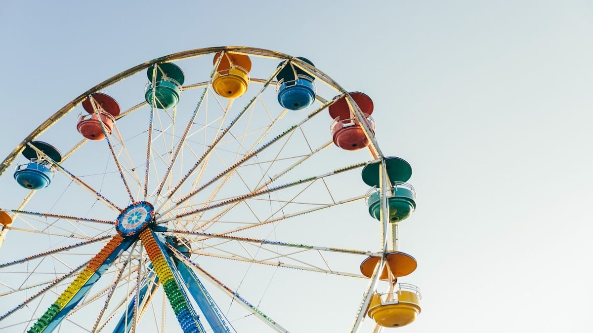
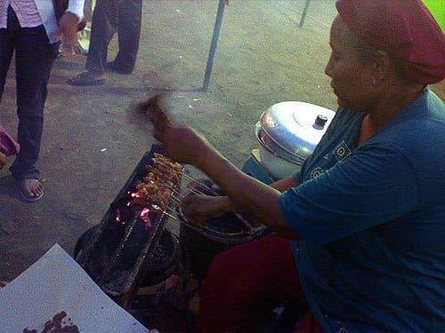
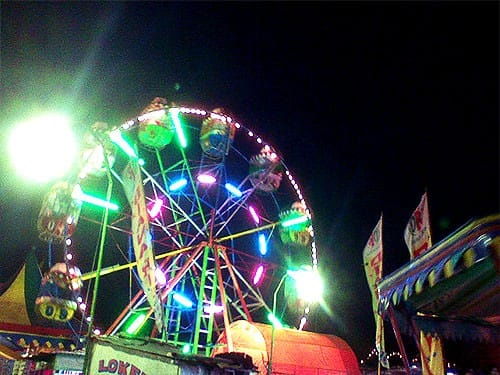

Senja luruh di pucuk-pucuk cakrawala, menyisakan semburat lembayung di ufuk Timur. Langkahku mengayun beriringan dengan desir angin. Dingin menyergap. Aku tidak juga peduli.

Langit tampak kelam. Bintang tidak jua tampak. Hanya lampu-lampu merkuri yang memelukku dalam temaram. Hingar bingar Alun-Alun Selatan perlahan hilang ditelan hembus angin. Mendung yang sedari tadi bergelayut di langit kota, akhirnya tidak kuasa menahan sang hujan. Bulir-bulir hujan jatuh satu persatu, membasahi tanah yang kupijak. Aroma khas tanah basah menguar menggoda penciumanku. Gerimis turun di kota Jogja.

Jantungku seolah berhenti berdetak. Benakku memutar kembali kenangan indah bersamanya. Bak ribuan panah beracun yang terbang melesat menghujamiku dari langit. Dadaku sesak. Nafasku tercekat. Pandangku nanar. Kau pun pernah merasa kehilangan bukan?

Langkahku terus mengayun. Angin dingin berderu-deru mengiringi, seolah mengerti kesedihanku. Jiwaku seolah tercerabut dari tubuhku, terlempar dan hanyut dalam jeram kepedihan. Kumenengadah, membiarkan bulir-bulir hujan menyapu wajahku.

Kakiku terus melangkah. Hujanpun mereda.

\*\*\*

Aku berhenti di sebuah persimpangan jalan. Seorang laki-laki memberhentikanku.

"Sedang ada pasar malam Sekaten, kalau mau masuk harus beli tiket," ujarnya.

Selembar uang seribu dan satu keping koin lima ratus cukup untuk menebusnya. Aku berjalan menerobos keramaian. Di kiri dan kanan jalan berjejer pedagang-pedagang. Gorengan, arumanis, permen gulali, boneka, mobil-mobilan, balon gas, jaket, jas, semua dijajakan.

Layaknya pasar malam yang lain, disini digelar berbagai permainan. Komidi putar, Bianglala, Tong Setan, Ombak Banyu, hingga Rumah Hantu. Orang-orang berjejal memadati. Anak-anak yang kegirangan, melompat-lompat dengan balon gas yang digenggamnya. Para ibu yang tampak sibuk memilah dan menawar barang-barang jualan. Muda-mudi yang tertawa lepas bersama teman-temannya. Sepasang kekasih yang berpegangan tangan mengumbar kemesraanya. Semua tampak bersukacita.

Perutku melilit. Aku memilih sate gajih yang ditawarkan seorang ibu sebagai penebus rasa laparku. Aku duduk disampingnya. Tidak banyak yang kuperbincangkan, kami memakai bahasa yang berbeda. Mataku hanya lekat memandang bara api yang beterbangan ke udara.

\*\*\*

Aku masih duduk di samping ibu penjual sate yang tengah sibuk melayani pembelinya. Di hadapanku roda-roda Bianglala berputar penuh keceriaan. Warna-warni lampunya berkerlip menghiasi langit malam. Kotak-kotak pengeras suara melantunkan lagu-lagu gembira.

Pandanganku tidak lepas mengikuti putaran roda Bianglala. Perlahan hatiku dirasuki kedamaian yang begitu indah. Dadaku tidak lagi sesak. Nafasku menghela lega. Jantungku berdetak mengikuti irama lagu gembira yang mengalun. Senyumku kembali menyimpul di wajahku.

Hidup tidak ubahnya sebuah bianglala raksasa. Ia terus berputar, tidak selamanya ia di bawah, tidak selamanya ia di atas. Ia terus berputar dengan kerlip lampu-lampunya yang penuh warna. Lagu-lagu pun akan terus diputar mengiringi bianglala. Entah kita suka atau tidak dengan lagu itu, lagu itu tetap mengalun mengiringi putaran bianglala. Orang-orang pun akan datang dan pergi, silih berganti mengisi bangku-bangku kosong bianglala.

Jentera bianglala berputar dalam jantungku. Lampu-lampunya berpendar, mengalirkan warna-warni indah lewat nadiku. Sekali lagi sudut-sudut bibirku terangkat tersenyum. Akupun melepaskan kepergianmu. Hidup terus berputar.

Foto cover dari [Unsplash](https://unsplash.com/photos/nmdv1H6l_2w) oleh [Daniel Roe](https://unsplash.com/@danielroe).
