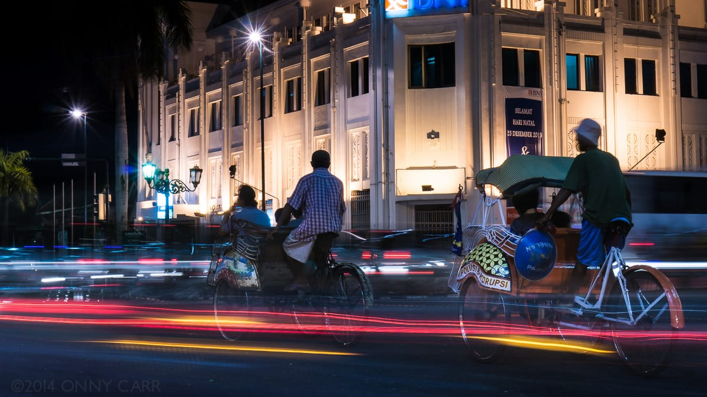
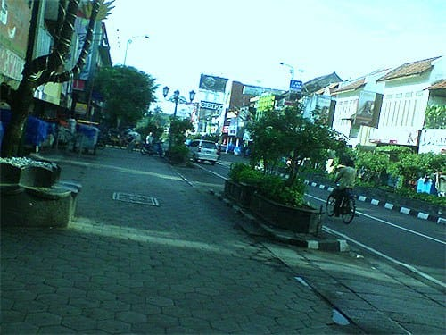
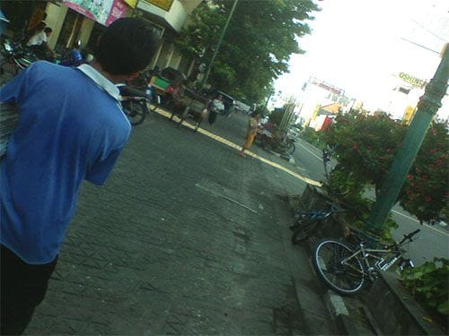

Udara dingin menyusup dari sela-sela jendela. Secara paksa ia membangunkanku dari tidur. Nanar mataku menatap keluar jendela. Hari masih pagi. Kulempar pandangan ke sekitar, beberapa penumpang tampak tergolek lelah dalam berbagai posisi tidur. Pedagang-pedagang asongan pun menyerah, duduk lesu di ujung gerbong.

Kereta tidak bergeming, terus ia susuri senti demi senti rel yang seolah tidak berujung ini. Roda-rodanya beradu seru dengan bantalan rel, menciptakan sebuah alunan bunyi yang ritmis. Meski tampak ringkih, kereta tua ini terus membelah pesawahan, ladang-ladang jagung, hutan-hutan jati yang meranggas, lalu pesawahan lagi. Untuk kali kedua Kereta Kahuripan membawaku kembali ke Kota Jogja, namun kini aku sendiri tanpa teman-teman.

Fajar menyingsing, kehidupan dalam gerbong berdenyut kembali. Para pedagang asongan mulai bergeliat menjajakan dagangannya, mulai dari kopi, susu jahe, rokok, nasi telur, nasi ayam, penitik, hingga mesin jahit *portable*. Ajaib pikirku. Para penumpang pun seolah secara paksa dibangunkan oleh orasi para pedagang.

Hari semakin terang, kereta pun akhirnya sampai di Stasiun Lempuyangan, Yogyakarta. Dengan membopong ransel berisi roti dan beberapa potong pakaian, aku meloncat keluar gerbong. Stasiun sudah ramai oleh para calon penumpang yang akan bekerja. Pedagang-pedagang pun tidak mau kalah. Para pedagang yang mayoritas wanita, tiada lelah menawarkan dagangannya lewat jendela di samping gerbong.

Bermodalkan peta hasil cetakan *printer*, kususuri rel kereta ke arah Barat, ke arah Malioboro. Bermandikan lembutnya sinar mentari, kuhirup dalam-dalam udara pagi. Ringan kakiku melangkah, meloncat dari bantalan rel yang satu ke bantalan rel yang lain. Tidak lama berselang, lengangnya Malioboro di pagi hari menyambut. Senang rasanya bisa kembali ke kota ini. Jogja aku kembali!

Foto cover dari [Flickr](https://www.flickr.com/photos/killerturnip/11925199334/) oleh [killerturnip](https://www.flickr.com/photos/killerturnip/).
