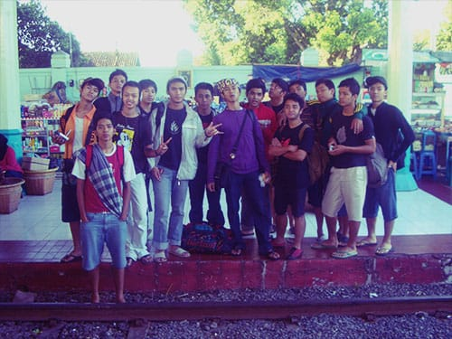
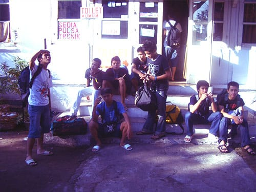
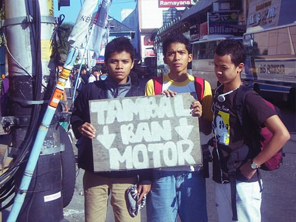
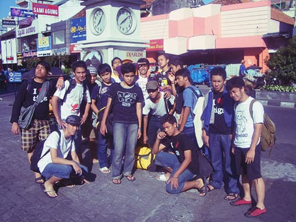
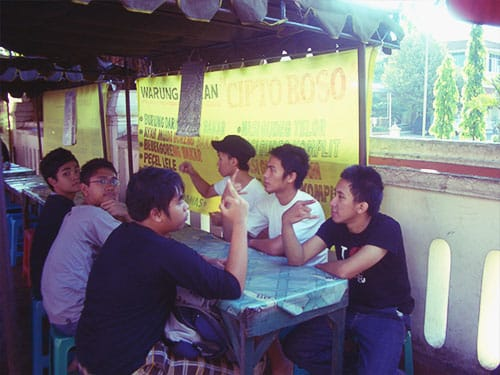
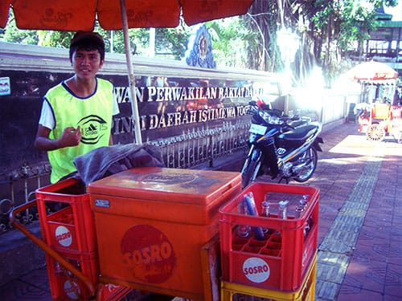
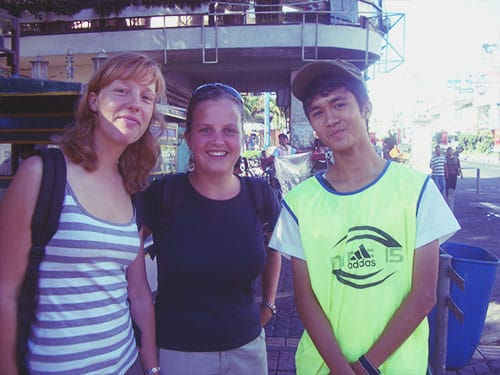
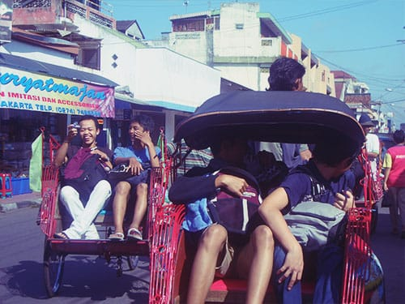
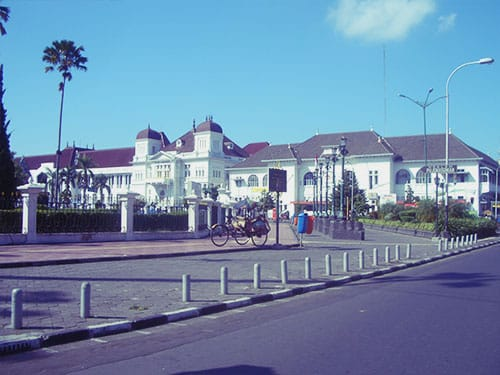
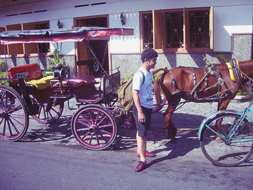

Setelah hampir 10 jam lebih di atas kereta, akhirnya kami pun sampai di kota Jogja. Kereta yang kami tumpangi berhenti di Stasiun Lempuyangan. Sebuah stasiun kecil di Yogyakarta, tempat kereta-kereta ekonomi singgah. Di Yogyakarta sendiri ada dua stasiun utama: Tugu dan Lempuyangan. Stasiun Tugu yang letaknya lebih dekat ke pusat kota, digunakan sebagai tempat transit kereta-kereta kelas bisnis dan eksekutif.

Sesampainya di luar stasiun kami mencari toilet umum untuk mandi dan menghilangkan lengket-lengket pada badan. Pada saat itu, tahun 2007, stasiun Lempuyangan belum memiliki toilet umum yang manusiawi. Namun sekarang Stasiun Lempuyangan yang tengah berbenah sudah memiliki toilet umum yang bersih, banyak, dan gratis!

Setelah merasa segar, kami pun melanjutkan perjalanan. Dengan berjalan kaki, kami menuju salah satu ikon kota Jogja: jalan Malioboro yang melegendaris.

Berselang 30 menit, kami pun akhirnya sampai di Malioboro. Maliboro di pagi hari sangat lengang. Pedagang-pedagang masih mempersiapkan jualan dagangannya. Jalanan masih sepi dari hilir mudik kendaraan bermotor.

Menyerah pada perut yang sedari tadi *ngomel* meminta makanan, akhirnya kami memutuskan untuk sarapan di Malioboro. Berhubung sedang di Jogja, menu sarapan kami tentu saja Gudeg—makanan khas Jogja yang berbahan dasar buah nangka. Gudeg Jogja sedikit berbeda dengan gudeg yang sering saya makan di Bandung. Gudeg Jogja tidak berkuah sama sekali dan rasanya manis. Nangkanya pun sangat lembut dan *juicy*. Enak!

Selesai sarapan, kami berjalan menyusuri Malioboro. Sesekali para anggota tim Belitung Merantau mengambil foto. Perhatikan foto Om Opik yang berlagak menjadi penjual Teh Botol. Tidak sampai di situ, Om Opik pun sempat berfoto dengan dua wisatawan asing.

Lelah berjalan kaki, kami pun menyetujui rayuan mas-mas pengayuh becak yang menawarkan tur keliling Jogja. Kami pun keliling Jogja menggunakan becak: menyusuri Malioboro hingga Alun-Alun Utara, kemudian ke Keraton, toko kaos oblong, hingga ke Taman Pintar.

Foto dari [Flickr](https://www.flickr.com/photos/peternijenhuis/4303781542/) oleh [Peter Nijenhuis](https://www.flickr.com/photos/peternijenhuis/).
