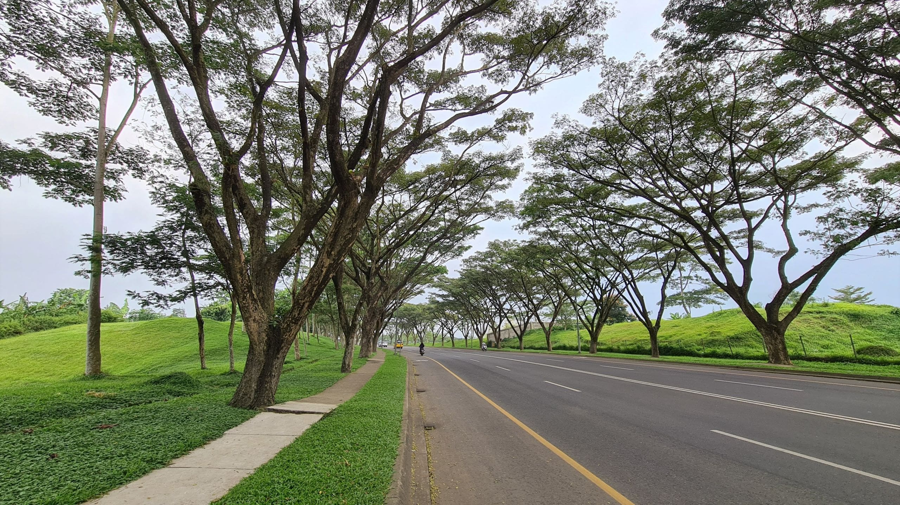
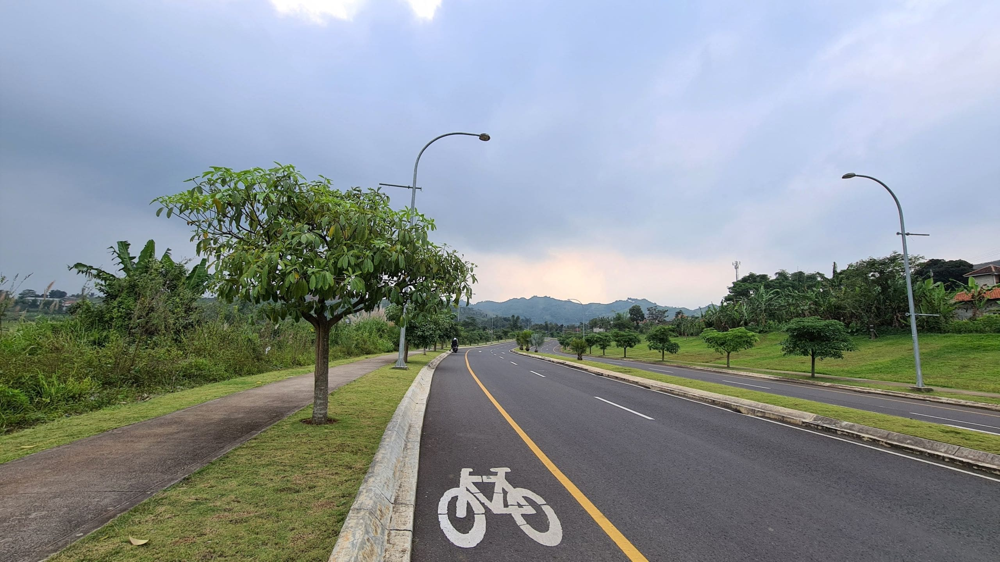
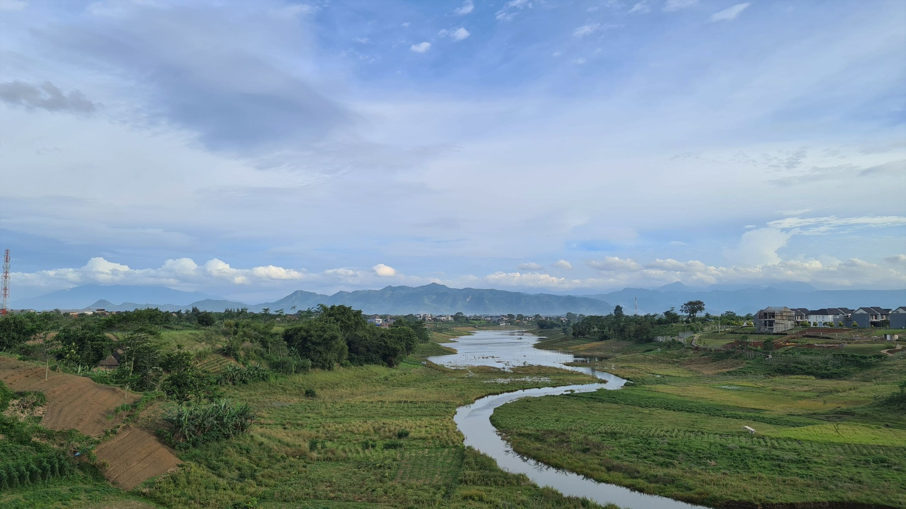
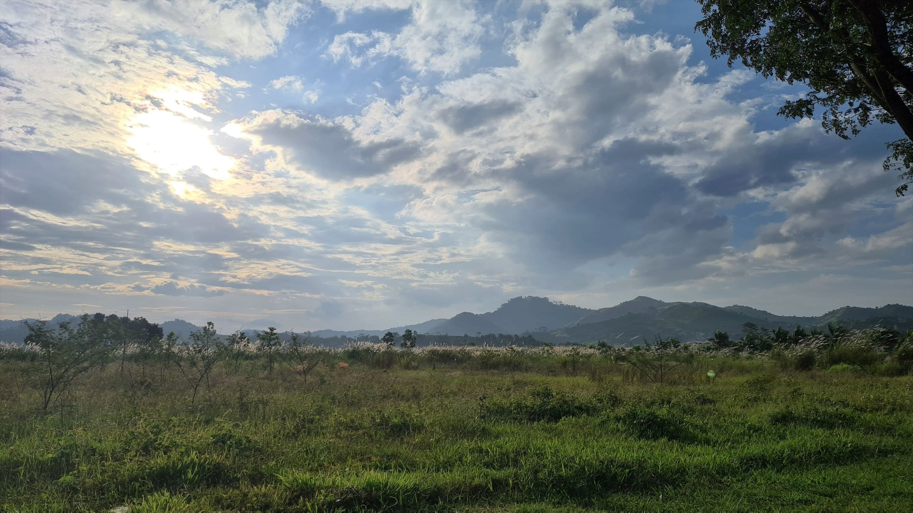

### 100 Hari Bersepeda

Awal tahun ini saya menantang diri saya sendiri untuk bersepeda selama 100 hari berturut-turut. Bukan suatu hal yang besar. Terlebih sejak akhir tahun 2019 saya memang getol bersepeda. Bisa empat sampai enam kali seminggu. Pun begitu tak jarang saya kesulitan untuk mendorong diri ke atas sadel sepeda dan mulai mengayuh. Terlebih sejak Desember kemarin saya lebih sering bersepeda menggunakan *indoor trainer*—jadi cukup monoton karena tidak ada pemandangan yang bisa saya lihat. Sebagai penggantinya saya memutar beragam tayangan *sitcom* atau kartun berdurasi pendek di layar komputer. Cukup membantu.

Hari ini genap 100 hari saya bersepeda berturut-turut. 130 sesi bersepeda. 106 jam waktu yang dihabiskan di atas sadel. 2.160 kilometer jarak yang ditempuh. 18.730 meter total elevasi yang telah dilalui. Lebih dari dua kali panjang Jalan Raya Pos dan dua kali tinggi Gunung Everest.

Sebagai penutup hari keseratus, saya pun sengaja bersepeda sejauh 100 kilometer. Dimulai terlampau siang, saya pun bersepeda dengan rute: Cimahi-Soreang-Cimahi-Padalarang-Cimahi. Sengaja menjadikan rumah di Cimahi sebagai *checkpoint* untuk beristirahat karena saya masih agak parno untuk makan di luar. Semoga pandemi ini bisa segera berakhir.

<time datetime="2021-04-08T03:00:00Z07:00">08 April 2021</time>

### Bersepeda ke Kota Baru Parahyangan

Minggu ini sudah dua kali bersepeda ke Kota Baru Parahyangan. Biasanya saya hanya menyusuri jalur utamanya: Jalan Parahyangan. Sore tadi saya sengaja berbelok di Jalan Gelap Nyawang—mengitari gerai Ikea yang baru saja dibuka. Ternyata banyak sekali kluster perumahan di sana. Yang dijajakan di ruko-rukonya pun nampak lebih beragam. Restoran Korea, pempek, masakan *chinese*, gerai pizza, kedai kopi, hingga toko sepeda.

Tidak seperti dua hari sebelumnya, perjalanan pulang-pergi ke Kota Baru Parahyangan hari ini cukup lancar. Hampir tidak ada titik macet. Walhasil waktu tempuh sore ini 10 menit lebih cepat.

