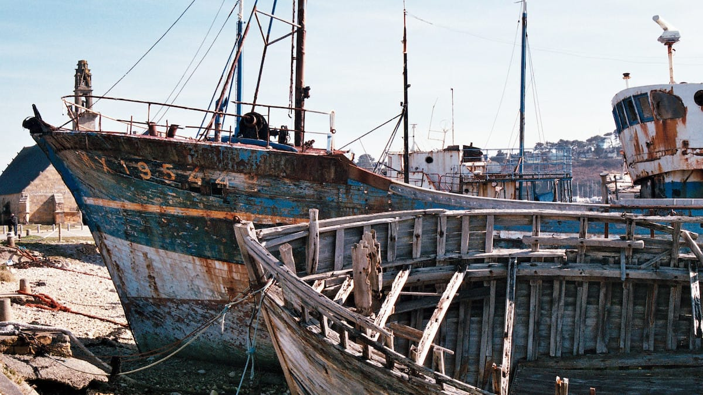
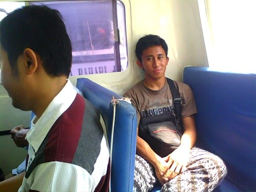
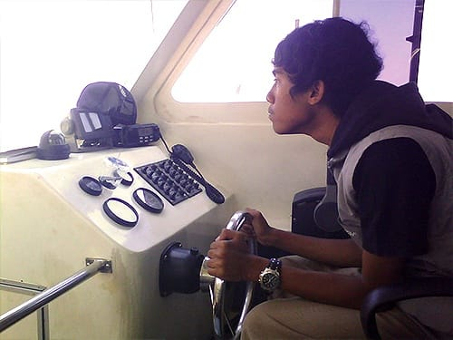
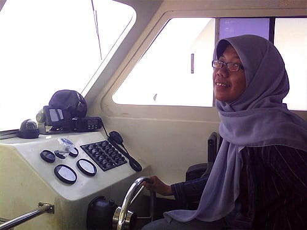

Awalnya kami sempat ragu dengan ajakan Dip dan kawan-kawannya untuk pulang dengan menggunakan Kapal Kerapu. Kami yang datang ke Pulau Tidung dengan Ojek Kapal dari Muara Angke, tidak tahu apapun tentang Kapal Kerapu ini. Biayanya hanya 32 ribu. Lebih murah seribu rupiah dibandingkan dengan ongkos Ojek Kapal. Di dalam benak kami, Kapal Kerapu itu tak ubahnya Ojek Kapal dari Muara Angke: perahu nelayan yang lebih kecil, lebih usang, lebih beresiko untuk tenggelam.

Namun akhirnya kami luluh juga, setelah Pak Taufik mewanti-wanti jika Ojek Kapal belum tentu ada yang ke Muara Angke esok hari. Kata Pak Taufik, biasanya hari Sabtu pengunjung yang bertandang ke Pulau Tidung bisa mencapai ribuan, sehingga Ojek Kapal hanya melayani rute keberangkatan saja. Kami pun diajak Pak Taufik untuk bertandang ke rumah Kakaknya yang biasa mengurusi Kapal Kerapu. Kakak Pak Taufik lah yang menyuruh kami untuk menjejerkan tas di depan loket dermaga pukul 6 pagi esok. Beliau menuturkan kalau jatah penumpang Kapal Kerapu dibatasi bagi penumpang yang bukan warga Pulau Tidung. Siapa cepat dia dapat tambahnya.

\*\*\*

Keesokan harinya kami yang sudah membariskan tas sejak subuh, berhasil mendapatkan tiket Kapal Kerapu. Ternyata betul apa kata Pak Taufik, belasan Ojek Kapal berdatangan dari seluruh penjuru. Penumpangnya membludak memenuhi dermaga, sangat kontras dengan saat kedatangan kami ke pulau ini. Jalanan Pulau Tidung yang tadinya lengang, kini dipadati para pengunjung yang mengayuh sepeda sewaannya. Beruntung kami mengunjungi pulau ini pada hari kerja.

Sekira pukul 9 pagi, kami dipersilakan untuk naik ke atas Kapal Kerapu. Kami terkejut, dugaan kami tentang Kapal Kerapu jauh meleset. Kapal Kerapu ternyata merupakan *speedboat* bermesin ganda. Kapal berkapasitas 30 penumpang ini memiliki kursi busa yang nyaman, lengkap dengan jaket pelampung di bawahnya. Meski harga tiketnya lebih murah, kapal pemberian Pemkot Jakarta ini memberikan asuransi dan makanan ringan bagi penumpangnya. Benar-benar di luar dugaan kami.

Waktu tempuh Kapal Kerapu pun jauh lebih cepat dibandingkan Ojek Kapal. Meski sempat singgah di beberapa pulau di Kepulauan Seribu, Kapal Kerapu sudah merapat di Dermaga Marina Ancol sekira pukul 11 siang. Sesampainya di Ancol, kami menyantap soto ayam yang sengaja kami bekal dari Pulau Tidung. Selesai makan siang, kami pun melanjutkan perjalanan pulang ke Bandung.

*Don’t judge a boat by its name*.

Foto cover dari [Flickr](https://www.flickr.com/photos/luxindark/16625121964/) oleh [Luxindark](https://www.flickr.com/photos/luxindark/).
