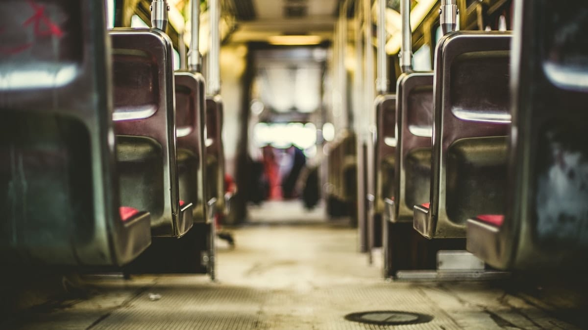
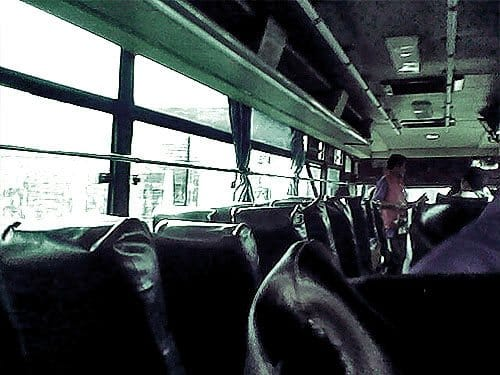

Malam pun menjelang, gulita melingkupi langit Kota Sukabumi. Lampu-lampu kota berpendar redup, menyapa kami yang kelelahan. Jalanan kota begitu lengang, geliatnya perlahan hilang ditelan malam. Malam sudah terlampau larut. Tidak memungkinkan bagi kami untuk meneruskan perjalanan ke pesisir Selatan Sukabumi. Badan kami pun sudah terasa lengket dan rontok. Awalnya kami memutuskan untuk menginap di Mesjid, namun rayuan Mas Febri untuk menginap di rumah kerabatnya begitu sulit kami tolak. *Alhamdulillah*.

Dari Terminal Leuwipanjang kami memilih untuk naik bis ekonomi non-AC, "RJ" nama bisnya. Cukup nyaman. Meski di beberapa bagian joknya sudah sobek. Untuk mencapai Sukabumi sendiri kami hanya perlu membayar 15 ribu rupiah kepada sang kenek. Sangat murah.

Aku terenyuh saat bertemu dengan seorang kakek di bis RJ ini. Pria yang sudah berumur ini baru saja menengok putranya di Bandung. Heran juga kenapa malah ayahnya yang sudah tua yang menengok anaknya. Ia membawa sepasang roda besi yang sangat berat. Katanya roda itu untuk gerobaknya. Di umur yang setua itu ia masih saja bekerja. Ia juga bercerita tentang bagaimana tambang-tambang batu kapur, marmer, dan granit di sepanjang Padalarang yang lebih banyak dimiliki oleh orang asing daripada pribuminya. Si Kakek pun turun di daerah Rajamandala. Membopong roda-roda yang berat itu.

Kami pun mengambil alih tempat duduk di barisan belakang bis. Awalnya tidak ada masalah dengan duduk di deretan paling belakang, namun kala malam tiba semua menjadi petaka. Pintu belakang bis sulit sekali ditutup, sehingga tubuh kami terpaksa menerima tamparan angin malam yang dingin. Jaket, minyak kayu putih, Salon Pas, dan Tolak Angin menjadi penolong kami. Pun begitu kami tetap saja *ketawa-ketiwi* sepanjang perjalanan. Dasar.

Di tengah perjalanan bis RJ yang kami naiki mogok di daerah antah berantah. Jalanan gelap tanpa ada penerangan sedikitpun. Di kiri dan kanan hanya ada semak belukar dan pepohonan, beruntung ada Bis Hiba Utama yang melintas. Kami pun dipindahkan ke Bis ber-AC ini.

Kami terpaksa berdiri di dalam bis karena kursi-kursinya sudah terisi penuh. Tak lama kemudian kami semua kebagian tempat duduk. Aku duduk bersama sekelompok pria yang beres memancing. Pria di sebelahku bercerita penuh semangat tentang Kota Sukabumi meski hasil pancingannya seret hari ini. Ia pun terkejut kala mengetahui kalau tujuan kami adalah Ujung Genteng. Masih sangat jauh untuk mencapainya. Orang Sukabumi sendiri tidak banyak yang pernah menyambangi Ujung Genteng ujarnya. Jarak dari Kota Sukabumi ke Ujung Genteng sendiri lebih jauh daripada jarak antara Bandung—Sukabumi, tambahnya. Aku sedikit mengeryitkan dahi mendengarnya.

Akhirnya bis sampai di Kota Sukabumi. Mengikuti saran Bapak Pemancing, kami turun di dekat alun-alun kota. Mesjid Agung di sebelahnya menjadi tujuan kami untuk melepas lelah. Awalnya kami akan menginap di mesjid ini, namun atas rayuan Mas Febri, kami pun luluh untuk menginap semalam di rumah kerabatnya. *Alhamdulillah*.

Foto cover dari [Unsplash](https://unsplash.com/photos/IisDI6liZEM) oleh [Matthew Henry](https://unsplash.com/@matthewhenry).
