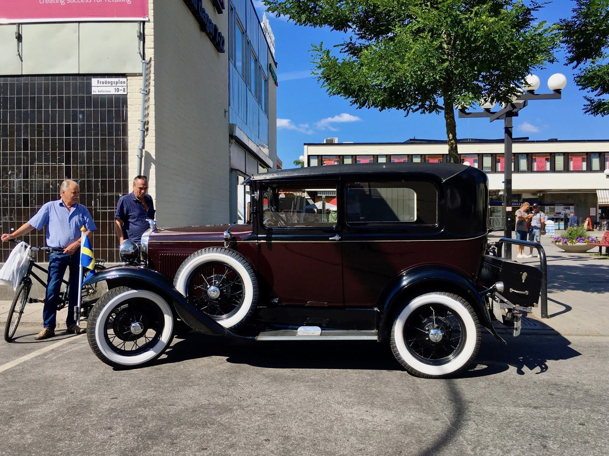
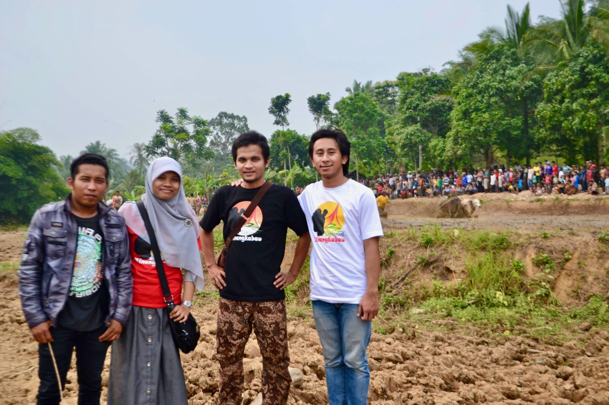

Satu-satunya hobi yang saya tekuni dan masih bertahan dari kecil hingga sekarang adalah bermain dengan komputer. Pun begitu ada sejumlah kegemaran lain yang silih datang dan pergi.

Saat kecil saya sangat senang menggambar dan mewarnai, terutama dengan menggunakan pensil warna. Ibu dan Bapak sering sekali membelikan saya buku gambar dan buku untuk mewarnai. Objek gambar yang paling saya gemari adalah mobil dan pemandangan. Saya bahkan masih ingat salah satu buku mewarnai favorit saya: buku itu bersampul cokelat dan berisi gambar-gambar mobil klasik.

{{}}



Saat sekolah dasar, saya sangat senang membaca. Bahkan saya sempat beberapa kali mendapat penghargaan sebagai peminjam buku terbanyak dari perpustakaan sekolah. Saat itu saya sangat senang membaca buku-buku berbau sains: tentang kisah para penemu, tentang ragam transportasi dan utamanya tentang luar angkasa. Saya juga gandrung dengan seri Lima Sekawan.

Selain itu saya juga mulai senang *ngoprek* dan melakukan percobaan sains sederhana di rumah. Terima kasih pada guru IPA saya saat SD, Pak Djanu. Beliau memang selalu melakukan percobaan dengan alat peraga di kelas untuk menerangkan suatu pokok bahasan. Usai sekolah atau saat jam istirahat tiba, saya dan kawan-kawan kelas kerap *nonkrong* di laboratorium pribadinya. Saya masih ingat bagaimana lampu-lampu neon di ruang laboratorium beliau akan otomatis menyala saat ada orang yang masuk. Ketertarikan pada sains juga membuat saya ditunjuk Pak Djanu untuk mewakili sekolah dalam lomba cerdas-cermat IPA. *Alhamdulillah* tim sekolah kami juara sekotamdaya.



Menginjak Sekolah Menengah Pertama, saya mulai mencoba beragam hobi. Saya sempat mengoleksi mobil-mobil *diecast* yang biasanya saya dapatkan dari Indomaret. Beberapa tahun bersilang, mobil-mobil ini diambil alih dan dimainkan oleh adik laki-laki saya. Kini banyak dari koleksi mobil-mobilan ini yang hilang, rusak catnya, atau bengkok poros rodanya.

)](altered-state-hot-wheels.jpg)

Saat SMP, saya juga mulai tertarik untuk mendengarkan musik dan mengumpulkan kaset dari beragam *band* yang tengah tersohor kala itu: Blink-182, Linkin Park, Audioslave, Muse, Red Hot Chili Peppers, Green Day, Jamrud, hingga Tipe-X. Radio *tape* Polytron milik ibu pun saya kuasai dan boyong ke kamar untuk memutar koleksi kaset-kaset saya. Mayoritas kaset-kaset itu saya beli di toko musik dekat alun-alun Kota Cimahi, sayang kini tokonya sudah tidak ada.

Saat SMP pula saya tertarik dengan otomotif dan modifikasi motor. Saya masih ingat setiap hari Rabu sepulang sekolah, saya dan kawan saya Regi selalu bergegas ke lapak penjual koran di depan gedung PLN untuk membeli tabloid Motor Plus. Kami sangat senang melihat modifikasi-modifikasi motor di tabloid itu.

Kala itu tengah gandrung modifikasi motor *trondol* à la *drag race*. Dan kebetulan kala itu ada motor Astrea 800 Supercub yang menganggur di rumah. Motor *jadul* keluaran tahun 1982 ini pun jadi korban eksperimen saya.

Semua *body* plastik pada motor Astrea itu saya tanggalkan, menyisakan rangka motor yang kemudian saya cat warna hijau *stabilo*. Jok tebalnya pun turut saya lengserkan, sehingga untuk mengendarainya saya harus duduk di atas tangki bensin. Pegas yang ada di dalam peredam kejutnya pun sengaja saya potong di bengkel las dekat rumah; menyisakan 5 centimeter saja antara blok mesin dan aspal. *Oh*, dan tak ketinggalan pernak-pernik aluminium berwarna biru mengkilat mulai dari mur, baut, hingga tutup pentil—meski semuanya imitasi dari merek asal Thailand: Posh.

)](astrea-800-1985.jpg)

Hobi baca saya saat SMP pun beralih pada komik. Tiap tiga atau empat hari sekali saya biasanya sengaja pulang sekolah lewat gang dekat Bank BRI untuk mampir dan menyewa komik di Taman Bacaan Garuda. Saya masih ingat beberapa komik yang saya ikuti: Doraemon, Samurai X, One Piece, Hunter x Hunter, Crayon Shin-chan, Kariage Kun, dan Kung Fu Komang.

Saat SMP pula Bapak membelikan saya satu set komputer. Mulanya saya hanya menggunakannya untuk bermain *game*, terlebih tak jauh dari sekolah ada penjual CD *game* komputer bajakan. Ketertarikan saya pada pemrograman juga tumbuh saat SMP, kala itu saya meminjam buku pemrograman Delphi dari saudara. Saya masih ingat pernah membuat program teks editor bermodal buku tentang Delphi tersebut. Teks editor sederhana itu saya beri nama RDF (akronim dari Reason da Freak 🙈).



Masuk SMA ketertarikan saya pada komputer kian bertambah. Mulanya saya sangat senang dengan desain grafis dan animasi. Beragam aplikasi pernah saya pelajari mulai dari Adobe Photoshop, CorelDRAW, Macromedia Flash, 3ds Max, hingga Maya dan After Effects. Karenanya tak jarang dimintai teman-teman untuk mendesain pin, pamflet, *slide* presentasi, hingga buku tahunan. Namun yang paling saya ingat adalah menerbitkan buletin mingguan bernama BULAT (Buletin Liga SMA Tiga) bersama kawan saya Taufik dan Aulia. Buletin independen dari kocek pribadi ini membahas liga bola antar kelas yang digelar tiap minggunya.

Saat SMA juga saya mulai mengenal pemrograman web. Mulanya saya meminjam buku tentang pemrograman PHP dari teman saya yang super mahir dengan komputer: Rizky Prillian. Dari situ lah saya mulai tertarik membuat website dan mulai mengumpulkan buku-buku seputar pemrograman web. Buntutnya saat kelas dua saya dan kawan saya Wasil diikutkan lomba web sekolah yang diselanggarakan POLBAN. Masih ingat bagaimana saya menjelaskan pencegahan CSRF (*Cross-site Request Forgery*), XSS (*Cross-site Scripting*), hingga *session fixation* yang diterapkan pada website yang kami buat. Akhirnya kami pun berhasil menyabet juara satu, *Alhamdulillah*. Masih ingat juga saya gunakan hadiah lombanya untuk membeli *graphic card* 😛.



Masuk jenjang kuliah sebetulnya saya tidak terlalu sering berkutat dengan komputer. Pun begitu saya tetap paling senang mengikuti mata kuliah yang ada hubungannya dengan komputer dan pemrograman: algoritma, Java, pemrograman web, mikrokontroler, hingga bahasa *assembly*. Untuk tugas akhir saya pun membuat simulator *link* gelombang radio berbasis web.

Di masa kuliah ini saya makin tertarik dengan pelesir à la *backpacking*. Tiap akhir semester saya dan teman-teman kelas rutin berkelana ke berbagai Taman Nasional: Pulau Seribu, Ujung Genteng, Bromo-Tengger-Semeru, hingga Karimunjawa.

Di samping itu saya pun mulai gemar menulis, terutama tentang cerita perjalanan yang pernah saya jalani. Saya pun sempat bercita-cita untuk menjadi *travel writer* saat itu. Buahnya [tulisan yang saya buat](/blog/petualangan-imajiner/) berhasil membawa saya jalan-jalan gratis ke Sumatera Barat; lewat lomba artikel wisata yang diadakan Explore Minangkabau.

{{}}

Minat baca saya saat kuliah pun bergeser ke novel. Mulai dari Laskar Pelangi, Supernova, *Lord of the Rings*, Abarat, hingga *The White Castle* karya Orhan Pamuk. Saya juga gandrung dengan tulisan-tulisan Pramoedya Ananta Toer dan Ahmad Tohari. Saya benar-benar menikmati penuturan mereka di tetralogi Pulau Buru, Arok Dedes, Ronggeng Dukuh Paruk, dan Lintang Kemukus Dini Hari.



Saat masuk dunia kerja, terlebih saat mulai berkarir sebagai *programmer*, semua hobi itu saya tinggalkan—kecuali *ngoding* di depan komputer tentunya. Saya jarang membaca buku selain buku pemrograman. Saya juga telah vakum menulis blog selama bertahun-tahun.

Sampai akhirnya beberapa minggu lalu saya membaca salah satu diskusi di [Hackernews](https://news.ycombinator.com/item?id=17274320) tentang mengatasi kejenuhan dalam bekerja sebagai *programmer*. Beberapa poin dari jawaban [@trcollinson](https://news.ycombinator.com/user?id=trcollinson) di *thread* tersebut menohok saya:

> 2) through therapy I realized that I didn't have an identity outside of being a software developer. That's what was burning me out. I wasn't Tim the person who has a family and interests and develops software. I was Tim: software developer. The end. This turns out to be really bad. I had to remember who I am other than software developer. All I ever did was work or think about work or work on other things that were just like work.
> 3) in discovering who I am I remembered my other passions in life. I spent more time with my family and enjoy the time more. I spend a little time with just myself and that is ok too. I enjoy hobbies (mine are recreational math, reading legal briefings (I'm aware this is weird), crocheting, and writing short stories). I do these by myself or with my kids and wife. It's nice.

Setelah saya menyelidiki diri sendiri, ternyata ada benarnya juga. Beberapa bulan ke belakang saya mudah jenuh saat *ngoding*. Padahal biasanya saya sangat betah menyelesaikan masalah pemrograman hingga berjam-jam lamanya. Mungkin ini ada kaitannya dengan saya yang tidak punya kegemaran lain diluar *ngoding*?

Karenanya beberapa minggu ini saya mulai menggiatkan kembali hobi lama saya untuk menulis. Selain itu saya mulai menjajaki hobi lain seperti fotografi. Dan yang paling teranyar: mengumpulkan kartu pos!
