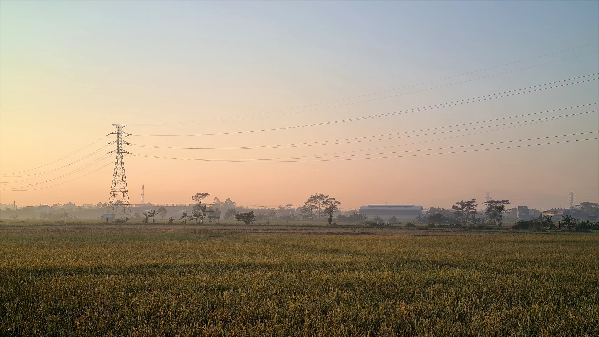
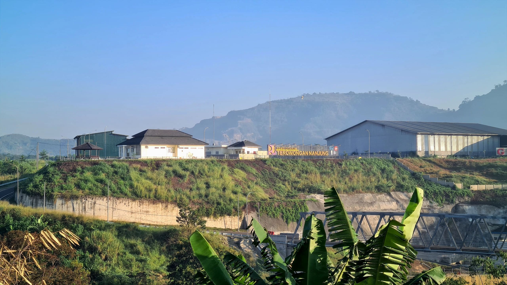
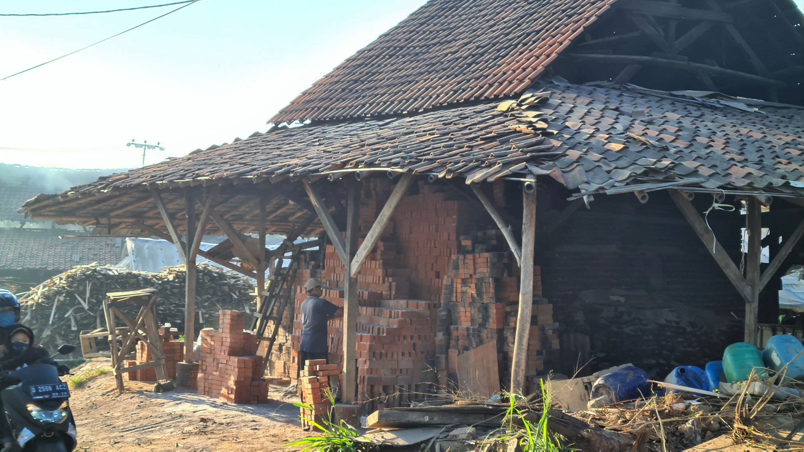
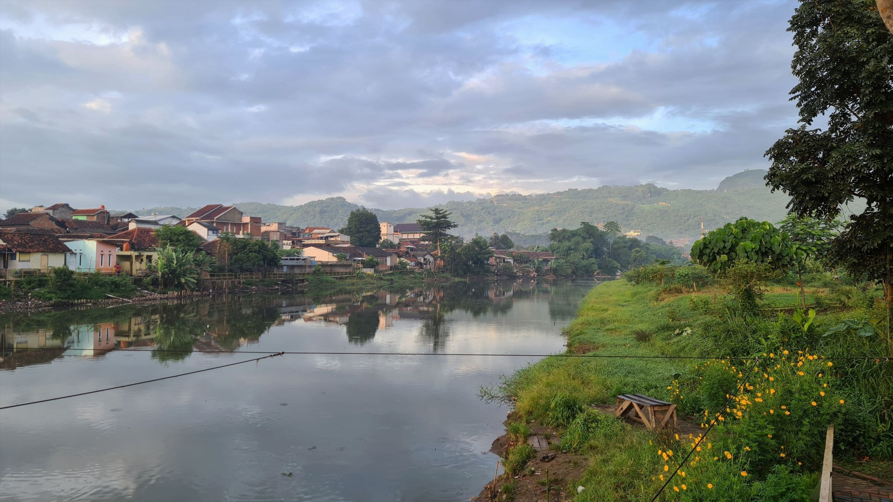
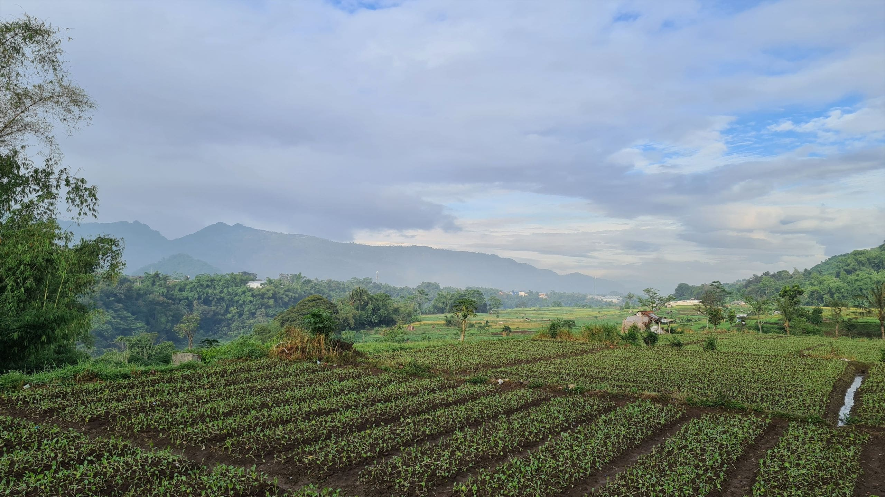

Setelah tiga bulan lebih bersepeda dengan menggunakan *indoor trainer*, di penghujung Februari kemarin akhirnya saya bersepeda ke luar rumah. Tidak jauh memang. Hanya sampai Cangkorah di Kabupaten Bandung Barat, sebelum akhirnya kembali pulang. Saya kira akan kewalahan saat kembali bersepeda di luar sana. Tapi rasanya level ketahanan fisik saya tidak jauh berbeda sebelum vakum bersepeda *outdoor*.

Sejak saat itu frekuensi bersepeda di luar rumah bertambah intens. Yang mulanya hanya satu kali dalam seminggu. Akhirnya minggu kemarin menjadi enam kali bersepeda di luar; dan hanya satu kali sesi di atas *trainer*.

Kecamatan Margaasih di Kabupaten Bandung menjadi rute gowes favorit saya saat ini. Meski akses jalannya tidak bisa dibilang ideal, arus lalu-lintasnya relatif lengang. Tidak ada macet. Tidak perlu berebut jalan dengan pengendara lain. Bebas dari serangan asap kendaraan bermotor. Juga banyak jalan-jalan kecil ke pedesaan atau area pesawahan dengan pemandangan yang asri. Dan yang paling utama: rutenya tidak terlalu menanjak.

Di Margaasih saya senang sekali melewati Jalan Irigasi dan Jalan Koreh Kotok. Dua jalan kecil ini dipisahkan oleh aliran sungai Citarum. Jalan Irigasi di sisi Utara Citarum, sedang Jalan Koreh Kotok di sisi Selatannya. 

Nama Jalan Irigasi sepertinya diambil dari saluran irigasi yang mengalir sepanjang jalan kecil ini. Kebun-kebun warga bertebaran di sepanjang bibir sungai Citarum. Ada yang menanam pisang, ketela, sawi, hingga kemangi. Di sisi lain ada Gunung Lagadar yang satu sisi lerengnya tampak gersang karena aktifitas penambangan batu andesit.

Di sisi lain, Jalan Koreh Kotok kondisinya jauh lebih baik. Sebagian diaspal, sebagian dibeton. Di sepanjang jalan kita bisa menemui sentra pembuatan batu bata tradisonal. Tungku-tungku besar untuk membakar batu bata berjejer di kiri dan kanan jalan. Jalan Koreh Kotok juga menjadi akses untuk menuju Terowongan Air Nanjung yang tahun 2020 kemarin diresmikan langsung oleh Presiden Jokowi. Terowongan air ini berfungsi untuk memperlancar dan memperbesar daya tampung Sungai Citarum. Sehingga diharapkan bisa mengurangi wilayah terdampak banjir di sekitar Bandung.

