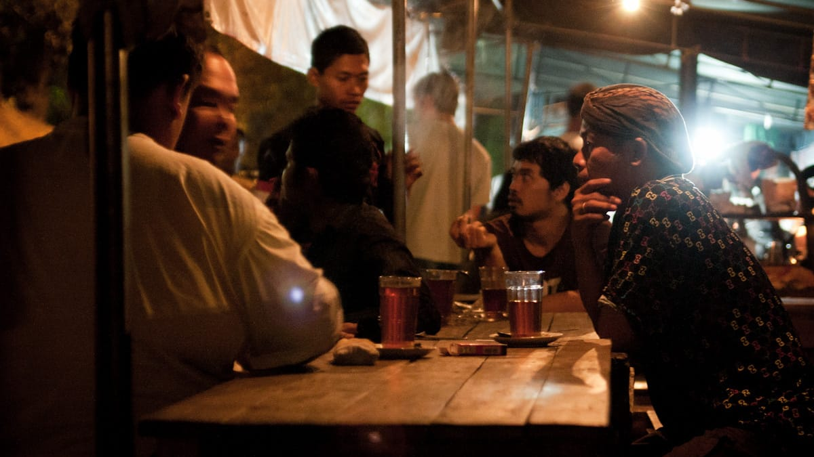
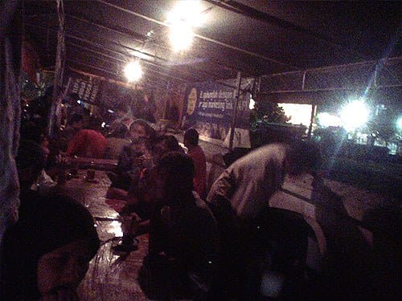

Kopi dan dinginnya udara malam memang pasangan yang sangat tepat. Tapi bagaimana jika kopi yang disajikan dicampur dengan arang? *Hmmmmmm* tunggu dulu.

Kala itu Kota Jogja Mendung seharian, namun hujan masih enggan untuk turun. Udara dingin berhembus, membekukan tubuhku yang hanya berbalut kaos tipis. Malam menyelimuti kota, namun kehidupan di Malioboro masih terus bergeliat. Jejeran pedagang ala lesehan memadati trotoar sepanjang Jalan Malioboro. Semuanya hampir menawarkan makanan yang sejenis: nasi gudeg, ayam goreng, lele goreng, burung dara goreng, dan sesekali ditemui soto serta bakso.

Dari Malioboro aku berjalan terus ke Utara, ke arah Stasiun Tugu. Maksudku tidak lain untuk menyambangi Angkringan Lek Man yang sempat aku tonton di acara TV beberapa hari sebelumnya. Setelah bertanya arah kepada beberapa orang di dekat stasiun, rupanya Angkringan Lek Man terletak tepat di sebelah Utara Stasiun.

Di setiap sudut Kota Jogja, mudah sekali untuk menemukan pedagang angkringan. Konon, pendahulu Lek Man inilah yang menjadi pelopornya. Harga makanan dan minuman yang tergolong murah serta suasana keakraban yang sangat kental, menjadikan angkirngan populer di berbagai kalangan. Mulai dari tukang becak, tukang ojek, mahasiswa, hingga pegawai kantoran.

Angkringan Lek Man sendiri berjualan dengan menggunakan pikulan, dua buah bakul yang dihubungkan oleh sebuah bambu. Pengunjung bisa duduk dekat pikulan sembari menghangatkan tubuh dengan panggangan arangnya atau lesehan di tikar-tikar yang digelar sepanjang trotoar jalan. Makanan yang ditawarkan pun bervariasi: mulai dari nasi kucing, sate telur, sate kulit, sate usus, ceker ayam, tempe bacem, jedah, hingga kepala ayam. Sedangkan minumannya ada teh manis, kopi, wedang jahe, wedang ronde, hingga susu.

Ada satu menu unik yang ditawarkan di Angkringan Lek Man ini, Kopi Joss namanya. Namanya yang unik ini tidak lain berasal dari suara bara arang yang mendesis kala dicelupkan ke dalam kopi. Ya, ramuan kopi ini dicampur dengan arang! Konon campuran bongkahan arang ini mampu menurunkan kadar kafein dalam kopi. Rasanya tidak berbeda dengan rasa kopi tubruk lainnya, namun keberadaan arang yang mengapung dalam gelas menjadikannya sangat unik dan menarik perhatian.


Aroma khas kopi bercampur arang menguar kala kusesap kopi ini. Teguk demi teguk terasa nikmat, kala kopi mengalir menghangatkan kerongkongan. Ditemani nasi kucing berlauk teri dan sate kulit yang gurih, menjadikan makan malam di Angkringan Lek Man terasa sempurna.

Foto cover dari [Flickr](https://www.flickr.com/photos/killerturnip/5817202207/) oleh [killerturnip](https://www.flickr.com/photos/killerturnip/).
