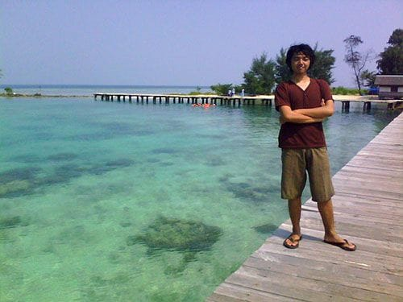
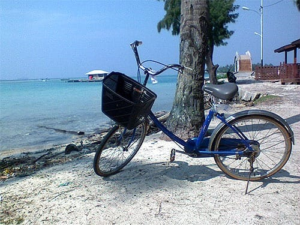

Hampir 3 jam kami terombang-ambing di atas ojek kapal ini. Sejauh mata memandang hanya birunya lautan yang kami lihat, tapi tidak jauh di Utara tampak sebuah pulau yang memanjang. Rumah-rumah berderet terhalangi rimbunnya pepohonan di sepanjang bibir pulau itu. "Itu Tidung!", gumam si ABK padaku. Aku tengah mengoborol dengan ABK yang sudah berumur ini. Suaranya lantang keras, khas orang-orang laut.

Kapal akhirnya merapat di dermaga Pulau Tidung. Si ABK memanggil seseorang di dekat dermaga. Ia menyuruhnya untuk mengantarkan kami ke rumah Pak Taufik, kenalannya. Ah, aku ingat betul kata Oom Nuran "Tuhan selalu menolong hamba-Nya yang *backpacking*". Pak Taufik ini merupakan warga Pulau Tidung, ia memiliki sebuah penginapan yang letaknya dekat dengan dermaga. Kala itu penginapan Pak Taufik sedang direnovasi, kami pun dipersilakan untuk menggunakan rumahnya. *Alhamdulillah*.

Rumahnya ada tepat di belakang penginapan. Dua buah kamar besar dengan dua buah kasur ukuran jumbo dan satu kasur ukuran kecil. Ruangannya bersih dan terpasang kipas angin yang siap mengusir hawa panas pesisir. Dua buah kamar mandi bisa kita gunakan, airnya melimpah dan tidak payau. Sebuah TV ukuran 21 *inch* serta dispenser juga disediakan oleh Pak Taufik. Untuk semua fasilitas itu, selama 3 hari 2 malam kami hanya dikenakan biaya sebesar 250 ribu rupiah. Karena berlima, kami membayar 50 ribu per-orangnya. Padahal kamar masih cukup luas untuk menampung 10 orang, bahkan lebih!

Belum lurus urat-urat yang mengkerut, kami berlima langsung mengayuh sepeda yang juga disediakan oleh Pak Taufik. Kondisi sepeda tampak mengkhawatirkan. Suara decitan timbul tiap kali sepeda digowes, bahkan jok sepeda turun-naik bak jungkat-jungkit. Beruntung pemandangan laut lepas di sepanjang jalan membuat kami melupakan sulitnya mengendalikan sepeda uzur ini.

Lokasi pertama yang kami tuju adalah Jembatan Cinta. Jembatan kayu ini membentang di atas laut, menghubungkan antara Pulau Tidung Besar dan Pulau Tidung Kecil. Konon pasangan yang berjalan sambil berpegangan tangan di jembatan ini, hubungannya akan langgeng dan berakhir di pelaminan.

Jembatan Cinta ini melengkung tinggi di bagian awalnya, perairan di bawah lengkungan ini cukup dalam. Perahu-perahu nelayan sering kali lewat di bagian ini. Setelah *cipak-cipuk* di air untuk memastikan ilmu renang kami masih tersisa, aku dan Gita berdiri di atas puncak jembatan. Rasanya belum sah kalau ke Tidung tidak loncat dari Jembatan Cinta ini.

Cukup lama kami berdiri terpaku di atas jembatan, memikirkan nasib kami jika loncat dari jembatan ini. "Bakal kena karang gak ya?" begitu pikirku. Gita pun loncat, badannya tercebur ke lautan. Ia tersenyum kegirangan, aku pun turut melompat. *Byuuuuur*!

Rasanya sangat melegakan, meski dibeberapa bagian tubuh menjadi kemerahan. Tiga kali kami mengulanginya, asyik sekali! Pelepas stres yang manjur. Sungguh. Pada lompatan terakhir, aku, gita, dan seorang pengunjung lainnya melompat bersamaan dari Jembatan Cinta. Pengalaman yang tidak terlupakan.

Foto cover dari [Unsplash](https://unsplash.com/photos/zNlM2ADjFC0) oleh [Austin Neill](https://unsplash.com/@arstyy).
