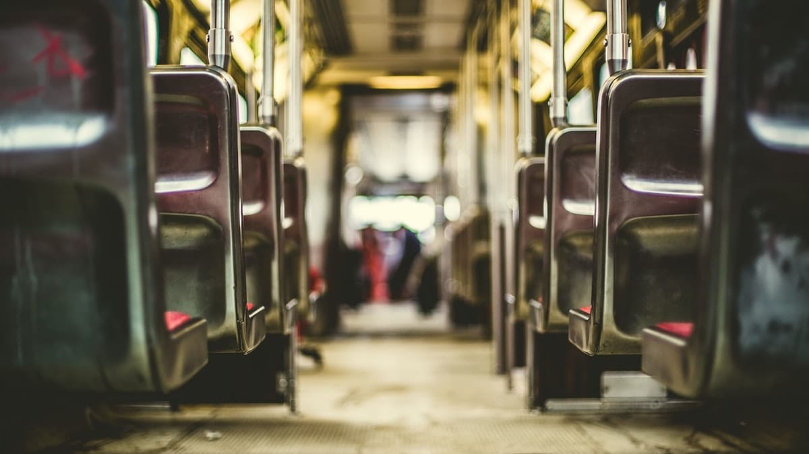

24 Juli 2010

Purnama di sudut langit kota merestui kepulangan kami.\
Putih pucat terangnya terlihat dari sudut kaca yang temaram.\
Aku duduk di kanan bersender pada tubuh bus tua yang dingin.\
Dia di sana duduk di kiri, tepat di sebelahku.\
Begitu dekat, sampai-sampai bisa kucium wangi pundaknya.

## Bersekutu dengan si Bis Tua

Oh, Tuhan, selamatkanlah hamba-Mu ini!!!\
Jangan biarkan dia mendengar ledakan dahsyat di ruang jantungku!\
Sekelebat bintang pun jatuh.\
Ledakan solar dan gesekan piston di ruang bakar menyembunyikan ledakan jantungku.\
Terimakasih Tuhan!!!

Oh, Tuhan, selamatkanlah pendosa-Mu ini!!!\
Jangan biarkan dia mendengar desir kencang darah di urat nadiku!\
Sekelebat bintang pun jatuh.\
Karet roda-roda berputar dan bergesekan dengan punggung aspal hitam.\
Desisnya serirama dengan dengan desir darah dalam pembuluhku.\
Kencang dan kasar.\
Terimakasih Tuhan!!!

Oh, Tuhan, selamatkanlah makhluk-Mu ini!!!\
Jangan biarkan dia mendengar getaran liar sendi-sendi tulangku!\
Sekelebat bintang pun jatuh.\
Mur, baut, engsel-engsel yang berkarat saling menjalin dan bergetar mempertahankan bentuk bus yang membosankan.\
Getarannya menyamarkan gerak tidak harmonis antar sendi tulangku.\
Terimakasih Tuhan!!!

## It was a lovely night

Wajahnya dengan jelas kutangkap dalam keremangan.\
Wajahnya bukan lagi wajahnya yang dulu kukenal.\
Wajahnya kini menjelma menjadi wajah malaikat tak bersayap.

Matanya dengan jelas memantul dalam keremangan.\
Matanya bukan lagi matanya yang dulu kukenal.\
Matanya kini menjelma menjadi mata boneka porselen yang tersimpan rapi dalam rak-rak kayu mewah.

Tawanya dengan jelas terjebak dalam keremangan.\
Tawanya bukan lagi tawanya yang dulu kukenal.\
Tawanya kini menjelma menjadi tawa renyah queen Lucy yang duduk di tahta Cair Paravel yang ajaib.

Deru parau bis tua mengantar sebagian penumpangnya ke gerbang dunia mimpi.\
Iramanya terdengar merdu seperti suara ibu yang bersenandung di penghujung malam, kala kita terlelap dahulu.\
Getaran yang dijalarkan dari mesin bus tua membawa penumpangnya ke tempat lain yang lebih jauh lagi.\
Ayunannya terasa lembut seperti timangan ibu waktu kita kecil dahulu.\
Tetapi tetap saja, kita terjaga dan mentertawakan banyak hal.

## She remains in a lonely bus

Sampai di sana, di tepi jalan yang keras dan dingin.\
Di daerah remang tempat angin memaksaku pergi meninggalkanmu.\
Derak engsel pintu berdecit, pertanda saatnya berpisah.\
Kau tetap di sana, di kursi biru memaku tanpa ragu sedikitpun.\
Tidakkah kau merasa gelisah malaikatku?\
Tidakkah kau merasa ketakutan boneka porselenku?\
Tidakkah kau merasa cemas ratuku?\
Apa kau menyembunyikan semua rasa itu?\
Siapakah engkau?\
Benarkah kau yang meledakan jantungku?\
Mungkinkah kau penyebab desiran kencang laju darahku?\
Apakah kau yang mengoyak dan mengguncang jalinan kokoh sendi-sendi tulangku?

Engkau gadis penumpang bus malam, siapa dirimu sebenarnya?

Foto dari [Unsplash](https://unsplash.com/photos/IisDI6liZEM) oleh [Matthew Henry](https://unsplash.com/@matthewhenry).
