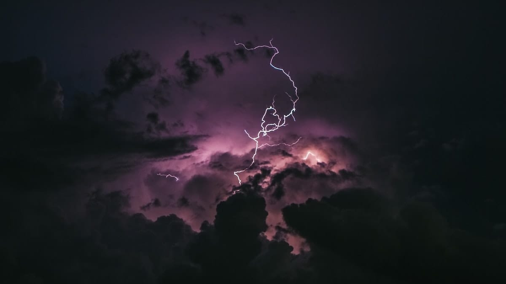

Hembusan angin menerpa wajah kami. Dingin menusuk kulit. Aroma garam tercium kuat dari udara yang berhembus. Kutarik nafas dalam-dalam menjejalkan udara yang dingin membeku ini. Mengisi setiap ruang-ruang dalam paruku yang kini begitu lelah.

Semua yang kudengar hanya decitan-decitan melengking dari papan-papan kayu yang dihempas air laut yang bergejolak. Hitam legam. Tidak tertembus cahaya bintang yang remang-remang.

Sesekali kudengar hembusan nafas yang sama lemahnya; begitu parau menyedihkan. Kulemparkan pandanganku ke kiri—kearah pemilik paru-paru yang menyedihkan itu.

Ku merangkak di atas jejeran papan kayu yang berderak-derak. Mendekati sosok yang sama menyedihkannya denganku. Kuayunkan lengan kiriku ke atas bahunya. Memeluk dirinya yang tampak begitu rapuh. Kuletakan kepalanya di dadaku. Kuraih dan kuusap rambut hitam-halus miliknya. Kami berdua bersandar pada tiang kayu yang menancap di tengah-tengah perahu kayu yang tampak begitu mengkhawatirkan.

Kutopangkan lengan kananku dan menarik tubuhnya berbaring berdampingan di lantai kayu yang lembab. Lama kami bebaring. Menatap langit malam. Di tengah-tengah lautan luas seperti ini, hanya langit malam lah yang menolong kami dari rasa kesepian. Dari kebosanan terombang-ambing di tengah lautan yang biru dimana-mana. Biru kelam yang membosankan.

Ribuan atau mungkin jutaan bintang bertebaran di legamnya layar langit malam. Seperti melihat pertunjukan cahaya. Cahaya remang bintang-bintang memantul dan menari-nari di permukaan air yang tengah bergejolak.

Kualihkan pandanganku ke samping. Cahaya pucat dari bintang-bintang memantul mengulas wajah yang sama pucatnya di sampingku. Kutatap lekat wajahnya yang sempurna tidak bercela. Ia memandang lurus ke langit. Tergambar jelas kelelahan di wajahnya. Matanya mengisyaratkan harapannya yang menipis. Namun dia tetap secemerlang intan permata. Cantik bak dewi yang turun dari pelangi.

Kusentuh pipinya dengan punggung tanganku. Halus bagaikan kain sutera. Dingin kulitnya mengalahkan hembusan angin laut yang berdesir di sekeliling kami.

Sesaat kemudian, sangat cepat: gerombolan awan-awan gajah bergejolak di Barat. Begitu besar bergulung-gulung. Mereka mengamuk bergelayutan di langit malam. Gelapnya malam tidak dapat menandingi gelapnya awan-awan hitam itu.

Hembusan angin terasa begitu keras menerpa. Suaranya mengerikan saat berputar-putar di layar yang compang-camping. Sementara gerombolan awan itu semakin membesar dan mendekat. Aku yakin tidak lama lagi mereka akan mengaduk-aduk kami.

Bergegas ku berdiri. Meletakan dia perlahan di lantai kayu yang berderak semakin keras. Kulepaskan tali yang mengikat layar dan menggulungnya di bahu kananku. Layar yang kusut itu kini tergulung dan berhenti berkibar. Air laut yang memang selalu bergejolak kini makin bergejolak. Naik turun begitu cepatnya menghempaskan perahu kecil yang kami tumpangi.

Dengan hati-hati aku berusaha mengambil dua buah tong kosong yang tadinya berisi pesediaan makanan dan minuman kami. Perahu rapuh ini terombang-ambing semakin keras tidak terkendali. Aku mulai merangkak menyusuri tepi perahu untuk mengambil tong-tong tersebut.

Setelah berhasil mencapai bagian belakang perahu, aku ikatkan kedua tong tersebut dengan tali tambang dari layar. Kembali kususuri tepi perahu dengan kedua tong yang terikat itu. Aku berpegangan pada tepi perahu. Menyeret tong-tong besar itu ke tengah perahu.

Kuhampiri sosok indah yang terbaring pada lantai kapal itu. Kutegakan tubuhnya dan menyandarkannya kembali pada tiang kapal. Kupererat simpul tali pada kedua tong kayu itu. Mengikatnya pada celah-celah di sisi-sisi selimut dan tutupnya.

Sisa tali layar yang mengikat tong-tong tersebut aku ikatkan melingkar pada pinggangnya, lalu kulilitkan juga pada pinggangku. Kini kami berdua terikat bersama tong-tong tersebut. Tampak seperti tahanan yang akan diasingkan atau seperti budak yang akan diperjual-belikan.

Gelombang air laut kini tampak lebih menyeramkan daripada biasanya. Puncak-puncak gelombangnya membumbung semakin tinggi. Sisa tali yang mengikat kami dan kedua tong kayu ini, aku lilitkan beberapa kali pada tiang layar. Sekarang kami benar-benar tampak seperti tahanan atau budak-budak yang dijual para pedagang di Hernaki.

Dinginnya air lautan memerciki tubuh kami yang terikat pada tiang layar. Kurangkul tubuhnya dengan tangan kiriku. Tangan kananku memegang erat ujung tali yang terlilit pada tiang layar.

Semakin keras ombak menghantam lambung perahu kami. Dengan sekuat tenaga kugenggam tali pada tangan kananku; menghiraukan denyut perih pada bahuku. Terlihat dari sudut mataku bercak merah darah menetes dari balutan kain yang tadinya berwarna putih. Aroma amis tercium dari kain yang membalut bahu kananku itu.

Semuanya tampak seperti akhir. Awan-awan itu berada begitu dekat. Begitu kelam. Bintang-bintang yang tadinya menghibur kami kini telah hilang dari langit, bersembunyi dari gerombolan yang mengerikan ini.

Percikan air laut dan tetesan air langit menusuk-nusuk tubuh kami. Semakin keras hujan menusuk tubuh kami. Semakin keras angin menampar wajah kami. Suara-suara mengerikan bergema di seluruh penjuru angin. Suaranya seperti geraman beruang lapar. Namun itu tidak lebih menakutkan daripada apa yang ada di hadapan kami. Sekelompok ombak bergulung tumbuh ke langit, seakan-akan sekelompok raksasa yang siap melahap kami dan kapal kami.

Kurangkul ia dengan kedua lenganku dengan kepalanya di dadaku. Kususuri keningnya dengan bibirku. Kucium tepat di antara kedua alis matanya. Sorot matanya melemah.

"Semua akan baik-baik saja," ucapku dengan lemah berusaha menenangkan dirinya.

"Kita akan baik-baik saja," aku sendiri tidak terlalu yakin dengan perkataanku. Namun semua hal yang telah kualami selama ini membuatku terbiasa untuk menutupi kekhawatiranku.

Seulas senyuman merekah dari sudut-sudut bibirnya. Senyuman tipis yang menunjukan kegetiran dalam dirinya. Senyumnya begitu manis walau kutahu ada keputusasaan di baliknya.

Raksasa dari air di hadapan kami berlari mendekat. Kupererat genggaman tali di tangan kananku. Kupererat pelukanku. Kutatap wajahnya di tengah gelapnya lautan. Senyumannya masih tersisa di bibirnya. Sorot matanya melemah. Kelopak matanya bergerak perlahan. Perlahan-lahan matanya tepejam. Ku tarik nafas dalam-dalam: BADAI DATANG!

Foto dari [Unsplash](https://unsplash.com/photos/in9-n0JwgZ0) oleh [Breno Machado](https://unsplash.com/@brenomachado).
