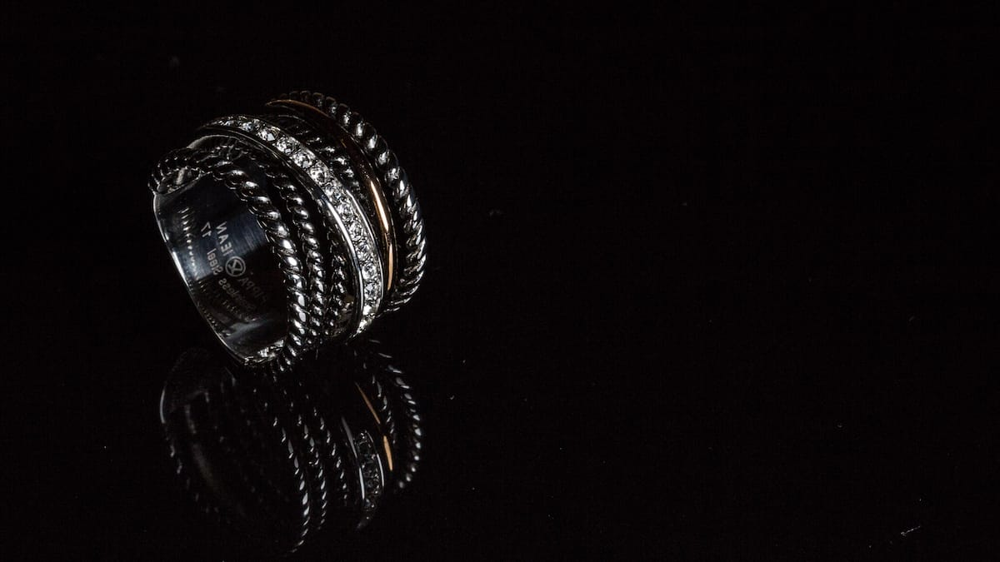
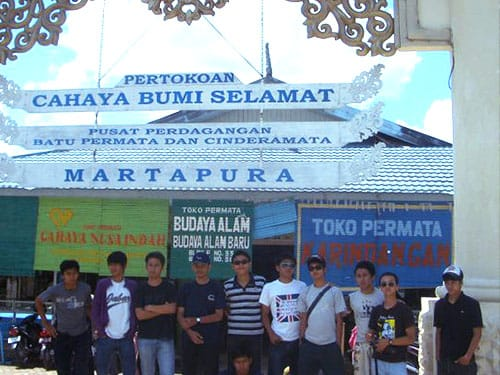

Hampir seminggu sudah kami melancong di Kalimantan Selatan. Beberapa tempat menarik sudah kami kunjungi. Mulai dari menyusuri aliran Sungai Barito yang menjadi tumpuan hidup masyarakat di sekitarnya. Menengok keunikan pasar terapung sembari menyantap gurihnya soto khas Banjar di atas perahu. Menjelajahi megahnya Goa Batu Hapu hingga menyusuri uniknya Pulau Kembang yang dihuni ratusan monyet. Pengalaman yang mengasyikan.

Kami menghabiskan hari terakhir liburan kami dengan jalan-jalan di Kota Martapura, ibukota Kabupaten Banjar. Siapa yang tidak kenal dengan Kota Martapura? Martapura si Kota Intan. Ia menjadi pusat pengolahan dan penjualan intan permata yang tersohor ke seantero negeri. Meski sebenarnya tambang-tambang batu mulia lebih banyak tersebar di daerah-daerah sekitarnya. Seperti daerah Cempaka di Kota Banjarbaru misalnya—daerah ini terkenal dengan "Intan Trisakti" nya. Intan Trisakti merupakan intan fenomenal seberat 167 karat yang ditemukan pada tahun 1965, saat Ir. Soekarno masih menjabat sebagai presiden.

Di pusat Kota Martapura terdapat pusat pertokoan yang menjual berbagai cenderamata khas Kalimantan, termasuk batu intan. Beragam batu mulia dijajakan di sini. Mulai dari intan yang masih berbentuk kristal hingga intan yang sudah dikombinasikan menjadi perhiasan seperti cincin, kalung, ataupun gelang. Meski menawarkan intan-intan bernilai jual sangat tinggi, toko-toko di sini tampak sederhana. Sangat jauh dari kesan mewah.

Dompet kami tentu tidak memadai untuk menjadikan intan sebagai cenderamata. Tapi tidak usah khawatir, pusat perdagangan ini juga menawarkan berbagai cenderamata lainnya yang lebih terjangkau. Gelang-gelang, kalung, atau cincin dari batu tambang yang berwarna-warni tersedia di sini. Ada yang merah, biru, hijau, putih, macam-macam. Harganya pun relatif terjangkau, tidak lebih dari 20 ribu rupiah. Kaos-kaos dengan motif khas Dayak juga bisa kita temui di sini. Tempat yang pas untuk berburu cenderamata!

Foto cover dari [Flickr](https://www.flickr.com/photos/traveller_40/16602452926/) oleh [Traveller_40](https://www.flickr.com/photos/traveller_40/).
