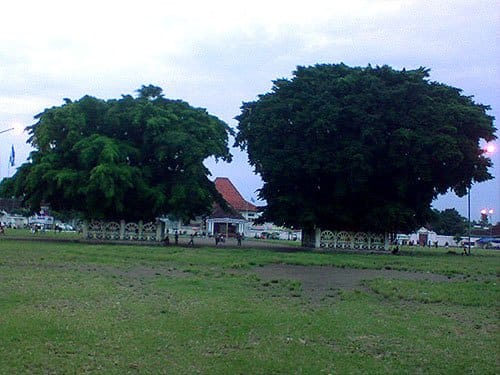

Hari mulai gelap, senja perlahan-lahan turun. Langit kota yang sedari tadi mendung, masih enggan meneteskan bulir-bulir hujannya. Saat itu aku tengah duduk di pinggir jalan, tepat berada di belakang Kraton Yogyakarta.

Di hadapanku Alun-Alun Selatan atau Alun-Alun Kidul tampak bergeliat. Di pinggir-pinggir lapangan yang luas itu beberapa pedagang tampak sibuk menggelar lapaknya. Ada yang menjual ronde, wedang jahe, roti bakar, hingga sate kambing. Tikar-tikar pun digelar untuk para pembeli. Beberapa anak kecil berlari riang mengejar baling-baling berlampu yang ia terbangkan. Beberapa muda-mudi pun tampak berpasangan memadu kasih di tengah temaramnya senja.

Ada yang menarik perhatianku sedari tadi. Seorang pedagang yang berada tepat di depanku menyewakan kain hitam seharga tiga ribu rupiah kepada pengunjung. Pengunjung-pengunjung tersebut mengenakan kain hitam itu untuk menutupi matanya. Dengan mata tertutup, mereka berjalan kesana kemari tak tentu arah, sesekali mereka ditertawai oleh kawan-kawannya sendiri.

Setelah bertanya-tanya rupanya kegiatan ini merupakan tradisi yang tumbuh di Alkid atau Alun-Alun Kidul. Masangin namanya. Dengan mata tertutup kain hitam, kita berjalan berusaha untuk melewati jalan tengah antara kedua beringin yang tumbuh di tengah alun-alun. Konon orang yang mampu berjalan melewati kedua beringin dengan mata tertutup, keinginan dan harapannya akan terkabul.

Terlepas dari mitos seputar Masangin, ada makna yang lebih dalam yang bisa kita tangkap. Masangin seolah mengajarkan kita bahwa hasil akhir benar-benar ada di Tangan Sang Khalik, namun kita sebagai ciptaan-Nya tetap harus berusaha sekuat mungkin.


Foto cover dari [Unsplash](https://unsplash.com/photos/-UmCb7gAAUI) oleh [Craig Strahorn](https://unsplash.com/@stags).
