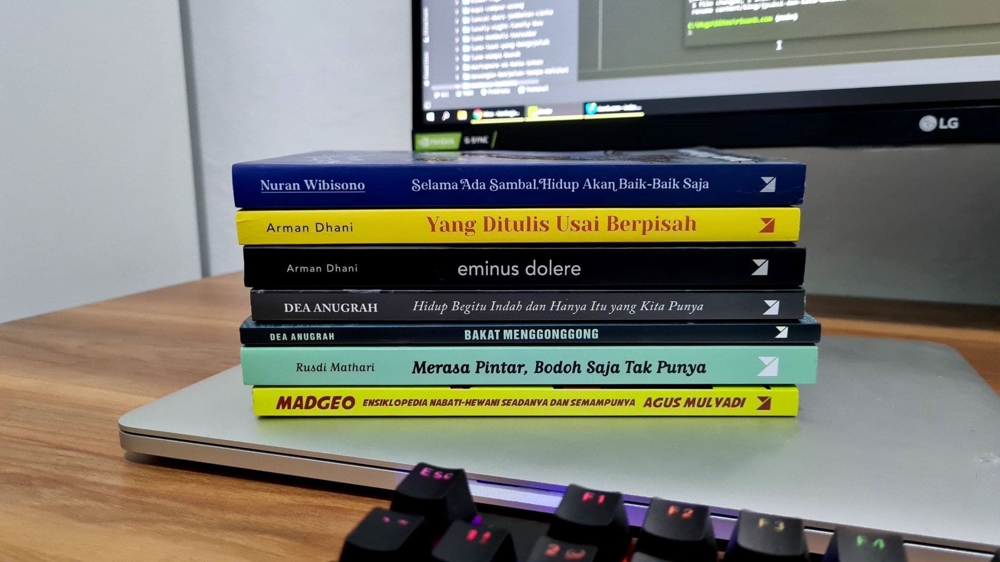
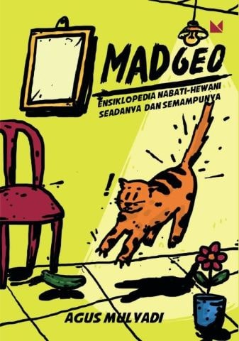
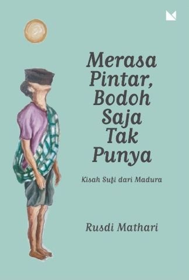
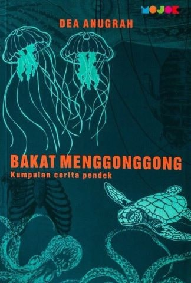
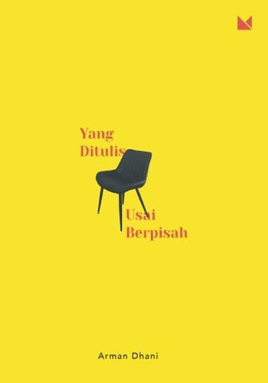
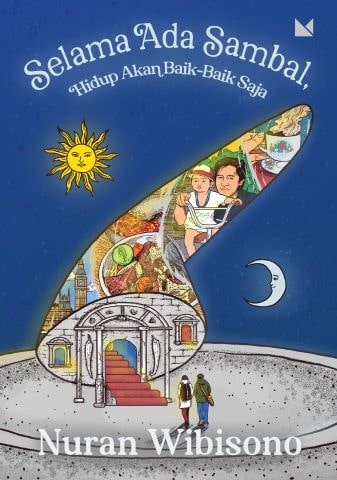

Minat membaca buku saya meredup sejak bergelut di dunia pemrograman beberapa tahun terakhir. Yang saya baca praktis hanya seputar pemrograman. Sambil sesekali membaca buku *self help*—yang seringkali efek positifnya berbekas beberapa hari saja. Ditambah derasnya arus informasi zaman kiwari. Kian terbiasa membaca artikel-artikel pendek dari media daring. Melihat buku beberapa ratus halaman saja, malas rasanya. Padahal dahulu saya cukup getol melahap beragam jenis buku.

Di samping SD saya dahulu sempat ada lapak penjual buku-buku bekas. Kadang saya menyisihkan uang jajan untuk membeli buku dengan gambar-gambar menarik. Kebanyakan tema luar angkasa dan ragam alat transportasi. Saya juga ingat sempat menelpon kantor Gramedia lewat Wartel karena terlewat membeli satu edisi majalah Bobo yang berhadiah mainan kereta dari karton. Saat kelas lima saya juga sempat mendapatkan hadiah karena menjadi peminjam buku paling aktif di perpustakaan sekolah.

Masuk SMP, minat baca saya beralih ke komik. Ini didukung dengan keberadaan penyewaan komik legendaris di Kota Cimahi: Taman Baca Garuda—yang saya lalui tiap pulang jalan kaki dari sekolah. Bacaan saya pun mayoritas judul-judul populer: Dragon Ball, Doraemon, Detektif Conan, Crayon Shin-chan, Samurai X, Kapten Tsubasa, Slamdunk, Hunter x Hunter, hingga Kariage Kun. Yang tidak *mainstream* mungkin hanya Kungfu Komang dan satu komik tentang tim olahraga *handball* yang saya lupa judulnya. Sesekali saya juga pinjam buku Lima Sekawan, Goosebumps atau Chicken Soup for the Soul.

Zaman SMA, minat baca saya mulai berkurang seiring dengan ketertarikan saya pada komputer. Tak banyak buku yang saya baca. Hanya beberapa seri Hercule Poirot dan beberapa novel fantasi seperti Harry Potter, The Chronicles of Narnia, dan His Dark Materials.

Di masa kuliah, minat baca saya kembali tumbuh. Cukup sering saya membayar denda karena terlambat atau lupa mengembalikan buku ke perpustakaan. Di masa ini saya mulai menyukai buku-buku sastra. Tetralogi Buru dan Gadis Pantai karya Pram. Namaku Merah Kirmizi dan Salju karya Orhan Pamuk. Ronggeng Dukuh Paruk karya Ahmad Tohari. Hingga tetralogi Laskar Pelangi karya Andrea Hirata. Saya juga masih suka dengan novel-novel fantasi: The Lord of the Rings, Abarat, hingga Twilight.

Pada masa-masa kerja sebagai *fresh graduate*, saya juga masih sempat untuk membaca. Saya ingat betul ketika ditugaskan sendiri ke Pulau Kundur di Kabupaten Karimun, Provinsi Kepulauan Riau. Lepas mengumpulkan data di lapangan, sorenya saya jalan-jalan di sekitar hotel tempat saya menginap. Tak jauh dari dermaga, saya menemukan kios buku kecil dengan buku-bukunya yang bertumpuk. Sepanjang sore itu saya menghabiskan waktu di kios buku tersebut dan akhirnya membawa pulang buku [Arok Dedes](/blog/arok-dedes/) karya Pram.

Tahun lalu sebetulnya performa membaca saya tidak buruk-buruk amat. Rata-rata masih sanggup membaca satu buku tiap bulan (meski salah satunya adalah komik). Tapi tahun ini, dari Januari hingga Maret, tidak ada satu pun buku yang saya baca. Sampai akhirnya, di bulan puasa kemarin, saya mencoba untuk menghidupkan kembali semangat baca yang kian kendor. Rencananya hanya akan membeli dan membaca dua buku hingga akhir bulan April. Dua buku tuntas dibaca, tambah dua lagi. Buku keempat tamat, tambah tiga lagi. Total ada tujuh buku yang saya baca dari awal puasa hingga akhir April kemarin—plus dua buku tipis bonus pembelian di toko *online*.

Tanpa direncanakan, ketujuh buku yang saya beli semuanya terbitan [Buku Mojok](https://bukumojok.com/). Padahal dibeli di tiga toko *online* yang berbeda dan dalam selang waktu yang berbeda pula. Berikut ulasan dan sedikit sinopsis dari ketujuh buku tersebut:

## Madgeo: Ensiklopedia Nabati-Hewani Seadanya dan Semampunya

Penulis: Agus Mulyadi\
Penerbit: Buku Mojok\
Tahun Terbit: 2019\
Jumlah Halaman: vi + 178\
ISBN: 978-623-7284-11-6

Saya membeli buku ini karena ada kucing di sampulnya dan yang menulis adalah Mas Agus Mulyadi—jaminan kocak. Ekspektasi saya tidak muluk-muluk. Meski ada kata "Ensiklopedia" di judulnya, mulanya saya mengira buku ini hanya menawarkan hiburan dan tawa belaka. Dugaan saya ternyata salah.

Selain penulisannya yang jenaka, banyak informasi menarik seputar hewan dan tumbuhan yang disisipkan dalam buku ini. Misal kuda nil jantan yang menarik perhatian lawan jenisnya dengan cara berak dan kencing secara bersamaan. Atau soal lele dumbo yang sebenarnya berasal dari benua Afrika. Atau bambu yang biasa disebut "pohon", tapi secara saintifik masuk kedalam keluarga rumput-rumputan.

Fakta lain yang mengejutkan bagi saya adalah perihal tomat tergolong sayur atau buah, ternyata pernah dibawa hingga ke pengadilan tinggi Amerika Serikat. Hal ini terkait bea impor sayur dan buah. Sayuran dikenakan bea masuk 10%, sedang buah-buahan bebas bea masuk. Pada 1893 Mahkamah Agung Amerika Serikat akhirnya memutuskan bahwa tomat tergolong kedalam sayur-sayuran.

Juga soal bayam yang dijadikan sumber kekuatan bagi karakter kartun Popeye. Pada tahun 1870, ilmuwan asal Jerman, Erich von Wolf meneliti kandungan zat besi pada beragam sayuran hijau. Dalam risetnya, 100 gram bayam mengandung 3,5 gram zat besi. Namun dalam publikasi hasilnya ia keliru menempatkan tanda desimal. Dari 3,5 gram menjadi 35 gram. Kekeliruan ini baru dikoreksi pada tahun 1937—delapan tahun setelah komik Popeye pertama kali terbit.

Yang menjadi keluhan bagi saya adalah ilustrasinya. Meski secara visual bagus, tapi beberapa tidak menambah kelucuan atau informasi dari tulisannya. Terasa seperti untuk mengisi halaman yang kosong saja. Terlepas dari itu, bukunya sangat menghibur dan informatif. Cocok dibaca saat sedang bosan atau dilanda penat.

## Merasa Pintar, Bodoh Saja Tak Punya: Kisah Sufi dari Madura

Penulis: Rusdi Mathari\
Penerbit: Buku Mojok\
Tahun Terbit: 2018\
Jumlah Halaman: 226\
ISBN: 978-602-1318-40-9

Idiom *don't judge a book by its cover* rasanya sangat pas disematkan pada Cak Dlahom—tokoh sentral di cerita-cerita pendek dalam buku ini. Tingkah lakunya yang *nyentrik* dan di luar kebiasaan, membuat orang-orang di kampung mengaggapnya tidak waras. Tapi tak sedikit juga warga yang melihatnya Cak Dlahom sebagai orang yang bijak dan mengejar penjelasan atas tindak-tanduknya yang absurd. Dibalik kelakuannya yang *nyeleneh* selalu ada alasan filosifis yang bisa menyentil ego warga kampung (dan juga pembacanya).

Kisah warga kampung dan Cak Dlahom mengingatkan saya pada cerita-cerita Abu Nawas atau Si Kabayan. Ceritanya lucu. Membacanya tidak hanya mengibur, ia juga menjadi sebuah sarana untuk refleksi diri. Menempatkan kita sebagai warga kampung yang kadang melihat lahiriah saja. Memandang sebelah mata dan penuh syak wasangka. Merasa pintar, padahal bodoh saja tak punya.

Salah satu episode yang menggelitik bagi saya adalah ketika Pak Lurah baru saja pulang umrah untuk yang kesekian kalinya. Warga kampung bertamu ke rumah Pak Lurah; menyelamati kepulangannya dari tanah suci. Sementara itu Cak Dlahom mondar-mandir di luar pagar kediaman Pak Lurah sambil bersuara: "Pak Haji... Bu Puasa...". Mat Piti—yang menampung Cak Dlahom—membujuknya untuk pulang. Di jalan pulang Cak Dlahom melontarkan pertanyaan yang menjadi jawaban atas tingkah lakunya.

> "Kenapa orang yang salat tidak dipanggil Pak Salat? Orang yang puasa dipanggil Pak Puasa? Orang yang berzakat, Pak Zakat?"

Ada juga cerita yang membuat pilu. Ketika warga kampung sibuk dengan rencana renovasi mesjid, datang berita lelayu dari janda Bunali. Ia nekat mengakhiri hidupnya karena himpitan ekonomi dan penyakit yang diderita. Meninggalkan Sarkum—anaknya—menjadi yatim piatu. Cak Dlahom sedih bukan kepalang. Orang-orang sibuk memperindah mesjid, getol menggalang dana untuk memperluas mesjid; sampai lupa ada tetangga yang kelaparan, sakit-sakitan, dan anaknya terpaksa putus sekolah.

Satu hal yang menggangu saya adalah fakta bahwa Romlah adalah anak kandung dari Cak Dlahom yang dititipkan kepada Mat Piti. Di cerita-cerita sebelumya digambarkan bahwa Cak Dlahom menaruh hati pada Romlah. Dan Mat Piti selalu menggerutu tiap kali Cak Dlahom menunjukan perhatiannya kepada Romlah. Mat Piti tentu tahu siapa ayah kandung Romlah, lantas kenapa masih menggerutu? Di luar itu buku ini layak untuk dibaca. Menghibur, menyentuh, dan membawa kita untuk merenung sejenak.

## Bakat Menggonggong: Kumpulan Cerita Pendek

Penulis: Dea Anugrah\
Penerbit: Buku Mojok\
Tahun Terbit: 2017\
Jumlah Halaman: 113\
ISBN: 978-602-1318-38-6

Saya memutuskan untuk membeli kumpulan cerpen karya Dea Anugrah ini setelah membaca tulisannya di Medium yang berjudul "[Hari-Hari yang Mencurigakan (1)](https://deaanugrah.medium.com/hari-hari-yang-mencurigakan-1-5c87e3d16f71)". Keputusan tersebut tidak saya sesali. Saya sangat menikmati cerita-cerita yang dibawakan Dea dalam buku ini.

Membacanya seperti menikmati sebuah film *thriller*. Plot pada ceritanya *sih* tidak begitu istimewa, tapi Dea pandai mendeskripsikan keadaan atau apa yang sedang dilakukan sang tokoh dalam cerita. Sebagai pembaca saya dengan mudah membayangkan detail cerita di dalam benak.

> Sebuah lubang hitam. Setangkai pipa baja sepanjang tiga kilan. Bebatan tali kain penuh gemuk dan lumpur. Sebuah teropong pendek. Sepucuk senapan jarak jauh. Seorang pemuda tugur, tengkurap dan basah dan kotor, dengan telunjuk menempel pada picu.
> 
> — Penembak Jitu halaman 41.

Gaya tulisannya pun variatif. Bagi saya yang referensi bacaannya masih sedikit, gaya penulisan Dea terkesan unik dan tidak biasa. Membacanya membuat saya berdecak kagum dan bergumam: "*Kok bisa kepikiran nulis kayak gini ya?*". Salah satu favorit saya adalah cerita berjudul "Kemurkaan Pemuda E". Dalam cerita itu pembacanya ditempatkan sebagai peserta tur dan Dea adalah pemandunya. Pembaca diajak mengamati tindak-tanduk Pemuda E dan mencari tahu kenapa ia nampak gelisah. Di akhir cerita juga Dea—sebagai pemandu tur—melakukan *callback* dengan merujuk kembali pada paragraf pertama.

Cerita favorit lainnya adalah yang berjudul "Perbedaan antara Baik dan Buruk". Kisah cinta antara Gustav—operator warnet yang sempat merasakan bangku kuliah di jurusan sejarah—dan Wanda, seorang transpuan yang mesti bertahan hidup dengan menjajakan jasanya di balik semak-semak di belakang terminal Jombor. Gustav tengah berusaha memperbaiki hubungannya dengan Wanda. Pasalnya ia kedapatan Wanda tengah main serong dengan wanita lain. Saat Gustav datang ke tempat praktik Wanda, alih-alih sumpah serapah atau acungan balok sebesar bantalan rel kereta, Wanda justru menyambut Gustav dengan baik. Sebuah kisah cinta yang masih tabu di tengah masyarakat. Disampaikan dengan komikal—diksi-diksi yang tak lazim dan kerap vulgar—tapi tetap terasa jujur. Yang jadi pertanyaan saya adalah: apakah penempatan kisah ini di halaman 69 kebetulan belaka?

Satu hal yang kurang saya sukai mungkin struktur paragraf dengan kalimat-kalimat yang diulang secara bersusun, seperti pada cerita dengan judul "Kisah Sedih Kontemporer (XXIV)".

> Ia menulis cerita-cerita bagus yang ringkas seperti Lydia Davis. Ia menulis cerita-cerita bagus yang ringkas seperti Davis dan mengejutkan seperti Denevi. Ia menulis cerita-cerita bagus yang ringkas seperti Davis dan mengejutkan seperti Denevi dan lucu seperti Vonnegut. Ia menulis cerita-cerita bagus yang ringkas seperti Davis dan mengejutkan seperti Denevi dan lucu seperti Vonnegut dan filosofis seperti Borges.  Ia menulis cerita-cerita bagus yang ringkas seperti Davis dan mengejutkan seperti Denevi dan lucu seperti Vonnegut dan filosofis seperti Borges dan sinis seperti Maupassant...

Bagi saya terasa membosankan. Lelah membaca paragraf seperti itu. Tapi boleh jadi trik yang bagus untuk menghafal. Di luar itu semua, saya sangat menikmati kisah-kisah yang ditawarkan Dea dalam bukunya ini. Saya bisa melihat diri saya membacanya lagi dalam waktu dekat.

## Hidup Begitu Indah dan Hanya Itu yang Kita Punya

Penulis: Dea Anugrah\
Penerbit: Buku Mojok\
Tahun Terbit: 2019\
Jumlah Halaman: 181\
ISBN: 978-602-1318-81-2

Setelah sukses membuat saya terkagum-kagum dengan ragam gaya penulisan yang unik di buku kumpulan cerpennya: Bakat Mengonggong; saya tak sabar melahap buku yang berisi esai-esai nonfiksi dari Dea Anugrah ini. Meski tidak seeksperimental gaya penulisan di kumpulan cerpennya, esai-esai yang ditulis Dea dalam bunga rampai ini tetap memikat. Informasi-informasi unik yang disisipkan dalam esainya menunjukan luasnya pengetahuan dan ragam referensi si penulis. Dea seperti seorang guru sejarah yang menyenangkan. Pandai merangkum bahan ajar menjadi sebuah dongeng yang tak membosankan.

Salah satu esai yang membekas bagi saya adalah yang berjudul "Orang Buta Berpandangan Jauh". Esainya bercerita tentang perjuangan hidup seorang Georg Eberhard Rumphius—pakar botani asal Jerman yang mengabdikan sebagian besar hidupnya di Pulau Ambon untuk mengatalogkan ragam spesies tanaman dan hewan.

Cobaan datang bertubi-tubi, tapi kecintaan Rumphius pada ilmu pengetahuan, mendorongnya terus melangkah ke depan. Di umurnya yang ke-43, Rumphius harus kehilangan penglihatannya karena glaukoma. Tapi itu tidak membuatnya berhenti. Dia terus melanjutkan penulisan manuskrip buku-bukunya dibantu istri dan anak laki-lakinya.

Empat tahun berselang, di tengah perayaan imlek, gempa besar melanda Ambon. Ribuan penduduk Ambon menjadi korban, termasuk istri dan putrinya. Tiga belas tahun kemudian rumahnya dilalap api. Manuskrip, ilustrasi, koleksi spesimen miliknya ikut terbakar. Itu juga tidak mematahkan semangatnya. Dibantu juru tulis dan juru gambar bayaran, ia mengerjakan ulang naskah-naskahnya.

Tahun 1690, karya Rumphius yang berjudul *Herbarium Amboinense* akhirnya rampung. Tahun 1692, kapal yang membawa salinan naskah tersebut ditenggelamkan angkatan laut Prancis. Tahun 1697, naskahnya terkumpul lengkap di Belanda. Tapi karena alasan biaya dan "keamanan", naskah tersebut tidak juga dicetak dan *menjogrorg* di gudang arsip.

Tahun 1699, Rumphius menyelesaikan *masterpiece*-nya yang lain: *D'Amboinsche Rariteitkamer*. Belajar dari naskahnya yang terdahulu, Rumphius tidak lagi mengirimkan naskahnya lewat petinggi VOC. Tahun 1701, ia menyelundukan naskah *D'Amboinsche Rariteitkamer* ke Walikota Delft.

Rumphius menutup usia selang setahun kemudian; tahun 1702 di umurnya yang ke-74. Rumphius wafat tanpa pernah melihat buku-buku hasil kerja kerasnya yang panjang diterbitkan. *D'Amboinsche Rariteitkamer* terbit tahun 1705, sedangkan *Herbarium Amboinense* akhirnya terbit tahun 1741—39 tahun setelah wafatnya Rumphius.

Dan masih banyak kisah-kisah menarik lainnya yang diangkat Dea dalam buku ini. Ada kisah Abah Ajip Rosidi yang ternyata gemar bersolek. Katanya abah bahkan pernah meminyaki rambutnya dengan oli mesin penggiling teh. Atau soal melankolia kolektif dan kata *hüzün* yang dalam konteks penduduk Istanbul berarti perasaan terputus dari bayang-bayang kejayaan bangsa Turki di masa Kesultanan Utsmani.

Ada juga kisah Giordano Bruno—seorang kosmolog, filsuf, dan mantan biarawan yang dibakar hidup-hidup di akhir abad ke-16. Atau asal kata "santai" yang pertama kali dibawa oleh Bur Rasuanto—novelis dan wartawan Tempo—dari bahasa Komering di Sumatera Selatan, sebagai padanan kata *relax*. Atau tentang praktik monokultur yang mengakibatkan pisang Gros Michel alias pisang Ambon nyaris punah di berbagai belahan dunia. Atau soal 80% anak-anak di Aleppo yang pernah mengalami atau menyaksikan kekerasan.

Sebuah bunga rampai yang memikat dan layak baca. Cocok untuk menghabiskan waktu luang sembari menambah wawasan.

## Eminus Dolere: Panduan Mempersiapkan Perpisahan

Penulis: Arman Dhani\
Penerbit: Buku Mojok\
Tahun Terbit: 2020\
Jumlah Halaman: vi + 236\
ISBN: 978-623-7284-40-6

Zaman remaja dahulu, kalau ingin *ngetwit* soal patah hati atau cinta-cintaan yang syahdu nan puitis, rujukan saya kalau tidak buku *Layla dan Majnun* ya *blog*-nya Mas Dhani. Meski kala itu Dhani mungkin lebih dikenal sebagai penulis dengan gaya satir juga sarkastik, tulisan-tulisan dengan tema patah hatinya lebih saya gandrungi. Karenanya saya sangat antusias mengetahui Dhani sudah menerbikan dua buku dengan tema perpisahan.

Buku ini terdiri dari 50 fragmen: sebagian curahan hati, sebagian cerita pendek, sebagian seperti surat untuk seseorang, dan beberapa afirmasi positif. Dibagi kedalam tiga bab: Bertemu, Bersama, dan Berpisah. Meski saya rasa pembagiannya terasa dipaksakan, karena tema fragmen-fragmen tersebut tumpang tindih. Bahkan rasanya hampir semua fragmen tersebut lebih cocok dimasukan ke dalam bab Berpisah.

Terlepas dari pembagian bab yang terasa ganjil, saya sangat suka dengan tulisan-tulisan Dhani di buku ini. Terlebih karena gaya penulisannya yang beragam. Dhani sangat pandai memilih diksi dan merangkainya menjadi kalimat-kalimat yang syahdu, melodramatis, dan kadang jenaka.

> Matamu adalah lautan pasang. Ia menenggelamkan pelabuhan-pelabuhan kenangan yang gagal diselamatkan. (hal.109)

> Tapi cinta, seperti juga ukuran snack Top yang tiap hari mengecil, barangkali adalah kerumitan yang lain. (hal. 61)

> Serupa kegembiraan malam tahun baru. Ia ingar bingar yang menyenangkan tapi mustahil untuk terjadi selamanya. (hal. 130)

> Aku lelaki brengsek yang barangkali lebih menyebalkan dari ban motor gembos di tengah malam... (hal. 134)

> Nasib bukan potongan jahe yang kamu kira rendang... (hal. 147)

Salah satu bagian yang saya suka adalah fragmen #13 dalam bab Bertemu. Saya suka dengan gaya penulisannya. Tokoh wanita dalam cerita tersebut "keluar" dari naskah dan tawar-menawar soal kelanjutan ceritanya dengan si penulis.

Saya juga suka fragmen #3 dalam bab Bersama. Alasannya sentimentil: karena saya sempat mengadu nasib di Kota Jakarta, meski tidak lama. Berdesak-desakan di gerbong kereta, bergelantungan sambil menahan kantuk. Duduk di kursi belakang TransJakarta, kedinginan karena AC-nya disetel kelewat kencang.

Meski mungkin masa-masa patah hati dan cinta yang menggelora sudah lewat, saya tetap bisa menikmati buku ini. Sekalipun temanya tentang perpisahan, saya sesekali tersenyum membacanya—teringat episode-episode kasmaran, pacaran, dan patah hati yang telah lalu. Lewat tulisannya, Dhani seolah mewakilkan apa yang (mungkin) pernah kita rasakan.

## Yang Ditulis Usai Berpisah

Penulis: Arman Dhani\
Penerbit: Buku Mojok\
Tahun Terbit: 2021\
Jumlah Halaman: vi + 190\
ISBN: 978-623-7284-52-9

Bila buku sebelumnya—Eminus Dolere—membahas soal kasmaran hingga betapa perihnya sebuah perpisahan. Buku ini seperti sebuah kontemplasi ke dalam. Sebuah usaha untuk menyembuhkan luka dari sebuah perpisahan. Format narasinya masih sama: seperti sebuah *diary* atau surat yang tak kunjung dikirimkan si penulis.

Jika "Eminus Dolere" gaya penulisannya cukup variatif. Pada buku ini gaya penulisannya cenderung seragam dan monoton. Sehingga dibaca dalam sekali duduk, bagi saya terasa sedikit membosankan dan melelahkan. Mungkin tidak akan kentara dan lebih menyenangkan apabila menyelesaikan buku ini dengan perlahan dan jeda yang cukup. Sisi positifnya, sosok perempuan yang diceritakan terasa lebih konsisten dari satu fragmen ke fragmen yang lain.

Salah satu yang paling membekas bagi saya adalah fragmen #20. Tentang si lelaki yang ingin mengakhiri hidupnya karena perih yang terlalu. Tentang kesehatan mental. Kisah yang sayangnya masih tabu di tengah masyarakat kita. Stigma yang kerap diberikan kepada penyintas bunuh diri atau mereka yang tengah mengalami gangguan kesehatan mental.

> Kalau kamu menyebut orang yang bunuh diri sebagai orang narsistik yang egois, lantas apa sebutan untuk mereka yang memaksakan orang lain hidup dalam penderitaan demikian berat, kondisi mental yang mengerikan, dan kondisi jiwa yang demikian terpuruk sehingga berpikir kematian adalah satu-satunya jalan untuk membebaskan diri dari penderitaan? (hal. 94)

Fragmen lainnya yang saya suka adalah #24. Deskripsi Kota Padang di pagi hari. Sungai-sungai yang membelah jantung kota. Anak-anak yang bermain di tepi sungai. Nelayan-nelayan yang pergi melaut. Juga diksi-diksinya yang menggelitik.

> Atau menemukan cara olah raga yang menyenangkan yang tidak membuatmu berkeringat seperti pesut yang menggelepar di daratan. (hal. 115)

> Cinta bukan soal pengorbanan tapi ia bisa jadi banyak hal, seperti obrolan telepon yang panjang, lelucon personal yang tak banyak orang tau, tebak-tebakan garing, meme lucu, juga hangat bakso di sore hari. (hal. 115)

Satu hal yang mengganjal bagi saya adalah akhir dari buku ini. Meski si lelaki akhirnya berhasil merelakan perpisahan dan menemukan jalan untuk mencintai dirinya sendiri. Resolusi tersebut begitu tiba-tiba dan terasa terlalu cepat. Mungkin akan ada buku lanjutannya?

## Selama Ada Sambal, Hidup Akan Baik-Baik Saja

Penulis: Nuran Wibisono\
Penerbit: Buku Mojok\
Tahun Terbit: 2021\
Jumlah Halaman: xxii + 222\
ISBN: 978-623-7284-51-2

Saya selalu kagum dengan kepiawaian Mas Nuran dalam menyisipkan data dalam esai-esainya. Begitu halus, tak kentara, mengalir, dan tetap rinci. Seperti membaca sebuah jurnal ilmiah dalam bentuk cerita pendek yang menyenangkan. Tak terkecuali bukunya yang satu ini. Kumpulan bunga rampai tema kuliner yang menghibur sekaligus mencerahkan.

Kita akan diajak bertualang, menyelami khazanah kuliner di beragam tempat. Mulai dari cara memilih terasi yang baik dan bisnisnya yang ternyata menggiurkan. Bagaimana kuliner Betawi yang *yahud* justru banyak ditemukan di pinggiran Kota Jakarta. Atau andaliman yang digunakan untuk menghilangklan bau amis pada babi.

Tentang pabrik-pabrik kecap kecil di daerah yang kian tergerus oleh kedigdayaan merek-merek besar. Rasa bir yang dipengaruhi perlakuan ragi juga komposisi gandum dan hop-nya. Tentang puritannya penjaga resep piza Neopolitan, sampai-sampai beberapa restoran di Napoli hanya menggunakan tomat San Marzano yang tumbuh di lereng gunung Vesuvius. Tentang mi dingin, yang bahkan Korea Selatan pun mengakui cikal bakalnya berasal dari Korea Utara. Atau kisah salad Oliver yang resep aslinya masih menjadi misteri hingga hari ini.

Ditutup dengan kisah dari dua legenda pakar kuliner: Bondan Winarno dan Anthony Bourdain. Kisah mendiang Pak Bondan yang melakukan investigasi terhadap laporan kematian manajer eksplorasi Bre-X yang janggal, hingga lahirnya kolom Jalansutra di Suara Pembaruan. Juga pengalaman yang paling diingat mendiang Bourdain saat kecil: mencicipi tiram segar pemberian tetangga kala ia berkunjung ke kampung halaman ayahnya di Prancis.

Sebuah buku yang layak anda baca dan koleksi. Banyak informasi menarik yang dipaparkan dengan begitu apik dan menyenangkan. Data-data yang rinci menunjukan luasnya referensi si penulis. Terlebih bila anda tertarik dengan ragam seluk-beluk dunia kuliner.
