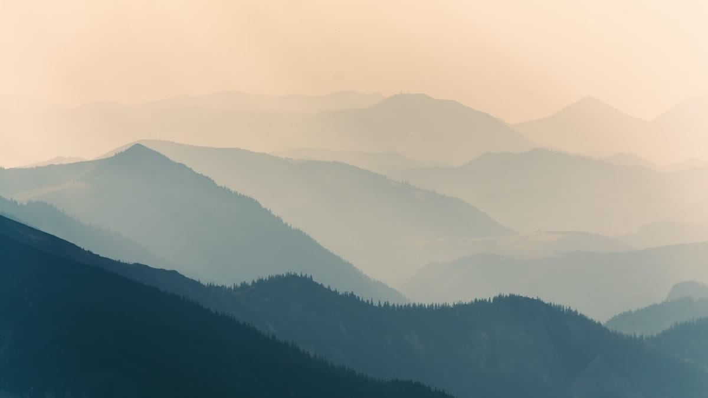
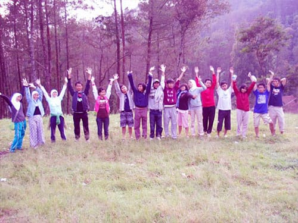
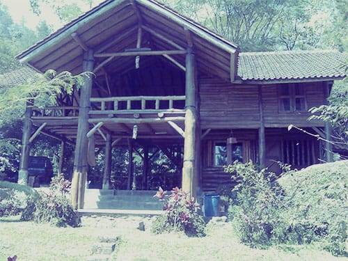
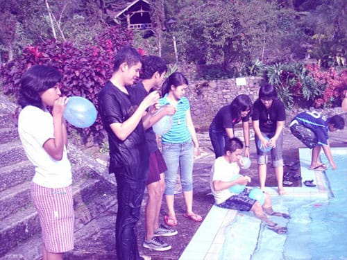
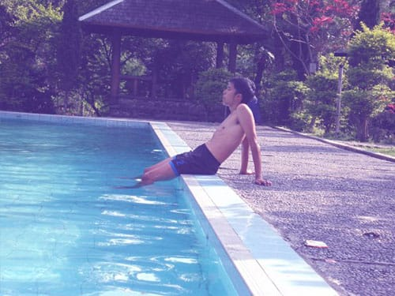
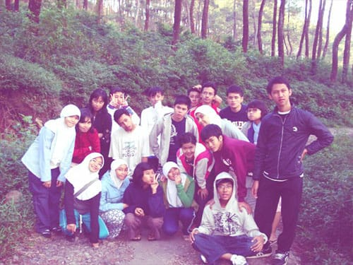
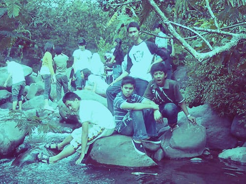
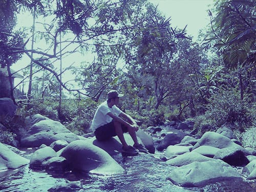

Udara dingin menyapa dan menusuk kulit. Rahangku pun ikut bergemeletuk seiring angin yang menusuk-nusuk tulang. Hanya membawa sehelai jaket tipis ke Gunung Puntang adalah awal dari sebuah petaka!

Gunung Puntang merupakan kawasan wisata sekaligus bumi perkemahan di daerah Bandung Selatan, tepatnya di Desa Cimaung, Kabupaten Bandung. Letaknya yang berada di ketinggian 1.300 meter di atas permukaan laut ini, menjadikan kawasan Gunung Puntang sebagai "kulkas alami". Dingin luar biasa, terlebih saat malam tiba.

Sekira tahun 2007, tepatnya saat liburan kenaikan kelas, kelasku merencanakan (semacam) acara perpisahan. Akhirnya kami pun sepakat untuk bermalam dan menikmati keindahan alam Gunung Puntang.

Di kawasan Gunung Puntang, selain terdapat areal perkemahan tersedia pula vila-vila yang dapat disewa. Fasilitas di Gunung Puntang pun terbilang cukup lengkap, mulai dari WC umum, warung makan, lapangan bola, kolam renang, bahkan fasilitas *out-bond* pun tersedia di sini. Selain itu lebatnya hutan pinus berpadu dengan aliran sungainya yang jernih, membangkitkan memoar manis tersendiri bagi pengunjungnya.

Banyak aktifitas yang dapat kita lakukan di Gunung Puntang: berkemah di alam terbuka, *tracking* menyusuri keriuhan hutan pinus, bermain air di jernihnya aliran sungai yang berasal dari Curug Sariwangi, hingga berenang dalam kolam yang airnya sedingin es. Sebuah pilihan wisata alternatif bagi mereka yang ingin sejenak menjauh dari hiruk pikuk kota.

Foto cover dari [Unsplash](https://unsplash.com/photos/nqVDLh2WLus) oleh [Zoltan Kovacs](https://unsplash.com/@kovacsz1).
